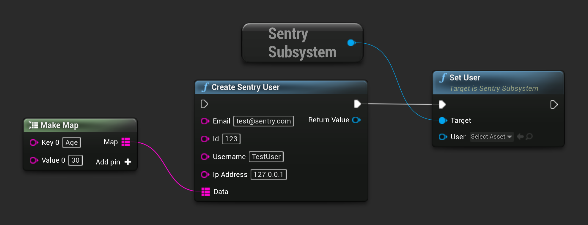

```cpp
USentrySubsystem* SentrySubsystem = ...;

TMap<FString, FString> AdditionalData;
AdditionalData.Add("DogName", "Spot");

USentryUser* User = NewObject<USentryUser>();
User->SetEmail("user@sentry.io");
User->SetId("123");
User->SetUsername("AwesomeUser99");
User->SetIpAddress("127.0.0.1");
User->SetData(AdditionalData);

SentrySubsystem->SetUser(User);
```

The same result can be achieved by calling corresponding function in blueprint:



Alternatively, this configuration can be provided to the crash reporter [during initialization](/platforms/unreal/configuration/setup-crashreporter/#configure-attributes).
