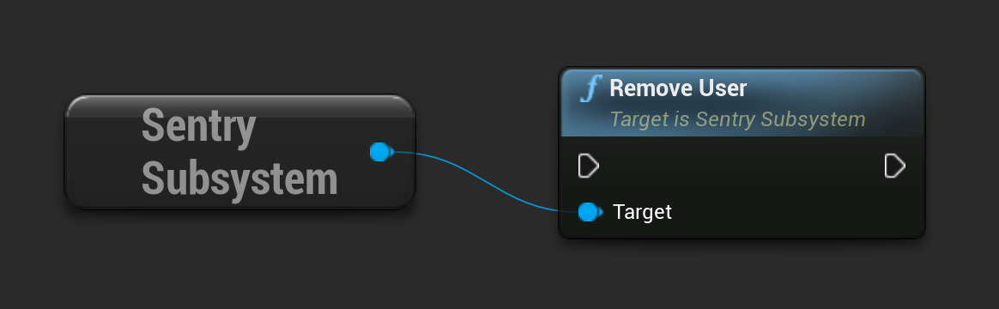

```cpp
USentrySubsystem* SentrySubsystem = ...;

SentrySubsystem->RemoveUser();
```

Or in blueprint:



In configurations with a crash reporter, create a new `__sentry` config object without the `user` field. Then, call `FGenericCrashContext::SetGameData` from the [initialization function](/platforms/unreal/configuration/setup-crashreporter/#configure-attributes) with the new JSON data. You have to provide all other fields again, as the call overrides the previously registered data.
