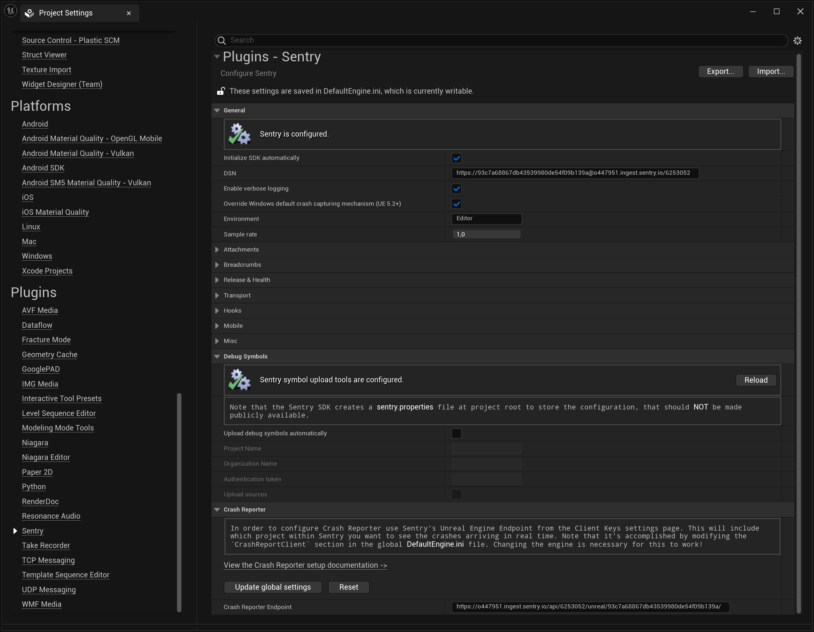

The minimum configuration required is the [DSN](/product/sentry-basics/dsn-explainer/) of your project:

<SignInNote />

```
___PUBLIC_DSN___
```

<Note>

If you are logged in, you can also go to your project settings and copy its DSN directly from there.

</Note>

Sentry can be configured using the Sentry configuration window.
The window can be accessed by going to editor's menu: **Project Settings > Plugins > Sentry**.



Alternatively, the `Initialize SDK automatically` option can be enabled in order to initialize the SDK on application startup. In this case, explicit SDK initialization won't be required.

To override SDK settings at runtime, use the `InitializeWithSettings` method of the `SentrySubsystem` class.
