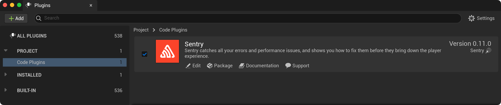

The Unreal Engine (UE) SDK is officially supported for the three latest UE versions. However, it is likely to be compatible with older engine versions as well depending on the specific features and functionality that you need.

To install the SDK, download the most up-to-date sources from the [Releases page](https://github.com/getsentry/sentry-unreal/releases) and add them to your project's `Plugins` directory. On the next project launch, UE will prompt you to build the Sentry module.

<Note>

Currently, this method is available only for C++ UE projects. Blueprint projects can be converted to a C++ one by adding an empty class using the editor.

</Note>

<Note>

[Releases page](https://github.com/getsentry/sentry-unreal/releases) provides two types of plugin packages (note `github` and `marketplace` suffixes in package names). The key difference between those two is the crash capturing backend which plugin uses under the hood on Windows. The UE Marketplace version relies on `Breakpad` (in-proc handler) that requires UE application or game to be relaunched in order to send the crash report to Sentry while the GitHub version uses `Crashpad` (out-of-proc handler) which does that right away.

</Note>

Alternatively, Sentry SDK can be downloaded from its UE Marketplace page via the Epic Games Launcher in which case the standard installation process will take place.

To make sure the Sentry plugin has been enabled after installation has been completed, go to the editor and navigate to the **Settings > Plugins > Code Plugins** menu and check for the installation. 



To access the plugin API from within C++,
add `Sentry` support to the build script (`MyProject.build.cs`):

```csharp
PublicDependencyModuleNames.AddRange(new string[] { ..., "Sentry" });
```
