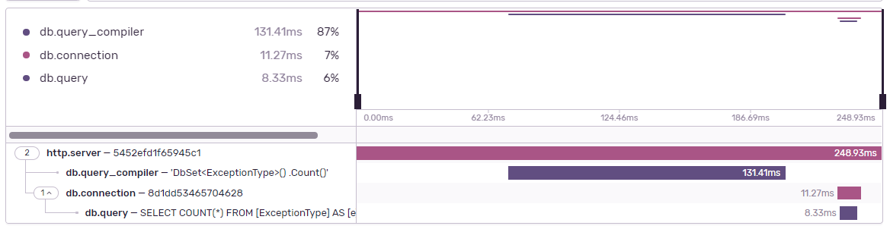
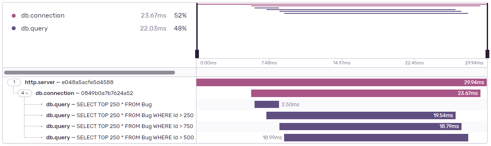

## DiagnosticSource Integration

Starting with version 3.9.0, the SDK automatically integrates with Entity Framework Core and SQLClient whenever available. Those integrations are automatically activated if your project matches one of the following conditions:

- Includes `Sentry.AspNet` 3.9.0 or higher
- Includes `Sentry.AspNetCore` 3.9.0 or higher
- Includes `Sentry` 3.9.0 and targets .NET Core 3.0 or higher (for example, .NET 5)

If you don't want to have this integration, you can disable it on `SentryOptions` by calling `DisableDiagnosticSourceIntegration();`

```csharp
option.DisableDiagnosticSourceIntegration();
```

If your project doesn't match any of the conditions above, (for example, it targets .NET Framework 4.6.1 and uses only the `Sentry` package), you can still manually activate those instrumentations by including the package `Sentry.DiagnosticSource` and enabling it during on the SDK's initialization.

```csharp
// Requires NuGet package: Sentry.DiagnosticSource
option.AddDiagnosticSourceIntegration();
```

### Entity Framework Core Integration



This integration is part of the `DiagnosticSource` integration and will automatically create spans for EF Core queries for the following operations:

`Query compiling`

: Occurs when EF Core optimizes a query. It then caches it so that future queries with the same input get reused.
The parameters for this span are:

- Operation: `db.query_compiler`

- Description: The query to be compiled

`Database connection`

: Represents the lifecycle of a database connection. One connection may contain one or more query execution spans, and, in some circumstances, may not be registered, due to the nature of the EF Core event model.
The parameters for this span are:

- Operation: `db.connection`

`Query Execution`

: Happens during the execution of a query. It represents how long a query took to be executed
The parameters for this span are:

- Operation: `db.query`

- Description: The query to be executed.

### SQLClient Integration



This integration is part of the DiagnosticSource integration and will automatically create spans for SQLClient operations, the integrated operations are:

`Database connection`

: Represents the lifecycle of a database connection. One connection may contain one or more query execution spans.
The parameters for this span are:

- Operation: `db.connection`

- `db.connection_id`: The Connection ID from the connection.

- `db.operation_id`: The Operation ID from the connection.

- `rows_sent`: The number of rows sent during the connection.

- `bytes_received`: The amount of data (in bytes) received during the connection.

- `bytes_sent`: The amount of data (in bytes) sent during the connection.

`Query Execution`

: Happens during the execution of a query. It represents how long a query took to be executed.
The parameters for this span are:

- Operation: `db.query`

- Description: The query to be executed.

- `db.operation_id`: The Operation ID from the connection.
