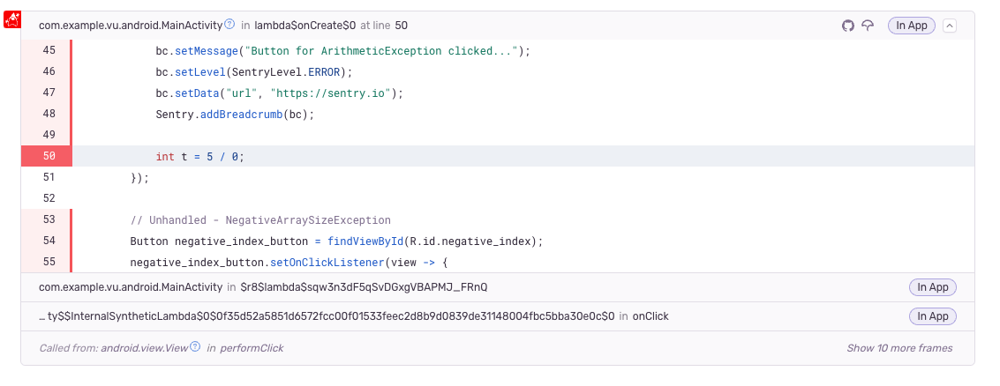

You'll need to enable the Source Context feature to see your source code as part of stack traces in Sentry. You can either do this:

- By adding one of a build tool plugin to your project
- Or, by manually uploading your source bundle using the Sentry CLI

This document covers both methods. You can find more information about uploading via the CLI in our [Debug Information Files](/product/cli/dif/#jvm-source-bundles) docs.

<PlatformSection supported={["android"]}>

Source Context also works with ProGuard. See the [ProGuard & DexGuard](/platforms/android/proguard/) docs for more information.

</PlatformSection>

### UUIDs

A random UUID must be generated and placed into the `sentry-debug-meta.properties`. The same UUID must be used to upload the source bundle file. Whenever an error is sent to Sentry, this UUID is sent alongside the error, allowing
the Sentry server to look up source code in the source bundle with a matching ID.

If you're using a build tool plugin, these steps happen automatically.



All of the following methods require `org`, `project` and an `authToken`.

You can create an auth token by visiting the
[User Auth Tokens](https://sentry.io/settings/account/api/auth-tokens/) settings page in Sentry.io.
The auth token requires either a `project:releases` or `project:write` Scope.

## Known Limitations

- Files with same name but different extensions will lead to undefined behavior
  - e.g. MainActivity.java and MainActivity.kt will both be renamed to MainActivity.jvm
- Package declaration and file tree must match for source lookup to work
  - e.g. a class io.sentry.sample.MainActivity.java has to be stored in io/sentry/sample

<PlatformSection supported={["android"]}>

- Kotlin files are allowed to contain multiple classes but code obfuscation tools like ProGuard or R8 may prevent this from working correctly
- We don't add generated sources for AGP < 7.4

</PlatformSection>

## Using the Gradle Build Tool Plugin

Add the Sentry Gradle plugin to your project by adding the following lines and making sure the `assemble` task is executed:

<PlatformSection supported={["android"]}>

```groovy
buildscript {
    repositories {
        mavenCentral()
    }
}

plugins {
    id "io.sentry.android.gradle" version "{{@inject packages.version('sentry.java.android.gradle-plugin', '3.9.0') }}"
}

sentry {
    // Enables more detailed log output, e.g. for sentry-cli.
    //
    // Default is false.
    debug = true

    // Generates a source bundle and uploads your source code to Sentry.
    // This enables source context, allowing you to see your source
    // code as part of your stack traces in Sentry.
    //
    // Default is disabled.
    includeSourceContext = true

    // Includes additional source directories into the source bundle.
    // These directories are resolved relative to the project directory.
    additionalSourceDirsForSourceContext = ["mysrc/java", "other-source-dir/main/kotlin"]

    org = "___ORG_SLUG___"
    projectName = "___PROJECT_SLUG___"
    authToken = "your-sentry-auth-token"
}
```

```kotlin
buildscript {
    repositories {
        mavenCentral()
    }
}

plugins {
    id("io.sentry.android.gradle") version "{{@inject packages.version('sentry.java.android.gradle-plugin', '3.9.0') }}"
}

sentry {
    // Enables more detailed log output, e.g. for sentry-cli.
    //
    // Default is false.
    debug.set(true)

    // Generates a source bundle and uploads your source code to Sentry.
    // This enables source context, allowing you to see your source
    // code as part of your stack traces in Sentry.
    //
    // Default is disabled.
    includeSourceContext.set(true)

    // Includes additional source directories into the source bundle.
    // These directories are resolved relative to the project directory.
    additionalSourceDirsForSourceContext.set(setOf("mysrc/java", "other-source-dir/main/kotlin"))

    org.set("___ORG_SLUG___")
    projectName.set("___PROJECT_SLUG___")
    authToken.set("your-sentry-auth-token")
}
```

</PlatformSection>

<PlatformSection notSupported={["android"]}>

```groovy
buildscript {
    repositories {
        mavenCentral()
    }
}

plugins {
    id "io.sentry.jvm.gradle" version "{{@inject packages.version('sentry.java.android.gradle-plugin', '3.9.0') }}"
}

sentry {
    // Enables more detailed log output, e.g. for sentry-cli.
    //
    // Default is false.
    debug = true

    // Generates a source bundle and uploads your source code to Sentry.
    // This enables source context, allowing you to see your source
    // code as part of your stack traces in Sentry.
    //
    // Default is disabled.
    includeSourceContext = true

    // Includes additional source directories into the source bundle.
    // These directories are resolved relative to the project directory.
    additionalSourceDirsForSourceContext = ["mysrc/java", "other-source-dir/main/kotlin"]

    org = "___ORG_SLUG___"
    projectName = "___PROJECT_SLUG___"
    authToken = "your-sentry-auth-token"
}
```

```kotlin
buildscript {
    repositories {
        mavenCentral()
    }
}

plugins {
    id("io.sentry.jvm.gradle") version "{{@inject packages.version('sentry.java.android.gradle-plugin', '3.9.0') }}"
}

sentry {
    // Enables more detailed log output, e.g. for sentry-cli.
    //
    // Default is false.
    debug.set(true)

    // Generates a source bundle and uploads your source code to Sentry.
    // This enables source context, allowing you to see your source
    // code as part of your stack traces in Sentry.
    //
    // Default is disabled.
    includeSourceContext.set(true)

    // Includes additional source directories into the source bundle.
    // These directories are resolved relative to the project directory.
    additionalSourceDirsForSourceContext.set(setOf("mysrc/java", "other-source-dir/main/kotlin"))

    org.set("___ORG_SLUG___")
    projectName.set("___PROJECT_SLUG___")
    authToken.set("your-sentry-auth-token")
}
```

</PlatformSection>

<PlatformSection notSupported={["android"]}>

## Using the Maven Build Tool Plugin

Add the [Sentry Maven Plugin](https://github.com/getsentry/sentry-maven-plugin) to your project by adding the following lines to your `pom.xml` file:

```xml
<build>
    <plugins>
        <plugin>
            <groupId>io.sentry</groupId>
            <artifactId>sentry-maven-plugin</artifactId>
            <version>{{@inject packages.version('sentry.java.mavenplugin', '0.0.2') }}</version>
            <configuration>
                <!-- for showing output of sentry-cli -->
                <debugSentryCli>true</debugSentryCli>

                <!-- download the latest sentry-cli and provide path to it here -->
                <!-- download it here: https://github.com/getsentry/sentry-cli/releases -->
                <!-- minimum required version is 2.17.3 -->
                <sentryCliExecutablePath>/path/to/sentry-cli</sentryCliExecutablePath>

                <org>___ORG_SLUG___</org>

                <project>___PROJECT_SLUG___</project>

                <!-- in case you're self hosting, provide the URL here -->
                <!--<url>http://localhost:8000/</url>-->

                <!-- provide your auth token via SENTRY_AUTH_TOKEN environment variable -->
                <!-- you can find it in Sentry UI: Settings > Account > API > Auth Tokens -->
                <authToken>${env.SENTRY_AUTH_TOKEN}</authToken>
            </configuration>
            <executions>
                <execution>
                    <phase>install</phase>
                    <goals>
                        <goal>uploadSourceBundle</goal>
                    </goals>
                </execution>
            </executions>
        </plugin>
    </plugins>
    ...
</build>
```

You must manually download `sentry-cli` for your required architecture and point
the Maven Plugin to it using `sentryCliExecutablePath`.
You can get the latest release from the following URL:

```
https://github.com/getsentry/sentry-cli/releases/tag/{{@inject apps.version('sentry-cli', '2.17.3') }}
```

</PlatformSection>

## Manually Uploading Source Context

If you're using a build tool we don't support, or you prefer not to use Sentry's build tool plugins, you'll need to create and upload source bundle files manually using the Sentry CLI.

The `sentry-cli` commands allow you to supply `--org` and `--project` as well as provide the auth token by setting the `SENTRY_AUTH_TOKEN` environment variable.

You can also use a `.sentryclirc` or a `.properties` file, which you can link using the `SENTRY_PROPERTIES` environment variable.

### Creating the Source Bundle

First, create the source bundle containing your source files:

```
sentry-cli debug-files bundle-jvm --output path/to/store/bundle --debug-id A_VALID_UUID path/to/source-code
```

### Uploading the Source Bundle

Next, upload that source bundle to Sentry:

```
sentry-cli debug-files upload --type jvm path/to/bundle
```

### Configuring the SDK

You'll need to tell the SDK which source bundle it should use for providing Source Context via one of the following options:

#### `sentry-debug-meta.properties`

Add a `sentry-debug-meta.properties` to your application resources at build time which will be picked up automatically by the SDK.

```properties
io.sentry.bundle-ids=A_VALID_UUID
```

#### `sentry.properties`

```properties
bundle-ids=A_VALID_UUID
```

<PlatformSection supported={["java.spring"]}>

#### `application.properties`

```properties
sentry.bundle-ids=A_VALID_UUID`
```

</PlatformSection>

#### `SentryOptions`

```Java
options.addBundleId("A_VALID_UUID");
```
