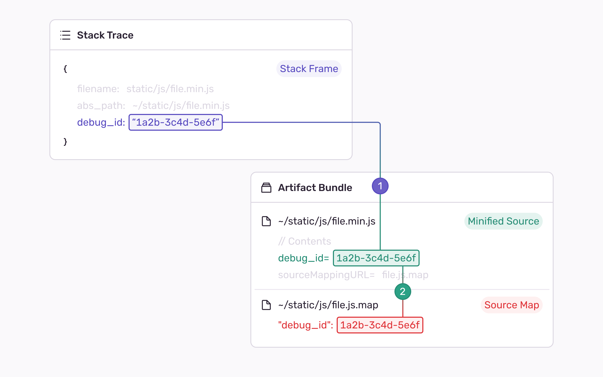

This article explains the difference between Artifact and Release bundles, and the implications of using them. Visit [Uploading Source Maps](/platforms/javascript/guides/react/sourcemaps/uploading/) if you're looking for our guides on how to upload source maps.

## Introduction

Sentry currently supports two methods of uploading sourcemaps: **Release bundles** and **Artifact bundles**. A bundle contains all the minified sources and source maps (known as _artifacts_) required for Sentry to unminify the frames of a stack trace.

## Release Bundles

A release bundle is a bundle format that's connected to an existing `release` in Sentry. That's why you **have to create a `release`** before uploading your artifacts.

| Pros                                    | Cons                                                                                                     |
| :-------------------------------------- | :------------------------------------------------------------------------------------------------------- |
| Currently works with every SDK version. | Configuring your build pipeline to upload artifacts can be very challenging.                             |
|                                         | Requires your project to use Sentry Releases.                                                            |
|                                         | **The current versions of our bundler plugins or `sentry-cli` tool don't use this option as a default.** |

### How Do They Work?

Release bundles get their name from using a `release` as a way to index a specific bundle. The `release` is extracted from an incoming error and used to look up the most recent bundle. When a bundle is found, we use the value of `abs_path` in each frame to find the corresponding minified source in the retrieved bundle. Once the minified source is found, we try to discover its source map with a series of heuristics, such as looking at the value of `sourceMappingURL`.

Based on user feedback, we've found that using a stack frames `abs_path` to find its relevant artifacts to be **very unreliable**. Dynamic paths (For example: `https://www.site.com/{some_value}/scripts/script.js`) will likely require addition SDK configuration to unminify stack frames.

## Artifact Bundles

An artifact bundle is our new format that addresses the shortcomings of release bundles by **adding support for Debug IDs** and **removing the need to create a `release`**.

| Pros                                                                                    | Cons                                                                                                |
| :-------------------------------------------------------------------------------------- | :-------------------------------------------------------------------------------------------------- |
| With Debug IDs, configuring your build pipeline to upload artifacts is straightforward. | **Requires you to update the version of our Javascript SDK and bundler plugin ( or `sentry-cli`).** |
| Associating a release is still possible, but not required.                              |                                                                                                     |

### How Do They Work?

Artifact Bundles solve the challenge of matching paths by using a new identification mechanism known as Debug IDs. Rather than relying on paths we uniquely identify and bind pairs of minified sources and source maps with an Debug ID (UUID). With this, we are able to quickly identify the minified source and corresponding source map without ever needing to check any paths.

<Note>

If you want to learn more about the rationale behind Debug IDs, we suggest taking a look at our [engineering blog](https://sentry.engineering/blog/the-case-for-debug-ids).

</Note>

### Associating a Release with Artifact Bundles

Since you might still want to know which `release` a specific artifact bundle is connected to, we came up with a new way to still connect your bundle to a `release`.

Artifact Bundles support a new kind of association to a `release` (and `dist`), known as a "weak association". In practice, this **doesn't require the creation of a `release`** before uploading source maps, allowing the creation of a `release` as a separate step down the pipeline.

With an associated `release` and optionally `dist` you will be able to quickly go to the Artifact Bundle from your `release` in Sentry, without having to worry about which artifact bundle was used for your errors.

## Summary

If you've had trouble uploading source maps in the past, we recommend you try artifact bundles with Debug IDs, but if your application already uses them successfully, we recommend you continue to use release bundles .
