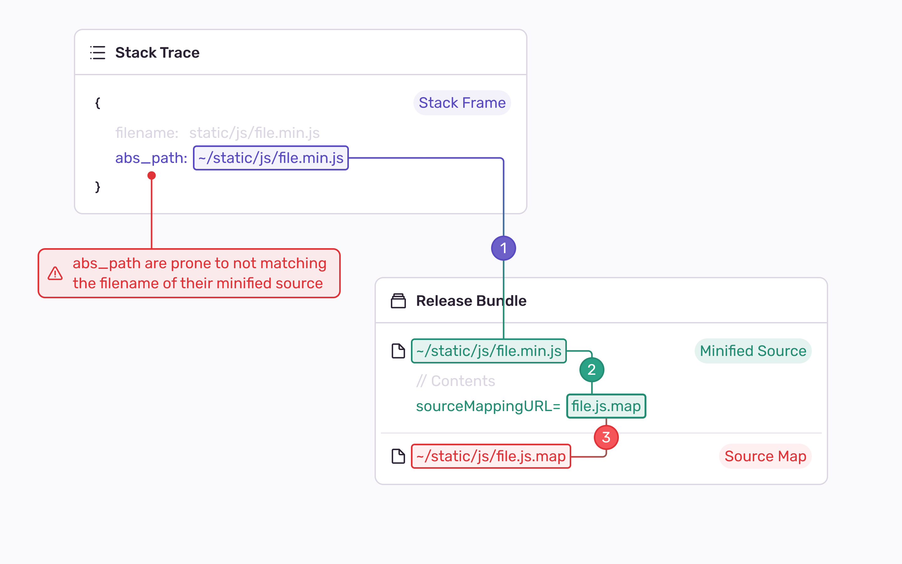

Sentry currently supports two methods of uploading sourcemaps: **release bundles** and **artifact bundles**. A bundle, at a higher level, includes all the build artifacts for your application and is necessary for Sentry to symbolicate incoming errors accurately.

This article will provide an explanation of how release and artifact bundles work, their distinctions, and the advantages of using one over the other.

<Note>

The knowledge contained in this article is **not** required for setting up sourcemaps. If you want to learn more on how to do it, go to [Uploading Source Maps](/platforms/javascript/guides/react/sourcemaps/uploading/).

</Note>

## The Bundle Upload

Irrespectively of which bundle format you decide to use, `sentry-cli` will be responsible of taking your artifacts, packing them and uploading them to Sentry.

Whenever the `upload` command is called, `sentry-cli` will create a special `.zip` file that contains metadata used by Sentry to index the bundle.

<Note>

`sentry-cli` is always used either directly or via a bundler plugin (e.g., Webpack, Rollup).

</Note>

## What are Release Bundles

A release bundle is a bundle format that must be connected to an existing release in Sentry. For this reason **the creation of a `release` is required** before uploading your artifacts.

| Pros                        | Cons                                       |
|-----------------------------|--------------------------------------------|
| Work with almost every SDK  | Hard to properly setup                     |
|                             | Require you to create a release in Sentry  |

### Processing an Error with Release Bundles

If you are using release bundles and a JavaScript error is ingested by Sentry the following steps are performed during processing:
1. The `release` and optionally `dist` are extracted from the error.
2. The **release bundle** connected to `release` and `dist` is loaded into memory (in case multiple bundles found, an arbitrary bundle will be chosen).
3. For each stack frame in the error, the corresponding `minified source` and `source map` are discovered in the **release bundle**.
4. When both the `minified source` and `source map` are discovered, they will be used for deriving the context lines of each stack frame.

## What are Artifact Bundles

An artifact bundle is a new bundle format that aims to address the shortcomings of release bundles by **adding the support for Debug IDs** and **removing the need to create a `release`**.

| Pros                                                 | Cons                                     |
|------------------------------------------------------|------------------------------------------|
| Support Debug IDs making the setup trivial          | Require SDKs and bundlers upgrade       |
| Support an optional weak association with a release | May cause problems with integrity checks |
|                                                      | Might have some maturity problems        |

### Introducing Debug IDs

The idea of Debug IDs emerged after the need of having a more reliable way to associate a `minified source` and its corresponding `source map`. The existing way of using a `//# sourceMappingURL=../some/url` at the end of the `source map`, coupled with the necessity of having the same base path in the uploaded and served bundle, created lots of complexities for users.

Debug IDs aim at solving this problem. They are unique identifiers generated by the `sentry-cli` or the bundler that bind together minified sources and their respective source maps. Each pair of `(minified source, source map)` contain the same Debug ID, which is injected into specific parts of each file. Debug IDs make the lookup process of sources much easier and less prone to errors, which translates into a better user experience.

<Note>

If you want to learn more about the rationale behind Debug IDs, we suggest taking a look at our [engineering blog](https://sentry.engineering/blog/the-case-for-debug-ids).

</Note>

### Weak Release Association

Since you might still want to know to which release a specific artifact bundle is connected to, we designed a new way to associate a release to your bundle.

The new artifact bundle format supports a new kind of association to a `release` and optionally `dist`, known as weak release association. This type of association **will not require the creation of a `release`** before uploading sourcemaps and will consequentely allow the creation of a `release` as a separate step down the pipeline.

With an associated `release` and optionally `dist` you will be able to quickly go to the artifact bundle from your release in Sentry, without having to worry about which artifact bundle was used for your errors.

<Note>

The lookup logic in case of weak release association, will be URL-based as with release bundles, thus the same problems related to mismatched URLs might arise.

</Note>

### Rationale Behind Artifact Bundles

The main rationale behind the creation of artifact bundles was the need to remove the strong association with a `release`. This association created problems for users who wanted to upload artifacts as part of their CI pipeline since it would create a release even if the bundle wasn't going to be deployed in that step.

Another issue we encountered was the imprecision of employing a URL-based lookup that was used to discover both the `minified source` and the `source map`. This led to a complicated implementation that used a best-effort algorithm to increase the likelihood of finding the correct URL. However, this added complexity and confusion for the user because the configuration of the bundle path needed to match precisely (e.g., `/static/chunks/somefile` instead of `/chunks/somefile` configured in the uploaded bundle).

### Processing an Error with Artifact Bundles

If you are using artifact bundles and a JavaScript error is ingested by Sentry the following steps are performed during processing:
1. The `debug ids`, `release` and optionally `dist` are extracted from the error.
2. The **artifact bundle** contaning the `debug ids` in the stack frames is loaded (in case multiple bundles found, the latest bundle will be chosen).
3. If the lookup via `debug ids` failed or there are no `debug ids` into the stack frames, the release bundle connected to `release` is loaded into memory (in case multiple bundles are found, the latest bundle will be chosen).
4. For each stack frame in the error, the corresponding `minified source` and `source map` are discovered in the **artifact bundle**.
5. When both the `minified source` and `source map` are discovered, they will be used for deriving the context lines of each stack frame.
