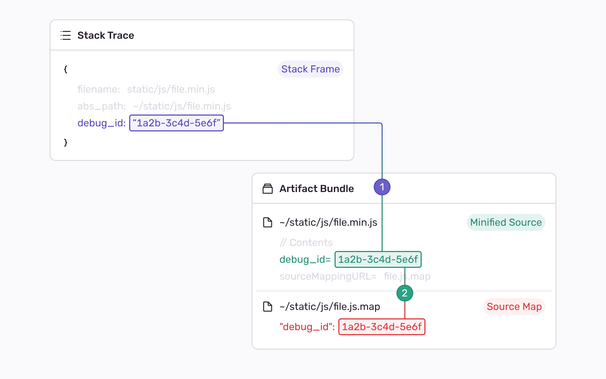

This article explains the inner workings of Artifact Bundles, and the implications of using them. Visit [Uploading Source Maps](/platforms/javascript/guides/react/sourcemaps/uploading/) if you're looking for our guides on how to upload source maps.

## Introduction

Sentry uses **Artifact Bundles** for managing un-minification of your stacktraces. A bundle, at a higher level, contains all the minified sources and source maps (known as _artifacts_) required for Sentry to unminify the frames of a stack trace.

## Artifact Bundles

An artifact bundle is our new bundle format that aims to address the shortcomings of the old Release Bundles by **adding the support for Debug IDs** and **removing the need to create a `release`**.

Artifact Bundles solve the challenge of matching paths by using a new identification mechanism known as Debug IDs. Rather than relying on paths we uniquely identify and bind pairs of minified sources and source maps with a Debug ID (UUID). With this, we are able to quickly identify the minified source and corresponding source map without ever needing to check any paths. Thus, you don't have to worry about wrong paths configurations.

<Note>

If you want to learn more about the rationale behind Debug IDs, we suggest taking a look at our [engineering blog](https://sentry.engineering/blog/the-case-for-debug-ids).

</Note>

### Associating a Release with Artifact Bundles

Since you might still want to know to which release a specific artifact bundle is connected to, we designed a new way to still associate a `release` to your bundle.

The new Artifact Bundle format supports a new kind of association to a `release` and optionally `dist`, known as weak release association. This type of association **will not require the creation of a `release`** before uploading sourcemaps and will consequently allow the creation of a `release` as a separate step down the pipeline.

With an associated `release` and optionally `dist` you will be able to quickly go to the Artifact Bundle from your `release` in Sentry, without having to worry about which artifact bundle was used for your errors.

## Retention Policy

Artifact Bundles have a retention period of _90 days_, using a _time to idle_ expiration mechanism.
This means that uploaded artifact bundles are retained for as long as they are actively being used for event processing.
Once an artifact bundle has not been used to process incoming events for at least 90 days,
it will automatically expire and be eligible for deletion.
