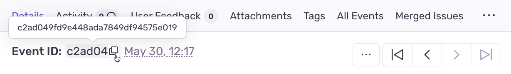

Setting up source maps can be tricky, but it's worth it to get it right. To troubleshoot your source maps set up, you can either:

1. Use our automated verification tool inside `sentry-cli`, or
2. Follow the manual steps listed below

## Use the Sentry CLI

To use the automated verification process, install and configure the Sentry [Command Line Interface](/product/cli/). Then, use the `sourcemaps explain` command, calling it with the relevant event ID, found in the top-left corner of the **Issue Details** page in [sentry.io](https://sentry.io).

For example, "Event ID: c2ad049f":



```shell
sentry-cli sourcemaps explain c2ad049fd9e448ada7849df94575e019
```

The CLI output should give you useful information about what went wrong with your source maps setup.

<PlatformSection notSupported={["javascript.electron"]}>

## Verify a release is configured in your SDK

For uploaded source maps to be located and applied, the release needs to be created by the CLI or API (and the correct artifacts uploaded with it), and the name of that newly-created release needs to be specified in your SDK configuration.

To verify this, open up the issue from the Sentry UI and check if the release is configured. If it says "_not configured_" or "_N/A_" next to **Release** on the right hand side of the screen (or if you do not see a `release` tag in the list of tags), you'll need to go back and [tag your errors](../../configuration/releases/). If this is properly set up you'll see "Release: my_example_release".

</PlatformSection>

## Verify artifacts are uploaded

Once your release is properly configured and issues are tagged, you can find the artifacts uploaded to Sentry by navigating to **[Settings] > Projects > Select your project > Source Maps**.

Additionally, make sure all of the necessary files are available. For Sentry to de-minify your stack traces you must provide both the minified files (for example, app.min.js) and the corresponding source maps. In case the source map files do not contain your original source code (`sourcesContent`), you must additionally provide the original source files. Alternatively, sentry-cli will automatically embed the sources (if missing) into your source maps.

## Verify `sourceMappingURL` is present

Some CDNs automatically strip comments from static files, including JavaScript files. This can have the effect of stripping your JavaScript file of its `sourceMappingURL` directive, because it is considered a comment. For example, CloudFlare has a feature called [Auto-Minify](https://blog.cloudflare.com/an-all-new-and-improved-autominify/) which will strip `sourceMappingURL` if it is enabled.

Double-check that your deployed, final JavaScript files have `sourceMappingURL` present.

Alternately, instead of `sourceMappingURL`, you can set a `SourceMap` HTTP header on your minified file. If this header is present, Sentry will use it to discover the location of your source map.

<PlatformSection notSupported={["javascript.electron"]}>

## Verify artifact distribution value matches value configured in your SDK

Whenever you are using a distribution identifier (the `dist` configuration option in the SDK), the same value has to be used during source map upload. Conversely, if your source maps are getting uploaded with a `dist` value, the same value must be set in your SDK.
To add a `dist` value to your uploaded source maps, use the `--dist` flag with `sentry-cli` or the `dist` option in our [Sentry Bundler Plugins](https://github.com/getsentry/sentry-javascript-bundler-plugins) (like for example `@sentry/webpack-plugin`). To set the `dist` value in the SDK, use the `dist` option in your `Sentry.init()`.

To verify that the distribution has been set correctly in the SDK, open an issue in the Sentry UI and check that the `dist` tag is present. For artifacts, go to the `Source Maps` page in project settings, choose the release shown on the event you just checked, and verify that the `dist` value (in the small oval next to the upload time) matches that on the event.

</PlatformSection>

## Verify artifact names match stack trace frames

If you've uploaded source maps and they aren't applying to your code in an issue in Sentry, take a look at the JSON of the event and look for the `abs_path` to see exactly where we're attempting to resolve the file - for example, `http://localhost:8000/scripts/script.js` (`abs_path` will appear once for each frame in the stack trace - match this up with the file(s) that are not deminified.). A link to the JSON view can be found at the top of the issue page next to the date the event occurred. The uploaded artifact names must match these values.

If you have **dynamic values in your path** (for example, `https://www.site.com/{some_value}/scripts/script.js`), you may want to use the <PlatformSection notSupported={["node"]}><PlatformLink to="/configuration/integrations/plugin/#rewriteframes">`rewriteFrames` integration</PlatformLink></PlatformSection><PlatformSection supported={["node"]}><PlatformLink to="/configuration/integrations/pluggable-integrations/#rewriteframes">`rewriteFrames` integration</PlatformLink></PlatformSection> to change your `abs_path` values.

### Using sentry-cli

If your `sourceMappingURL` comment is similar to:

```javascript
// -- end script.min.js (located at http://localhost:8000/scripts/script.min.js)
// sourceMappingURL=script.min.js.map
```

An example `sentry-cli` command to upload these files correctly would look like this (assuming you're in the `/scripts` directory, running your web server from one directory higher, which is why we're using the `--url-prefix` option):

```shell
sentry-cli releases files VERSION upload-sourcemaps . --url-prefix '~/scripts'
```

This command uploads all JavaScript files in the current directory. The Artifacts page in Sentry should now look like:

```
~/scripts/script.js
~/scripts/script.min.js
~/scripts/script.min.js.map
```

Alternately you can specify which files to upload. For example:

```
sentry-cli releases files VERSION upload-sourcemaps script.min.js script.min.js.map --url-prefix '~/scripts'
```

You can also upload it with the fully qualified URL. For example:

```
sentry-cli releases files VERSION upload-sourcemaps . --url-prefix 'http://localhost:8000/scripts'
```

### Using the API

You can alternately [use our API](/api/releases/update-an-organization-release-file/) to upload artifacts, following the same naming convention explained here.

```shell
curl -X POST \
  https://sentry.io/api/0/organizations/ORG_SLUG/releases/VERSION/files/ \
  -H 'Authorization: Bearer AUTH_TOKEN' \
  -H 'content-type: multipart/form-data' \
  -F file=@script.min.js.map \
  -F 'name=~/scripts/script.min.js.map'
```

### Using the `~`

The `~` is used in Sentry to replace the scheme and domain. It is not a glob!

`http://example.com/dist/js/script.js` will match `~/dist/js/script.js` or `http://example.com/dist/js/script.js`

but will NOT match `~/script.js`.

## Multiple Origins

It's not uncommon for a web application to be accessible at multiple origins. For example:

- Website is operable over both `https` and `http`
- Geolocated web addresses: such as `https://us.example.com`, `https://eu.example.com`
- Multiple static CDNs: such as `https://static1.example.com`, `https://static2.example.com`
- Customer-specific domains/subdomains

In this situation, **identical** JavaScript and source map files may be located at two or more distinct origins. In this situation we recommend using our special tilde (`~`) prefix on paths.

So for example, if you have the following:

- https://static1.example.com/js/app.js
- https://static2.example.com/js/app.js

You can upload using the URL of `~/js/app.js`. This will tell Sentry to ignore the domain and use the artifact for any origin.

Additionally you can also upload the same file under multiple names. Under the hood Sentry will deduplicate these.

<Note>

The ~ prefix tells Sentry that for a given URL, **any** combination of protocol and hostname whose path is `/js/app.js` should use this artifact. Use this method **only** if your source/source map files are identical at all possible protocol/hostname combinations. **Sentry will prioritize full URLs over tilde prefixed paths**, if found.

</Note>

## Verify artifact names match `sourceMappingURL` value

The `sourceMappingURL` comment on the last line of your bundled or minified JavaScript file tells Sentry (or the browser) where to locate the corresponding source map. This can either be a fully qualified URL, a relative path, or the filename itself. When uploading artifacts to Sentry, you must name your source map files with the value the file resolves to.

That is, if your file is similar to:

```javascript
// -- end script.min.js
// sourceMappingURL=script.min.js.map
```

and is hosted at http://example.com/js/script.min.js, then Sentry will look for that source map file at http://example.com/js/script.min.js.map. Your uploaded artifact must therefore be named `http://example.com/js/script.min.js.map` (or `~/js/script.min.js.map`).

Or, if your file is similar to:

```javascript
//-- end script.min.js
// sourceMappingURL=https://example.com/dist/js/script.min.js.map
```

then your uploaded artifact should also be named `https://example.com/dist/js/script.min.js.map` (or `~/dist/js/script.min.js.map`).

Finally, if your file is similar to:

```javascript
//-- end script.min.js
// sourceMappingURL=../maps/script.min.js.map
```

then your uploaded artifact should be named `https://example.com/dist/maps/script.min.js.map` (or `~/dist/maps/script.min.js.map`).

###Verify Artifacts Are Uploaded Before Errors Occur

Sentry expects that source code and source maps in a given release are uploaded to Sentry **before** errors occur in that release.

If you upload artifacts **after** an error is captured by Sentry, Sentry will not go back and retroactively apply any source annotations to those errors. Only new errors triggered after the artifact was uploaded will be affected.

## Verify your source maps are built correctly

We maintain an online validation tool that can be used to test your source maps against your **hosted** source: [sourcemaps.io](https://sourcemaps.io).

Alternatively, if you are using Sentry CLI to upload source maps to Sentry, you can use the `--validate` command line option to verify your source maps are correct.

## Verify your source maps work locally

If you find that Sentry is not mapping filename, line, or column mappings correctly, you should verify that your source maps are functioning locally. To do so, you can use Node.js coupled with Mozilla's [source-map library](https://github.com/mozilla/source-map).

First, install `source-map` globally as an npm module:

```bash
npm install -g source-map
```

Then, write a Node.js script that reads your source map file and tests a mapping. Here's an example:

```javascript
var fs = require("fs"),
  path = require("path"),
  sourceMap = require("source-map");
// Path to file that is generated by your build tool (webpack, tsc, ...)
var GENERATED_FILE = path.join(".", "app.min.js.map");
// Line and column located in your generated file (for example, the source
// of the error from your minified file)
var GENERATED_LINE_AND_COLUMN = { line: 1, column: 1000 };
var rawSourceMap = fs.readFileSync(GENERATED_FILE).toString();
new sourceMap.SourceMapConsumer(rawSourceMap).then(function (smc) {
  var pos = smc.originalPositionFor(GENERATED_LINE_AND_COLUMN);
  // You should see something like:
  // { source: 'original.js', line: 57, column: 9, name: 'myfunc' }
  console.log(pos);
});
```

If you have the same (incorrect) results locally as you do via Sentry, double-check your source map generation configuration.

## Verify your source files are not too large

For an individual artifact, Sentry accepts a max filesize of **40 MB**.

Often users hit this limit because they are transmitting source files at an interim build stage. For example, after your bundler has combined all your source files, but before minification has taken place. If possible, send the original source files.

## Verify artifacts are not gzipped

The Sentry API currently only works with source maps and source files that are uploaded as plain text (UTF-8 encoded). If the files are uploaded in a compressed format (for example, gzip), they will be not be interpreted correctly.

If you are using `sentry-cli` to upload your artifacts, starting with version `2.4.0` you can add the `--decompress` flag to your `sourcemaps upload` or `files upload` commands.

Sometimes build scripts and plugins produce pre-compressed minified files (for example, Webpack's [compression plugin](https://github.com/webpack/compression-webpack-plugin)). In these cases, you'll need to disable such plugins and perform the compression **after** the generated source maps/source files have been uploaded to Sentry.

## Verify workers are sharing the same volume as web (if running self-hosted Sentry via Docker)

Sentry does source map calculation in its workers. This means the workers need access to the files uploaded through the front end. Double check that the cron workers and web workers can read/write files from the same disk.

## Verify you are not using the `source-map-support` package

The Sentry Node.js SDK generally works well with the [source-map-support](https://www.npmjs.com/package/source-map-support) package if you don't already have source maps uploaded to Sentry.

If you are uploading source maps to Sentry or if you are using a Sentry SDK in the browser, your code cannot use the `source-map-support` package.
`source-map-support` overwrites the captured stack trace in a way that prevents our source map processors from correctly parsing it.
