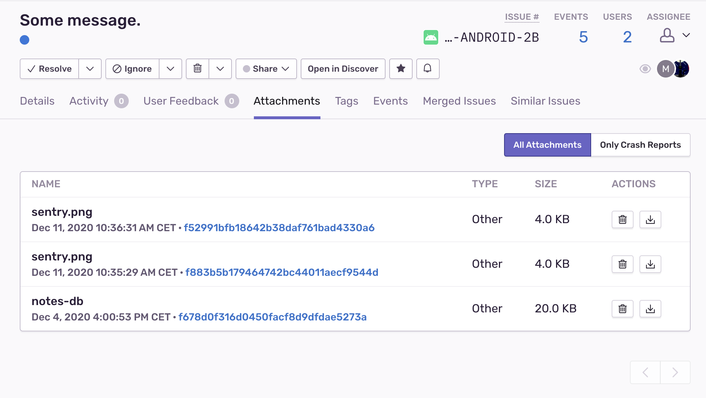

__Attention: This is a preview API, available since 4.0.0-alpha.2. This API is not in stable state yet. It may be renamed, changed or even removed in a future version.__

Attachments provide the ability to to store additional files to an event. Be aware that attachments don't work yet with crashes.


## Uploading Attachments

You can either pass bytes or use a pathname to a file to create an attachment.

```java
import io.sentry.Sentry;
import io.sentry.Attachment;

Attachment bytesAttachment = new Attachment(bytes, "file.log");
Attachment fileAttachment = new Attachment("your/path/file.log"):
```

The attachments live on the <PlatformLink to="/enriching-events/scopes/">Scope</PlatformLink>. You can either add an attachment on the global scope to be sent with every event or add it on the <PlatformLink to="/enriching-events/scopes/#local-scopes">local Scope</PlatformLink> to just send the attachment with one specific event.


```java
import io.sentry.Sentry;
import io.sentry.Attachment;

Attachment fileAttachment = new Attachment("your/path/file.log"):

// Global Scope
Sentry.configureScope(
    scope -> {
      scope.addAttachment(fileAttachment);
    });

// Local Scope
Sentry.withScope(
      scope -> {
          scope.addAttachment(fileAttachment);

          Sentry.captureMessage("my message");
      });
```


## Viewing Attachments

Attachments appear in the _Attachments_ tab on the **Issue Details** page, where you can view the _Type_ of attachment, as well as associated events. Click the Event ID to open the **Issue Details** of that specific event.


