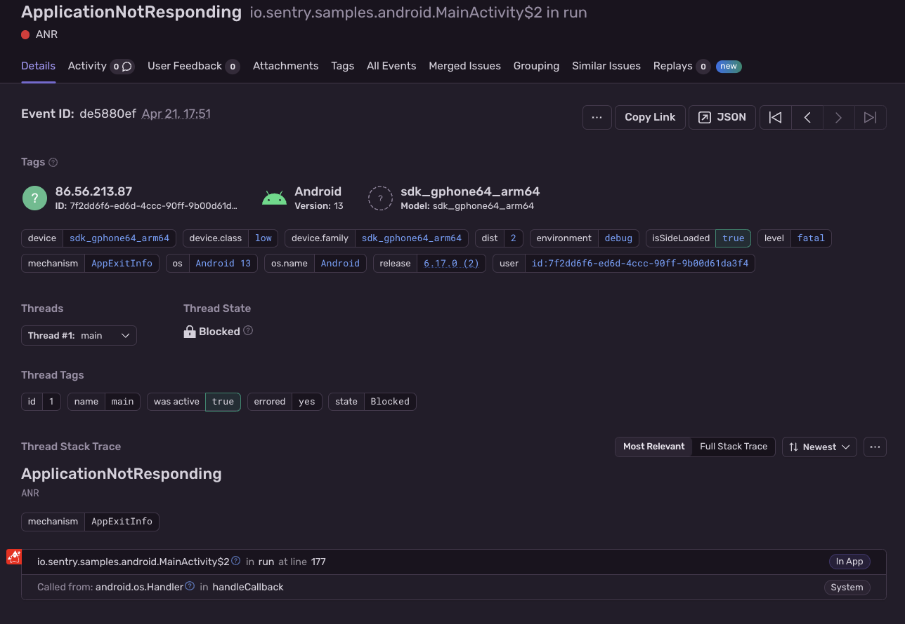
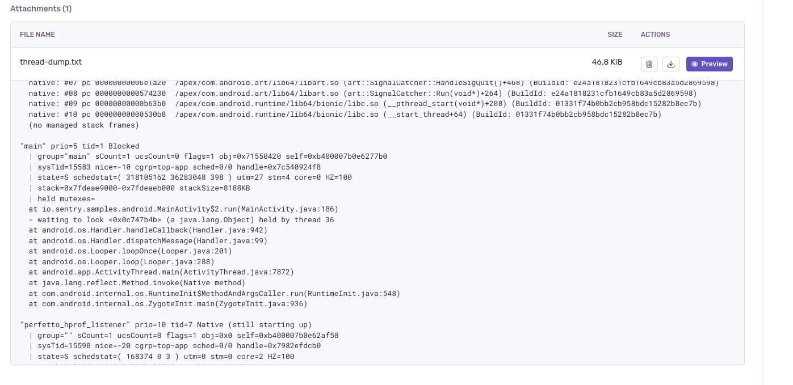
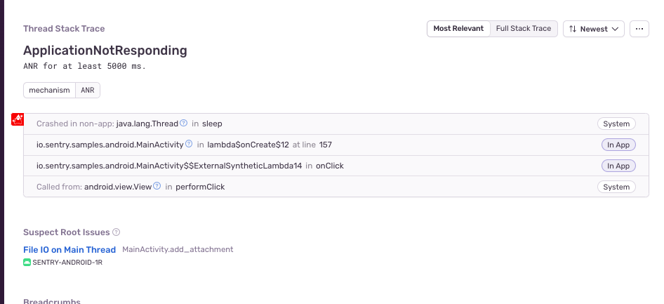
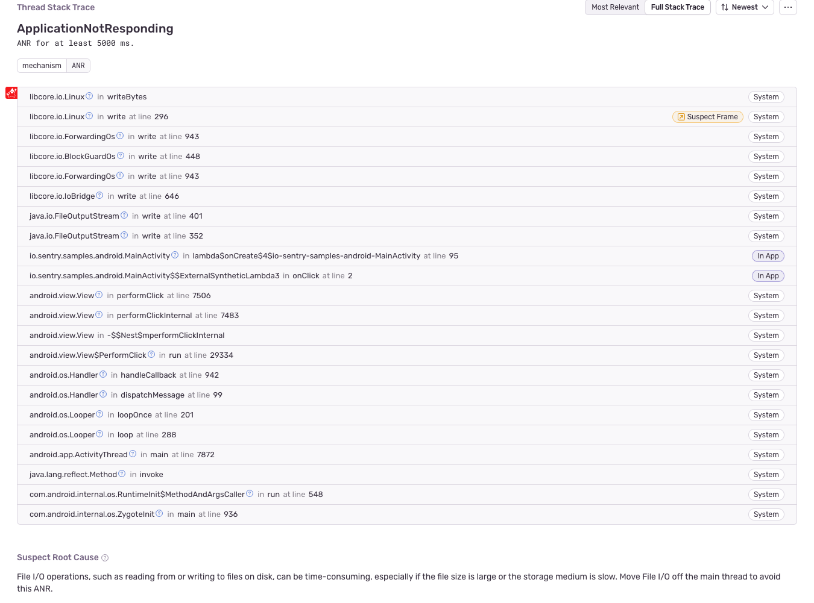
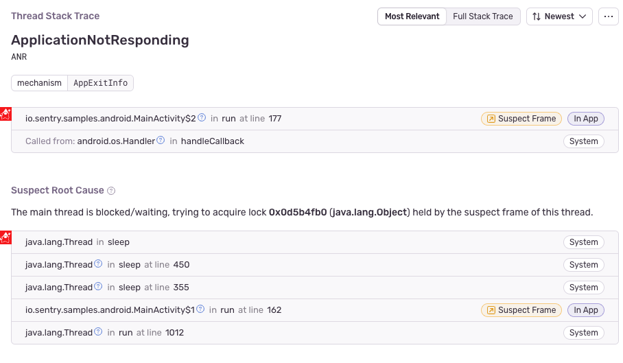

Application Not Responding (ANR) errors are triggered when the main UI thread of an application is blocked for more than five seconds. The Android SDK reports ANR errors as Sentry events. In addition, Sentry calculates [ANR rate](/platforms/android/performance/instrumentation/performance-metrics/#application-not-responding-anr-rate) based on these events and user sessions.

## ANR implementation details

The Android SDK uses different implementations to detect ANRs, depending on what version of Android the device is running:

- Below Android 11: Running a Watchdog thread (v1)
- Android 11 and above: Reading [ApplicationExitInfo](https://developer.android.com/reference/android/app/ApplicationExitInfo) (v2)

The new implementation (v2) uses the same data source as Google Play Console. This means the reported ANR events and [ANR rate](/platforms/android/performance/instrumentation/performance-metrics/#application-not-responding-anr-rate) should match with what you see on Sentry. The new implementation also captures a thread dump with additional information, like held locks, to help you resolve ANRs more efficiently.

While the original Watchdog approach (v1) reports many false positives and is based on heuristics, it still has some advantages over v2, like capturing screenshots and transactions with profiles at the time of ANR.

<Note>

We're considering SDK support for both approaches working alongside each other on Android 11 and up. Please upvote [this GitHub discussion](https://github.com/getsentry/sentry-java/discussions/2716) and share your feedback if you have a case for v1 and v2 working together.

</Note>

Both ANR detection implementations are controlled by the same flag:

```xml {filename:AndroidManifest.xml}
<application>
    <meta-data android:name="io.sentry.anr.enable" android:value="false" />
</application>
```

### Watchdog (v1)

Whenever the main UI thread of the application is blocked for more than five seconds, the SDK will report the problem to the server.

The integration reports ANR events with `mechanism:ANR`.

<Note>

Sentry does not report the ANR if the application is in debug mode.

</Note>

You can also specify how long the thread should be blocked before the ANR is reported. Provide the duration in the attribute `io.sentry.anr.timeout-interval-millis` in your `AndroidManifest.xml`:

```xml {filename:AndroidManifest.xml}
<application>
    <meta-data android:name="io.sentry.anr.timeout-interval-millis" android:value="2000" />
</application>
```

### ApplicationExitInfo (v2)

This approach reads the [ApplicationExitInfo](https://developer.android.com/reference/android/app/ApplicationExitInfo) API on the next app launch
and asynchronously sends ANR events to Sentry for each ANR in the history, enriching only the latest one with breadcrumbs, contexts, tags, etc.

The integration reports ANR events with `mechanism:AppExitInfo`.

<Note>

If [ApplicationExitInfo#getTraceInputStream](<https://developer.android.com/reference/android/app/ApplicationExitInfo#getTraceInputStream()>) returns `null`, the SDK will no longer report an ANR event, since these events won't be actionable without it.

</Note>



#### Historical ANRs

By default, the SDK only reports and enriches the latest ANR and it's the only one counted towards the ANR rate. However, there's also a `setReportHistoricalAnrs` option available in `SentryOptions`, which enables the SDK to report all ANRs from the [getHistoricalExitReasons](<https://developer.android.com/reference/android/app/ActivityManager?hl=en#getHistoricalProcessExitReasons(java.lang.String,%20int,%20int)>) list:

```kotlin
SentryAndroid.init(context) { options ->
  options.isReportHistoricalAnrs = true
}
```

```java
SentryAndroid.init(context) { options ->
  options.setReportHistoricalAnrs(true)
}
```

This option is useful after updating the SDK to the version where the new ANR implementation was introduced, in order to report all ANRs that took place prior to the SDK update. Other than that, the SDK will always pick up the latest ANR from the historical exit reasons list on next app restart, and there won't be any historical ANRs to report.

The integration reports ANR events with `mechanism:HistoricalAppExitInfo`.

#### Attaching Thread Dump

The SDK makes it possible to send the ANR thread dump from [ApplicationExitInfo#getTraceInputStream](<https://developer.android.com/reference/android/app/ApplicationExitInfo#getTraceInputStream()>) as an attachment. This is useful for performing deeper investigations using all available information from the OS (in addition to the SDK parsing the thread dump into threads with stack traces):

```kotlin
SentryAndroid.init(context) { options ->
  options.isAttachAnrThreadDump = true
}
```

```java
SentryAndroid.init(context) { options ->
  options.setAttachAnrThreadDump(true)
}
```



## ANR Root Cause Analysis

Sentry performs various root cause analyses to give you insights about why certain ANRs might appear. If a potential root cause is detected, it'll be displayed in a new section below the ANR stack trace. Sentry can detect the following root causes:

### Performance Issues

If an ANR is connected to one of the Performance Issues detected by Sentry (for example, [File I/O on Main Thread](/product/issues/issue-details/performance-issues/file-main-thread-io/) or [DB on Main Thread](/product/issues/issue-details/performance-issues/db-main-thread-io/)), the offending span will be linked to the ANR event, showing you exactly which slow operation is to blame.



### Common Patterns

This detector looks at the stack trace of an ANR and tries to identify common pitfalls, such as accessing files, assets, or heavy resources on the main thread. If an offending stack frame is found, it'll be highlighted in the stack trace with some information about how to prevent this type of ANR:



### Deadlock Detection

Sentry will try to detect deadlocks and point out potential causes. If, for example, the main thread is blocked by waiting on a lock object that's held by another thread, the suspect frame that's waiting on the lock will be highlighted. The stack trace of the offending thread that's holding the lock, as well as the offending frame of that thread will also be shown:


