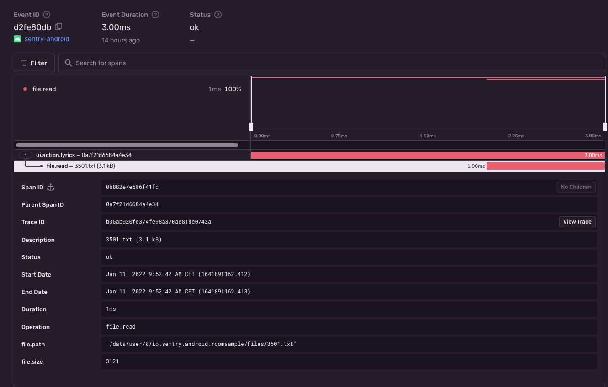

<Note>

Supported in Sentry's Android SDK version `5.5.0` and above.

Supported in Sentry Android Gradle Plugin version `3.0.0` and above.

</Note>

The [Sentry Android Gradle Plugin](/platforms/android/gradle/) provides file I/O support through bytecode manipulation. The source can be found [on GitHub](https://github.com/getsentry/sentry-android-gradle-plugin/tree/main/plugin-build/src/main/kotlin/io/sentry/android/gradle/instrumentation).

On this page, we get you up and running with Sentry's file I/O integration, so that it will automatically start a span from an active transaction that's bound to the scope of each file input/output stream operation.

## Install

To use the file I/O integration, add the Sentry Android Gradle plugin and the Sentry Android SDK (version `5.5.0` or above) in `build.gradle`:

```groovy
buildscript {
  repositories {
    mavenCentral()
  }
}

plugins {
  id "io.sentry.android.gradle" version "{{@inject packages.version('sentry.java.android.gradle-plugin', '3.0.0') }}"
}

dependencies {
  implementation 'io.sentry:sentry-android:{{@inject packages.version('sentry.java.android', '5.0.0') }}'
}
```

```kotlin
buildscript {
  repositories {
    mavenCentral()
  }
}

plugins {
  id("io.sentry.android.gradle") version "{{@inject packages.version('sentry.java.android.gradle-plugin', '3.0.0') }}"
}

dependencies {
  implementation("io.sentry:sentry-android:{{@inject packages.version('sentry.java.android', '5.0.0') }}")
}
```

<Note>

Make sure, that [performance monitoring](/platforms/android/performance/#configure-the-sample-rate) is enabled.

</Note>

## Configure

In general, no further configuration is required as the auto-instrumentation is enabled by default. If you would like to disable the file I/O instrumentation feature, we expose a configuration option for that:

```groovy
import io.sentry.android.gradle.extensions.InstrumentationFeature

sentry {
  tracingInstrumentation {
    enabled = true
    features = EnumSet.allOf(InstrumentationFeature) - InstrumentationFeature.FILE_IO
  }
}
```

```kotlin
import java.util.EnumSet
import io.sentry.android.gradle.extensions.InstrumentationFeature

sentry {
  tracingInstrumentation {
    enabled.set(true)
    features.set(EnumSet.allOf(InstrumentationFeature::class.java) - InstrumentationFeature.FILE_IO)
  }
}
```

## Verify

Assuming you have the following (reduced) code snippet performing a file I/O operation:

```kotlin
import android.os.Bundle
import android.widget.Button
import android.widget.TextView
import androidx.activity.ComponentActivity
import io.sentry.Sentry
import io.sentry.SpanStatus
import java.io.File

class LyricsActivity : ComponentActivity() {

  override fun onCreate(savedInstanceState: Bundle?) {
    super.onCreate(savedInstanceState)
    findViewById<Button>(R.id.load_lyrics).setOnClickListener {
      val transaction = Sentry.startTransaction(
        name = "Track Interaction",
        operation = "ui.action.lyrics",
        bindToScope = true
      )

      val file = File(context.filesDir, "lyrics.txt")

      val lyricsTextView = findViewById<TextView>(R.id.lyrics)
      lyricsTextView.setText(file.readText())

      transaction.finish(SpanStatus.OK)
    }
  }
}
```

To view the recorded transaction, log into [sentry.io](https://sentry.io) and open your project. Clicking **Performance** will open a page with transactions, where you can select the just recorded transaction with the name `Track Interaction`. The event will look similar to this:



<Note>

At the moment, we only support `java.io.FileInputStream`, `java.io.FileOutputStream`, `java.io.FileReader` and `java.io.FileWriter` classes for auto-instrumentation.

</Note>

## (Optional) Custom Instrumentation

Alternatively, if you are not using our Gradle Plugin, the Android SDK provides the capability to manually instrument file I/O operations through the custom Sentry-specific implementations.

<PlatformContent includePath="performance/file-io-instrumentation" />
