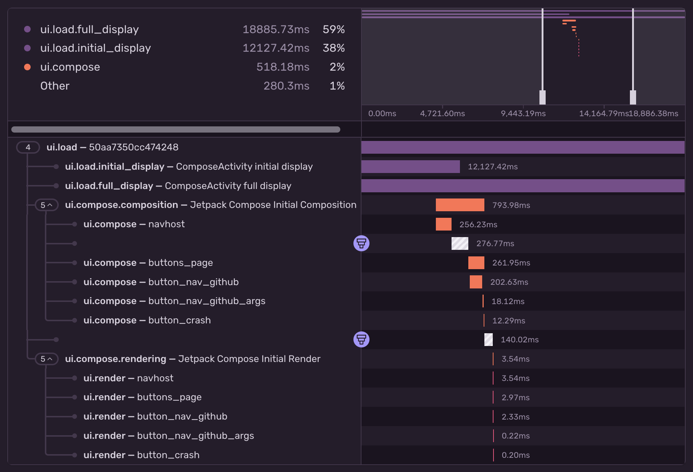
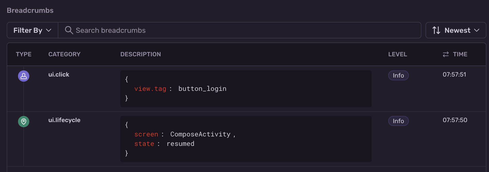
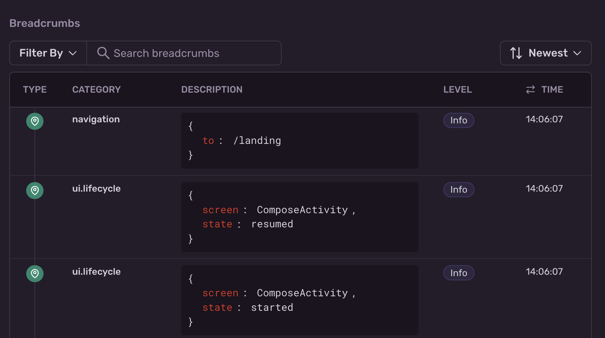

The `sentry-compose-android` library provides [Jetpack Compose](https://developer.android.com/jetpack/androidx/releases/compose) support in the following areas:

- `@Composable` performance metrics
- Transaction and breadcrumb support for user interactions (clicks, swipes and scroll gestures)
- Transaction and breadcrumb support for navigation events
- Support for <PlatformLink to="/enriching-events/viewhierarchy/">View Hierarchies</PlatformLink>

## Performance Metrics

_(New in version 6.16.0)_

With Jetpack Compose performance metrics the Sentry Android SDK can automatically measure the initial `composition` and `rendering` time as performance spans of your `@Composable` UI elements.



<Note>

This feature requires an underlying transaction to attach it's spans to. Transactions can be created manually or automatically by configuring

- <PlatformLink to="/performance/instrumentation/automatic-instrumentation/">
    Android's Activity instrumentation
  </PlatformLink>
- [Navigation Instrumentation](#jetpack-compose-navigation)
- [User Interactions](#user-interactions)

</Note>

Once performance metrics have been enabled, you'll see two spans inside your transactions:

- `ui.compose.composition`, describing the time it took to execute your `@Composable`
- `ui.compose.rendering`, describing the time it took to render your `@Composable` to the canvas

The `SentryTraced` function also provides an `enableUserInteractionTracing` argument, which automatically applies a `Modifier.testTag()` and enables the _User Interactions_ feature mentioned below.

### Installation

To add the Jetpack Compose integration, install the [Android SDK](/platforms/android/), then add the `sentry-compose-android` dependency using Gradle:

```groovy
implementation 'io.sentry:sentry-android:{{@inject packages.version('sentry.java.android', '6.2.0') }}'
implementation 'io.sentry:sentry-compose-android:{{@inject packages.version('sentry.java.compose', '6.2.0') }}'
```

Once installed, you need to wrap your `@Composable` body with the `SentryTraced` function.

```kotlin
import io.sentry.compose.SentryTraced

@Composable
fun LoginScreen() {
  SentryTraced("login_screen") {
    Column {
      // ...
      Button(
          onClick = { TODO() }) {
          Text(text = "Login")
      }
    }
  }
}
```

## User Interactions

_(New in version 6.10.0)_

The Sentry User Interactions feature for Jetpack Compose can detect click, scroll, and swipe gestures. For every gesture, the SDK can automatically collect breadcrumbs and launch transactions.



### Installation

To add the Jetpack Compose integration, install the [Android SDK](/platforms/android/), then add the `sentry-compose-android` dependency using Gradle:

```groovy
implementation 'io.sentry:sentry-android:{{@inject packages.version('sentry.java.android', '6.2.0') }}'
implementation 'io.sentry:sentry-compose-android:{{@inject packages.version('sentry.java.compose', '6.2.0') }}'
```

### Configuration

This feature is disabled by default, but you can enable it the following ways.

#### Using `AndroidManifest.xml`

```xml {filename:AndroidManifest.xml}
<application>
    <meta-data android:name="io.sentry.traces.user-interaction.enable" android:value="true" />
    <meta-data android:name="io.sentry.breadcrumbs.user-interaction" android:value="true" />
</application>
```

#### Using `SentryOptions`

If you initialize the SDK [manually as mentioned here](/platforms/android/configuration/manual-init/#manual-initialization), you can enable user interactions like this:

```kotlin {filename:MyApplication.kt}
SentryAndroid.init(this) { options ->
    // ...
    options.isEnableUserInteractionTracing = true
    options.isEnableUserInteractionBreadcrumbs = true
}
```

The Sentry SDK utilizes the built-in `Modifier.testTag("<tag>")` of a Composable to determine its identifier. Here's an example:

```kotlin
import androidx.compose.ui.platform.testTag

@Composable
fun LoginScreen() {
  Column {
    // ...
    Button(
        modifier = Modifier.testTag("button_login"),
        onClick = { TODO() }) {
        Text(text = "Login")
    }
  }
}
```

<Note>

If a `@Composable` doesn't have a `testTag` modifier applied, both breadcrumbs and transactions won't be captured because they can't be uniquely identified. To automatically generate tags, refer to the docs about our <PlatformLink to="/enhance-errors/kotlin-compiler-plugin/">Sentry Kotlin Compiler Plugin</PlatformLink>.

</Note>

<Note>

If you want to customize the recorded breadcrumbs/transactions, you can skip to [the section below](#customize-the-recorded-breadcrumbtransaction).

</Note>

## Jetpack Compose Navigation

In this section, we get you up and running with Sentry's Compose Navigation Integration, so that it will automatically add a breadcrumb and start a transaction for each navigation event.



### Auto-Installation With the Sentry Android Gradle Plugin

#### Install

If you're using the [Sentry Android Gradle Plugin](/platforms/android/configuration/gradle/), the Jetpack Compose Navigation Integration is automatically applied, and both breadcrumbs and transactions are automatically created for every navigation event.

Add the Sentry Android Gradle plugin in `build.gradle`:

```groovy
buildscript {
  repositories {
    mavenCentral()
  }
}

plugins {
  id "io.sentry.android.gradle" version "{{@inject packages.version('sentry.java.android.gradle-plugin', '3.0.0') }}"
}
```

```kotlin
buildscript {
  repositories {
    mavenCentral()
  }
}

plugins {
  id("io.sentry.android.gradle") version "{{@inject packages.version('sentry.java.android.gradle-plugin', '3.0.0') }}"
}
```

<Note>

Learn more about the Sentry Android Gradle plugin in our [Gradle](/platforms/android/configuration/gradle/) documentation. Details about auto-installation can be found in the [Auto Instrumentation](/platforms/android/configuration/gradle/#tracing-auto-instrumentation) section.

</Note>

#### Disable

If you want to disable the Jetpack Compose instrumentation feature, you can adapt your `build.gradle(.kts)` file like so:

```groovy
import io.sentry.android.gradle.extensions.InstrumentationFeature

sentry {
  tracingInstrumentation {
    enabled = true
    features = EnumSet.allOf(InstrumentationFeature) - InstrumentationFeature.COMPOSE
  }
}
```

```kotlin
import java.util.EnumSet
import io.sentry.android.gradle.extensions.InstrumentationFeature

sentry {
  tracingInstrumentation {
    enabled.set(true)
    features.set(EnumSet.allOf(InstrumentationFeature::class.java) - InstrumentationFeature.COMPOSE)
  }
}
```

### Manual Installation

#### Install

Sentry captures data by adding a `withSentryObservableEffect` extension function to `NavHostController`. To add the Navigation integration, install the [Android SDK](/platforms/android/), then add the `sentry-compose` dependency using Gradle:

```groovy
implementation 'io.sentry:sentry-android:{{@inject packages.version('sentry.java.android', '6.2.0') }}'
implementation 'io.sentry:sentry-compose-android:{{@inject packages.version('sentry.java.compose.android', '6.2.0') }}'
```

#### Configure

Configuration should happen in the respective `@Composable` function, once you obtain an instance of `NavHostController`:

```kotlin
import androidx.navigation.compose.NavHost
import androidx.navigation.compose.rememberNavController
import io.sentry.compose.withSentryObservableEffect

val navController = rememberNavController().withSentryObservableEffect(
  enableNavigationBreadcrumbs = true, // enabled by default
  enableNavigationTracing = true  // enabled by default
)
NavHost(
  navController = navController
) {
  ...
}
```

By default, the navigation transaction finishes automatically after it reaches the specified [idleTimeout](/platforms/android/configuration/options/#idle-timeout) and all of its child spans are finished. You can customize the timeout to your needs.

### Verify

This snippet includes a sample `Activity` with a couple of navigation events between composables and captures an intentional message, so you can test that everything is working as soon as you set it up:

```kotlin
import android.os.Bundle
import androidx.activity.ComponentActivity
import androidx.activity.compose.setContent
import androidx.compose.foundation.layout.Arrangement
import androidx.compose.foundation.layout.Column
import androidx.compose.foundation.layout.fillMaxSize
import androidx.compose.foundation.layout.padding
import androidx.compose.material3.Button
import androidx.compose.material3.Text
import androidx.compose.runtime.Composable
import androidx.compose.ui.Alignment
import androidx.compose.ui.Modifier
import androidx.compose.ui.unit.dp
import androidx.navigation.NavHostController
import androidx.navigation.NavType
import androidx.navigation.compose.NavHost
import androidx.navigation.compose.composable
import androidx.navigation.compose.rememberNavController
import io.sentry.Sentry
import io.sentry.compose.withSentryObservableEffect

class ComposeActivity : ComponentActivity() {

  override fun onCreate(savedInstanceState: Bundle?) {
    super.onCreate(savedInstanceState)

    setContent {
      val navController = rememberNavController().withSentryObservableEffect()
      SampleNavigation(navController)
    }
  }
}

@Composable
fun SampleNavigation(navController: NavHostController) {
  NavHost(
    navController = navController,
    startDestination = "first"
  ) {
    composable("first") {
      First(
        navigateToSecond = { navController.navigate("second") }
      )
    }
    composable("second") {
      Second()
    }
  }
}

@Composable
fun First(
  navigateToSecond: () -> Unit
) {
  Column(
    verticalArrangement = Arrangement.Center,
    horizontalAlignment = Alignment.CenterHorizontally,
    modifier = Modifier.fillMaxSize()
  ) {
    Button(
      onClick = { navigateToSecond() },
      modifier = Modifier.padding(top = 32.dp)
    ) {
      Text("Navigate to Second")
    }
    Button(
      onClick = { Sentry.captureMessage("Some message from Compose.") },
      modifier = Modifier.padding(top = 32.dp)
    ) {
      Text("Message from Compose")
    }
  }
}

@Composable
fun Second() {
  Column(
    verticalArrangement = Arrangement.Center,
    horizontalAlignment = Alignment.CenterHorizontally,
    modifier = Modifier.fillMaxSize()
  ) {
    Text("Second Screen")
  }
}
```

## Customize the Recorded Breadcrumb/Transaction

By default, the Navigation integration captures route arguments as additional data on breadcrumbs and transactions. In case the arguments contain any PII data, you can strip it out by way of `BeforeBreadcrumbCallback` and `EventProcessor` respectively. To do that, [manually initialize](/platforms/android/configuration/manual-init/#manual-initialization) the SDK and add the following snippet:

```kotlin
import io.sentry.EventProcessor
import io.sentry.android.core.SentryAndroid
import io.sentry.SentryOptions.BeforeBreadcrumbCallback
import io.sentry.android.navigation.SentryNavigationListener

SentryAndroid.init(this) { options ->
  options.beforeBreadcrumb = BeforeBreadcrumbCallback { breadcrumb, hint ->
    if (SentryNavigationListener.NAVIGATION_OP == breadcrumb.category) {
      breadcrumb.data.remove("from_arguments")
      breadcrumb.data.remove("to_arguments")
    }
    breadcrumb
  }
  options.addEventProcessor(object : EventProcessor {
    override fun process(transaction: SentryTransaction, hint: Hint): SentryTransaction? {
      if (SentryNavigationListener.NAVIGATION_OP == transaction.contexts.trace.operation) {
        transaction.removeExtra("arguments")
      }
      return transaction
    }
  })
}
```
