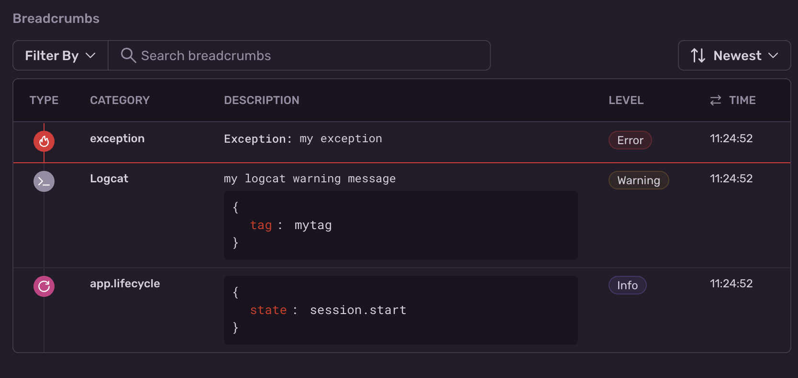

<Note>

Supported in Sentry's Android SDK version `6.17.0` and above.

Supported in Sentry Android Gradle Plugin version `3.5.0` and above.

</Note>

The Sentry Logcat integration adds support for automatically reporting log calls above a minimum logging level as breadcrumbs.
Any matching `android.Log.*` calls inside your app package are captured as breadcrumbs, including `android.Log.*` calls originating from bundled third party libraries.



## Installation With the Sentry Android Gradle Plugin

### Install

To use the Logcat integration, add the Sentry Android Gradle plugin and the Sentry Android SDK (version `6.17.0` or above) in `build.gradle`:

```groovy {filename:app/build.gradle}
buildscript {
  repositories {
    mavenCentral()
  }
}

plugins {
  id "io.sentry.android.gradle" version "{{ packages.version('sentry.java.android.gradle-plugin', '3.5.0') }}"
}

dependencies {
  implementation 'io.sentry:sentry-android:{{ packages.version('sentry.java.android', '6.17.0') }}'
}
```

```kotlin {filename:app/build.gradle.kts}
buildscript {
  repositories {
    mavenCentral()
  }
}

plugins {
  id("io.sentry.android.gradle") version "{{ packages.version('sentry.java.android.gradle-plugin', '3.5.0') }}"
}

dependencies {
  implementation("io.sentry:sentry-android:{{ packages.version('sentry.java.android', '6.17.0') }}")
}
```

### Configure

Auto-instrumentation is enabled by default, so no further configuration is required. If you'd like to disable the Logcat instrumentation feature, or change the minimum log level the following options are provided:

```groovy {filename:app/build.gradle}
import io.sentry.android.gradle.extensions.InstrumentationFeature
import io.sentry.android.gradle.instrumentation.logcat.LogcatLevel

sentry {
  tracingInstrumentation {
    enabled = true

    logcat {
      enabled = true
      minLevel = LogcatLevel.WARNING
    }
  }
}
```

```kotlin {filename:app/build.gradle.kts}
import java.util.EnumSet
import io.sentry.android.gradle.extensions.InstrumentationFeature
import io.sentry.android.gradle.instrumentation.logcat.LogcatLevel

sentry {
  tracingInstrumentation {
    enabled.set(true)

    logcat {
      enabled.set(true)
      minLevel(LogcatLevel.WARNING)
    }
  }
}
```

## Verify

This snippet captures an intentional error, so you can test that everything is working once you've set it up:

```kotlin
import androidx.appcompat.app.AppCompatActivity
import android.os.Bundle
import io.sentry.Sentry
import android.util.Log

class MyActivity : AppCompatActivity() {
  override fun onCreate(savedInstanceState: Bundle?) {
    super.onCreate(savedInstanceState)
    Log.w("MyTag", "Warning message.")

    Sentry.captureException(Exception("My Exception"))
  }
}
```

```java
import androidx.appcompat.app.AppCompatActivity;
import android.os.Bundle;
import java.lang.Exception;
import io.sentry.Sentry;
import android.util.Log;

public class MyActivity extends AppCompatActivity {
  protected void onCreate(Bundle savedInstanceState) {
    super.onCreate(savedInstanceState);
    Log.w("MyTag", "Warning message.");

    Sentry.captureException(new Exception("My Exception"));
  }
}
```

<Note>

Learn more about manually capturing an error or message in our <PlatformLink to="/usage/">Usage documentation</PlatformLink>.

</Note>

To view and resolve the recorded message, log into [sentry.io](https://sentry.io) and open your project. Click on the error's title to open a page where you can see error details and mark errors as resolved.
