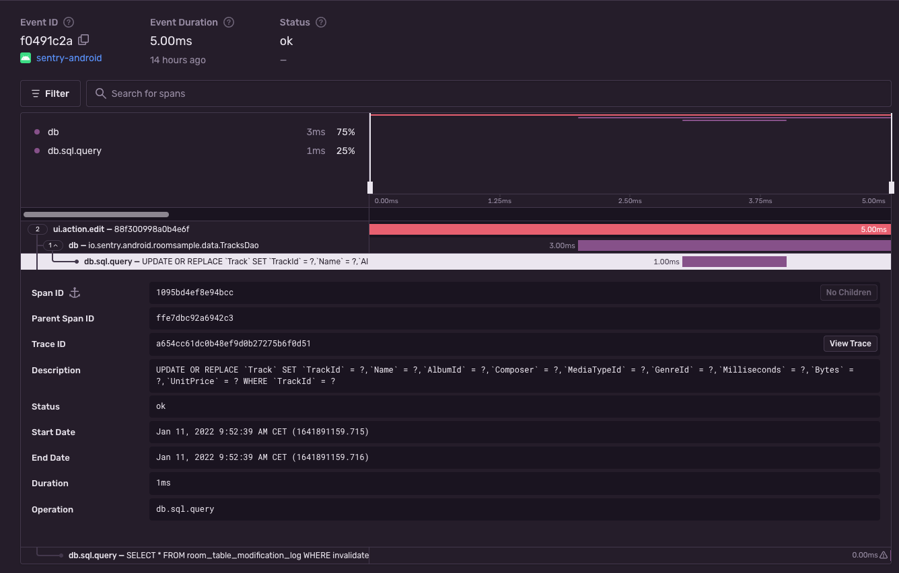

<Note>

Supported in Sentry's Android SDK version `4.0.0` and above.

Supported in Sentry Android Gradle Plugin version `3.0.0` and above.

</Note>

The [Sentry Android Gradle Plugin](/platforms/android/gradle/) provides Room and AndroidX SQLite support through bytecode manipulation. The source can be found [on GitHub](https://github.com/getsentry/sentry-android-gradle-plugin/tree/main/plugin-build/src/main/kotlin/io/sentry/android/gradle/instrumentation).

On this page, we get you up and running with Sentry's Room and SQLite Integration, so that it will automatically start a span from an active transaction that's bound to the scope of each sqlite/dao query.

## Install

To use the Room and AndroidX SQLite integration, add the Sentry Android Gradle plugin and the Sentry Android SDK (version `4.0.0` or above) in `build.gradle`:

```groovy
buildscript {
  repositories {
    mavenCentral()
  }
}

plugins {
  id "io.sentry.android.gradle" version "{{ packages.version('sentry.java.android.gradle-plugin', '3.0.0') }}"
}

dependencies {
  implementation 'io.sentry:sentry-android:{{ packages.version('sentry.java.android', '5.0.0') }}'
}
```

```kotlin
buildscript {
  repositories {
    mavenCentral()
  }
}

plugins {
  id("io.sentry.android.gradle") version "{{ packages.version('sentry.java.android.gradle-plugin', '3.0.0') }}"
}

dependencies {
  implementation("io.sentry:sentry-android:{{ packages.version('sentry.java.android', '5.0.0') }}")
}
```

<Note>

Make sure, that [performance monitoring](/platforms/android/performance/#configure-the-sample-rate) is enabled.

</Note>

## Configure

In general, no further configuration is required as the auto-instrumentation is enabled by default. If you would like to disable the database instrumentation feature, we expose a configuration option for that:

```groovy
import io.sentry.android.gradle.extensions.InstrumentationFeature

sentry {
  tracingInstrumentation {
    enabled = true
    features = EnumSet.allOf(InstrumentationFeature) - InstrumentationFeature.DATABASE
  }
}
```

```kotlin
import java.util.EnumSet
import io.sentry.android.gradle.extensions.InstrumentationFeature

sentry {
  tracingInstrumentation {
    enabled.set(true)
    features.set(EnumSet.allOf(InstrumentationFeature::class.java) - InstrumentationFeature.DATABASE)
  }
}
```

## Verify

Assuming you have the following (reduced) code snippet performing a database query on a Room Dao:

```kotlin
import android.os.Bundle
import android.widget.Button
import androidx.activity.ComponentActivity
import androidx.room.Database
import androidx.room.Dao
import androidx.room.Insert
import androidx.room.OnConflictStrategy
import androidx.room.RoomDatabase
import io.sentry.Sentry
import io.sentry.SpanStatus
import kotlinx.coroutines.withContext

@Dao
abstract class TracksDao {
  @Insert(onConflict = OnConflictStrategy.REPLACE)
  abstract suspend fun insert(track: Track): Long
}

@Database(
  entities = [Track::class],
  version = 1,
  exportSchema = false
)
abstract class TracksDatabase : RoomDatabase() {
    abstract fun tracksDao(): TracksDao
}

class EditActivity : ComponentActivity() {
  private lateinit var database: TracksDatabase

  override fun onCreate(savedInstanceState: Bundle?) {
    super.onCreate(savedInstanceState)
    database = TODO("initialize database...")

    findViewById<Button>(R.id.editTrack).setOnClickListener {
      val transaction = Sentry.startTransaction(
        name = "Track Interaction",
        operation = "ui.action.edit",
        bindToScope = true
      )

      val newTrack = Track(/* fill in track values */)

      withContext(Dispatchers.IO) {
        database.tracksDao().insert(newTrack)
        transaction.finish(SpanStatus.OK)
      }
    }
  }
}
```

To view the recorded transaction, log into [sentry.io](https://sentry.io) and open your project. Clicking on **Performance** will open a page with transactions, where you can select the just recorded transaction with the name `Track Interaction`. The event will look similar to this:



<Note>

At the moment, we only support standard `androidx.room` usage. That is, the SDK will not report SQL queries for any `SupportSQLiteOpenHelper.Factory` other than [androidx.sqlite](https://github.com/androidx/androidx/tree/androidx-main/sqlite). However, if you are using a different `SupportSQLiteOpenHelper.Factory`, please report any [issues on Github](https://github.com/getsentry/sentry-android-gradle-plugin/issues), so we are aware and can possibly work on them.

</Note>

<Note>

If you are directly using [SupportSQLiteDatabase#query](<https://developer.android.com/reference/androidx/sqlite/db/SupportSQLiteDatabase#query(java.lang.String)>) or [SupportSQLiteDatabase#execSQL](<https://developer.android.com/reference/androidx/sqlite/db/SupportSQLiteDatabase#execSQL(java.lang.String)>) methods through the Room's SQLiteOpenHelper, consider switching to their alternatives that accept `bindArgs` as a second parameter.

Because Sentry captures SQL queries as Span description, there is a risk of leaking sensitive data when not using an SQL string with placeholders.

</Note>
