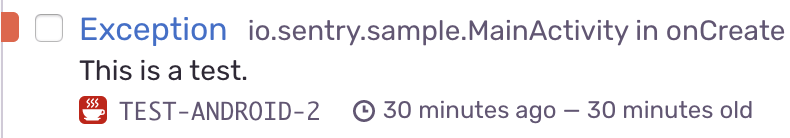

---
redirect_from:
  - /clients/java/modules/android/
---

On this page, we get you up and running with Sentry's Android SDK, so that it will automatically report errors and exceptions in your application.

The Android SDK can be used with Java and Kotlin. Code examples are mostly in both Java and Kotlin.

## Overview

Your application will crash whenever a thrown exception goes uncaught. The Sentry SDK catches the exception right before the crash and builds a crash report that will persist to the disk. The SDK will try to send the report right after the crash, but since the environment may be unstable at the crash time, the report is guaranteed to send once the application is started again.

If there is a fatal error in your native code, the process is similar. The crash report might send before the app crashes, but will for sure send on restart.

The NDK is not only catching the unhandled exceptions but is also set as a signal handler to be able to react to the signals from OS. When the application is about to crash, an error report is created and saved to disk. The SDK will try to send the report right after the crash, but since the environment may be unstable at the crash time, the report is guaranteed to send once the application is started again.

## Install

<PlatformContent includePath="getting-started-install" />

<Note>

For the minimal required API level, see [Advanced usage](usage/advanced-usage/).

</Note>

## Configure

After you’ve completed setting up a project in Sentry, Sentry will give you a value which we call a DSN or Data Source Name. It looks a lot like a standard URL, but it’s just a representation of the configuration required by the Sentry SDKs. It consists of a few pieces, including the protocol, public key, the server address, and the project identifier.

<PlatformContent includePath="getting-started-config" />

## Verify

Great! Now that you’ve completed setting up the SDK, maybe you want to quickly test out how Sentry works. Start by capturing an exception:

<PlatformContent includePath="getting-started-verify" />

Then, you can see the error in your dashboard:

If you prefer learning with examples, you can download our [sample application](https://github.com/getsentry/sentry-java/tree/master/sentry-samples/sentry-samples-android).

<PageGrid nextSteps header="Next Steps" />
