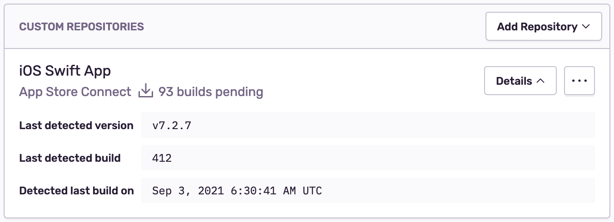
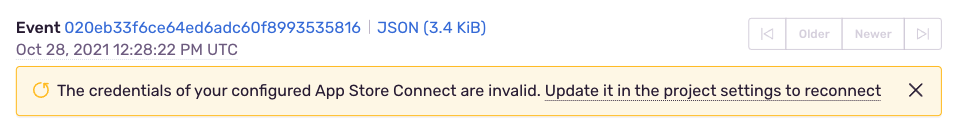
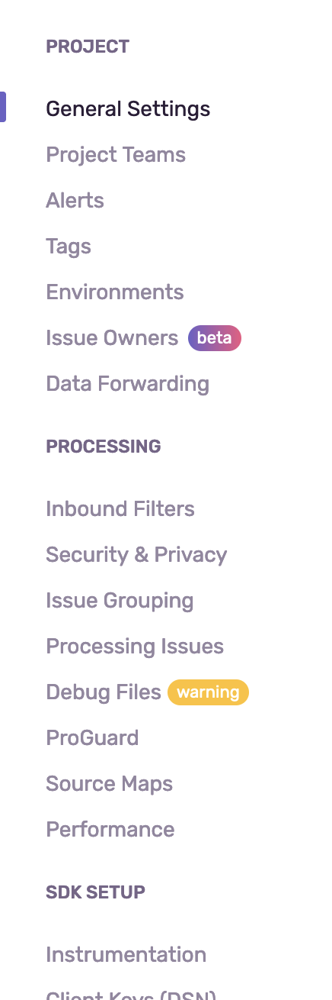
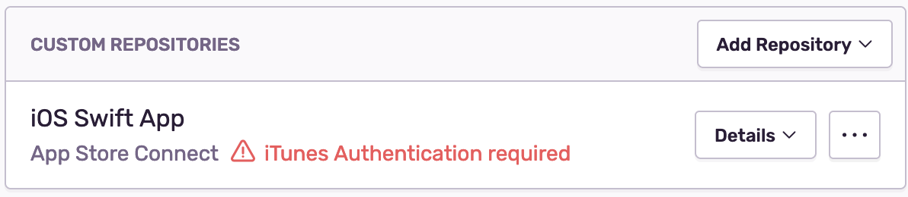

Sentry requires a dSYM upload to symbolicate your crash logs. The symbolication process unscrambles Apple’s crash logs to reveal the function, file names, and line numbers of the crash. Upload the dSYM file using either [sentry-cli](https://github.com/getsentry/sentry-cli), the [Fastlane](https://fastlane.tools/) action, or set up the Sentry [App Store Connect](#bitcode-appstore) integration for Bitcode builds. Every solution requires a Sentry Auth Token with the [correct permissions](/product/cli/dif/#permissions). You can [create one here](https://sentry.io/api/).

## With Bitcode {#dsym-with-bitcode}

If [Bitcode](https://developer.apple.com/library/ios/documentation/IDEs/Conceptual/AppDistributionGuide/AppThinning/AppThinning.html#//apple_ref/doc/uid/TP40012582-CH35-SW2) **is enabled** in your project, dSYM files will only be available **after** App Store Connect finishes processing the build. Sentry can fetch dSYM files automatically as they become available from App Store Connect when setting up the [App Store Connect](#bitcode-appstore) integration.
Alternatively, the dSYM files can be downloaded either with [Fastlane](#bitcode-fastlane) or manually, and uploaded with [Fastlane](#bitcode-fastlane) or [sentry-cli](#bitcode-sentrycli).

### Using App Store Connect {#bitcode-appstore}

<Alert level="Note">

Looking for the upload methods when using this intergration?

- [Upload BCSymbolMaps Using Fastlane](#symbolmap-fastlane)
- [Upload BCSymbolMaps Using sentry-cli](#symbolmap-sentrycli)

</Alert>

When you use the App Store Connect integration, Sentry will automatically discover and fetch dSYM files for Bitcode builds as they become available on App Store Connect. These dSYM files however contain obfuscated symbol names and paths. An additional BCSymbolMap file needs to be uploaded to provide properly symbolicated crash reports. These BCSymbolMap files can be uploaded using either [sentry-cli](#symbolmap-sentrycli) or [Fastlane](#symbolmap-fastlane).

To configure the integration, go to **[Project] > Settings > Debug Files** and add "App Store Connect" in the "Custom Repositories" section.


Once the integration is set up it will ensure that new builds are detected and fetched within an hour of being available on App Store Connect.



<Alert level="Note">

Free subscription plans are limited to one App Store Connect source per project, subscribers to our Business plan are able to integrate multiple App Store Connect sources per project. You can read further about our [plans](https://sentry.io/pricing/) or contact [sales@sentry.io](mailto:sales@sentry.io) if your organization needs more than one App Store Connect source.

</Alert>

Setting up App Store Connect currently requires two separate credentials.

1. **App Store Connect API Key**:

Follow the documentation on [Creating API Keys for App Store Connect API](https://developer.apple.com/documentation/appstoreconnectapi/creating_api_keys_for_app_store_connect_api) and provide the _Issuer_, _Key ID_, and _Private Key_. The API Key needs to have the _Developer_ role in order to fetch build details.

2. **iTunes Credentials**:

An iTunes user and password are required, in addition to the normal App Store Connect API Key, due to limitations of the App Store Connect API. The App Store Connect API Key alone will only allow detection of new builds; an iTunes user is required to fetch the associated dSYM files.

[Create a new Apple ID](https://support.apple.com/en-us/HT204316) specifically for this integration and provide its credentials. The user needs to have the _Developer_ role in the appropriate App Store Organization.

<Alert level="warning">

We highly recommend that you create a dedicated iTunes user account for the purpose of this integration, and that you **not** use a regular user account.

Using the configured iTunes account on a different device will disrupt Sentry's ability to use it in order to download dSYM files.

</Alert>

These credentials will need to be verified by a two-factor authentication token that you can choose to have sent by SMS.

**Re-authentication**

The iTunes credentials and two-factor authentication are short-lived and need to be refreshed on a regular basis. Sentry will prompt users to re-authenticate in the **Issue Details** pages of a project, in the settings menu of a project, as well as in the "Custom Repositories" section of a project's "Debug Files" settings once their iTunes credentials expire.

**Issue Details**



**Project Settings**



**Custom Repositories**




#### Upload BCSymbolMaps Using Fastlane {#symbolmap-fastlane}

As dSYM download will be handled by sentry, it is not necessary to use the _download_dsyms_ or _sentry_upload_dsym_ commands.
Instead, use the _sentry_upload_dif_ command to upload the BCSymbolMap.

```ruby
sentry_upload_dif(
  auth_token: 'YOUR_AUTH_TOKEN',
  org_slug: '___ORG_SLUG___'
  project_slug: '___PROJECT_SLUG___',
  path: '/path/to/files' # Optional. Well default to '.' when no value is provided.
)

```

When using the _upload_to_testflight_ action, it is recommended to pass the _skip_waiting_for_build_processing_ parameter to speed up the action.

#### Upload BCSymbolMaps Using `sentry-cli` {#symbolmap-sentrycli}

The `sentry-cli upload-dif` command will automatically find and upload all _BCSymbolMap_ files, given the path to the app's `.xcarchive`.

### Using Fastlane {#bitcode-fastlane}

Use the [Fastlane](https://github.com/fastlane/fastlane) action, _download_dsyms_, to download the dSYMs from App Store Connect and upload to Sentry. The dSYM won’t be generated until **after** the app is done processing on App Store Connect so this should be run in its own lane.

```ruby
lane :upload_symbols do
  download_dsyms # this is the important part
  sentry_upload_dsym(
    auth_token: 'YOUR_AUTH_TOKEN',
    org_slug: '___ORG_SLUG___',
    project_slug: '___PROJECT_SLUG___',
  )
end
```

<Alert level="" title="On Prem">

By default fastlane will connect to sentry.io. For on-prem you need to provide the _url_ parameter to instruct the tool to connect to your server:

```
url: 'https://mysentry.invalid/'
```

</Alert>

### Using `sentry-cli` {#bitcode-sentrycli}

Download the dSYM from App Store Connect. After that, you can upload the dSYM using [sentry-cli](https://github.com/getsentry/sentry-cli/releases).

1.  Open Xcode Organizer, go to your app, and click “Download dSYMs...”
2.  Login to App Store Connect, go to your app, go to “Activity", click the build number to go into the detail page, and click “Download dSYM”

Afterwards manually upload the symbols with _sentry-cli_:

```bash
sentry-cli --auth-token YOUR_AUTH_TOKEN upload-dif --org ___ORG_SLUG___ --project ___PROJECT_SLUG___ PATH_TO_DSYMS
```

<Alert level="" title="On Prem">

By default sentry-cli will connect to sentry.io. For on-prem you need to export the _SENTRY_URL_ environment variable to instruct the tool to connect to your server:

```bash
export SENTRY_URL=https://mysentry.invalid/
```

</Alert>

## Without Bitcode {#dsym-without-bitcode}

When not using Bitcode you can directly upload the symbols to Sentry as part of your build.

### Using Fastlane

If you are already using Fastlane you can use it in this situation as well:

```ruby
lane :build do
  gym # building your app
  sentry_upload_dsym(
    auth_token: 'YOUR_AUTH_TOKEN',
    org_slug: '___ORG_SLUG___',
    project_slug: '___PROJECT_SLUG___',
  )
end
```

<Alert level="" title="On Prem">

By default fastlane will connect to sentry.io. For on-prem you need to provide the _api_host_ parameter to instruct the tool to connect to your server:

```
api_host: 'https://mysentry.invalid/'
```

</Alert>

### Uploading Symbols with _sentry-cli_

Your project’s dSYM can be upload during the build phase as a “Run Script”. For this you need to set the _DEBUG_INFORMATION_FORMAT_ to be _DWARF with dSYM File_. By default, an Xcode project will only have _DEBUG_INFORMATION_FORMAT_ set to _DWARF with dSYM File_ in _Release_ so make sure everything is set in your build settings properly.

You need to have an Auth Token for this to work. You can [create an Auth Token here](https://sentry.io/api/).

1.  Download and install [sentry-cli](/product/cli/installation/)
2.  You will need to copy the script below into a new _Run Script_ and set your _AUTH_TOKEN_, _ORG_SLUG_, and _PROJECT_SLUG_

```bash
if which sentry-cli >/dev/null; then
export SENTRY_ORG=___ORG_SLUG___
export SENTRY_PROJECT=___PROJECT_SLUG___
export SENTRY_AUTH_TOKEN=YOUR_AUTH_TOKEN
ERROR=$(sentry-cli upload-dif "$DWARF_DSYM_FOLDER_PATH" 2>&1 >/dev/null)
if [ ! $? -eq 0 ]; then
echo "warning: sentry-cli - $ERROR"
fi
else
echo "warning: sentry-cli not installed, download from https://github.com/getsentry/sentry-cli/releases"
fi
```

3.  If you are using Xcode 10 or newer, you also need to add the following line to the _Input Files_ section in the _Run Script_ from step 2:

[//]: # "Don't use bash here. Clicking the copy button on the code sample with bash"
[//]: # "removes the leading $."

```text
${DWARF_DSYM_FOLDER_PATH}/${DWARF_DSYM_FILE_NAME}/Contents/Resources/DWARF/${TARGET_NAME}
```

<Alert level="" title="On Prem">

By default sentry-cli will connect to sentry.io. For on-prem you need to export the _SENTRY_URL_ environment variable to instruct the tool to connect to your server:

```bash
export SENTRY_URL=https://mysentry.invalid/
```

</Alert>
