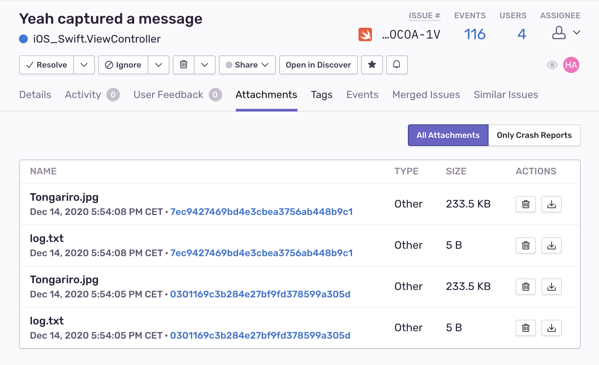

__Attention: This is a preview API, available since 6.1.0-alpha.0. This API is not in stable state yet. It may be renamed, changed or even removed in a future version.__

Attachments provide the ability to to store additional files to an event. Be aware that attachments don't work yet with crashes.


## Uploading Attachments

You can either pass data or use a path to a file to create an attachment.

```swift {tabTitle:Swift}
import Sentry

let dataAttachment = Attachment(data: data, filename: "file.log")
let fileAttachment = Attachment(path: "your/path/file.log")
```

```objc {tabTitle:Objective-C}
@import Sentry;

SentryAttachment *dataAttachment =
  [[SentryAttachment alloc] initWithData:data filename:@"file.log"];
SentryAttachment *fileAttachment =
  [[SentryAttachment alloc] initPath:@"your/path/file.log"];
```

The attachments live on the <PlatformLink to="/enriching-events/scopes/">Scope</PlatformLink>. You can either add an attachment on the global scope to be sent with every event or add it on the <PlatformLink to="/enriching-events/scopes/#local-scopes">local Scope</PlatformLink> to just send the attachment with one specific event.

```swift {tabTitle:Swift}
import Sentry

let fileAttachment = Attachment(path: "your/path/file.log")

// Global Scope
SentrySDK.configureScope { scope in
	scope.addAttachment(attachment)
}

// Local Scope
SentrySDK.captureMessage(message: "my message", block: { scope in
	scope.addAttachment(attachment)
})
```

```objc {tabTitle:Objective-C}
@import Sentry;

SentryAttachment *fileAttachment =
  [[SentryAttachment alloc] initPath:@"your/path/file.log"];

// Global Scope
[SentrySDK configureScope:^(SentryScope *_Nonnull scope) {
    [scope addAttachment:fileAttachment];
}];

// Local Scope
[SentrySDK captureMessage:@"my message" withScopeBlock:^(SentryScope * _Nonnull scope) {
    [scope addAttachment:fileAttachment];
}];

```


## Viewing Attachments

Attachments appear in the _Attachments_ tab on the **Issue Details** page, where you can view the _Type_ of attachment, as well as associated events. Click the Event ID to open the **Issue Details** of that specific event.


