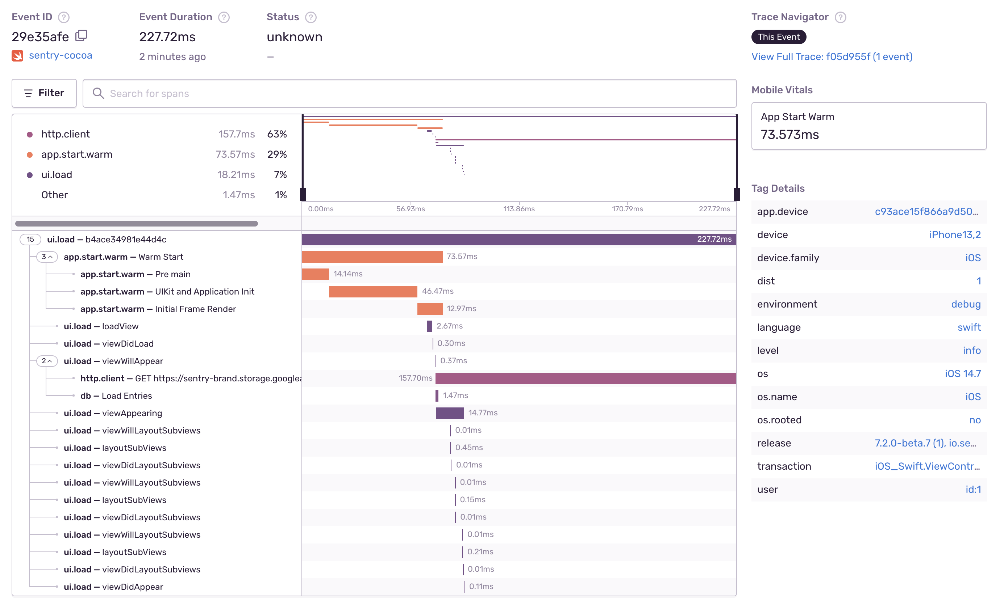
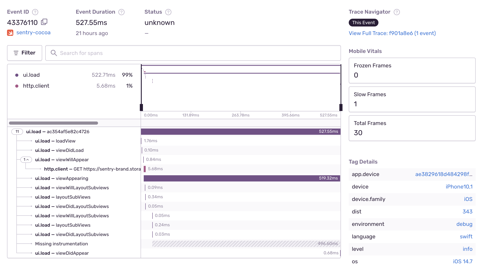

<Note>

Once you <PlatformLink to="/performance/">set up performance monitoring</PlatformLink>, the SDK enables the following features by default:

- UIViewController Tracing
- App Start Tracing
- Slow and Frozen Frames
- Network Tracking
- File I/O Tracing
- Core Data Tracing
- User Interaction Tracing

</Note>

## UIViewController Tracing

This feature is available for iOS, tvOS, and Mac Catalyst, is enabled by default, and works for `UIViewControllers`.

UIViewController Tracing is enabled by default once you <PlatformLink to="/performance/">set up performance monitoring</PlatformLink>. This feature captures transactions when your app loads an in-app [UIViewController][UIViewController]. However, the SDK doesn't capture transactions for UIViewControllers of third-party libraries or SwiftUI.
The SDK sets the transaction name to the name of the ViewController, including the module — for example, `Your_App.MainViewController` — and the transaction operation to `ui.load`.

The SDK creates spans to provide insight into the time consumed by each of the methods shown in the screenshot below. Due to implementation limitations, the SDK only adds a span for loadView if the instrumented view controller implements it. The SDK adds spans for all other methods, whether you implement them in your view controller or not.


To disable the `UIViewController` Tracing:

```swift {tabTitle:Swift}
import Sentry

SentrySDK.start { options in
    options.dsn = "___PUBLIC_DSN___"
    options.enableUIViewControllerTracing = false

    // Before 8.0.0
    options.enableUIViewControllerTracking = false
}
```

```objc {tabTitle:Objective-C}
@import Sentry;

[SentrySDK startWithConfigureOptions:^(SentryOptions *options) {
    options.dsn = @"___PUBLIC_DSN___";
    options.enableUIViewControllerTracing = NO;


    // Before 8.0.0
    options.enableUIViewControllerTracking = NO;
}];
```

[UIViewController]: https://developer.apple.com/documentation/uikit/uiviewcontroller

## App Start Tracing

This feature is available for iOS, tvOS, and Mac Catalyst.

App Start Tracing is enabled by default once you <PlatformLink to="/performance/">set up performance monitoring</PlatformLink>. This feature provides insight into how long your application takes to launch. It adds spans for different phases, from the application launch to the first auto-generated UI transaction.

The SDK adds these spans to the first transaction that starts during the app launch with the operation `ui.load`. This is what UIViewController tracing uses. If the duration between the transaction start time and the end timestamp of the app start is more than 5 seconds, the SDK doesn't attach the spans from the app start. This helps prevent attaching spans to unrelated transactions.
To enable this feature, enable `enableAutoPerformanceTracing`.

The SDK differentiates between a cold and a warm start, but doesn't track hot starts/resumes.

- **Cold start**: App launched for the first time, after a reboot or update. The app is not in memory and no process exists.
- **Warm start**: App launched at least once, is partially in memory, and no process exists.

The SDK uses the process start time as the beginning of the app start and the [`UIWindowDidBecomeVisibleNotification`][uiwindow] as the end. The SDK creates the following spans:

- **Pre Main**: From the process start time to the runtime init.
- **UIKit and Application Init**: From the runtime init to the [`didFinishLaunchingNotification`][didfinishlaunching].
- **Initial Frame Render**: From the [`didFinishLaunchingNotification`][didfinishlaunching] to [`UIWindowDidBecomeVisibleNotification`][uiwindow].



Cold and warm start are Mobile Vitals, which you can learn about in the [full documentation](/product/performance/mobile-vitals).

### Prewarmed App Start Tracing

Starting with iOS 15, the system might [prewarm](https://developer.apple.com/documentation/uikit/app_and_environment/responding_to_the_launch_of_your_app/about_the_app_launch_sequence#3894431) your app by creating the process before the user opens it. In these cases, we won’t be able to reliably measure the app start. However, with [sentry-cocoa 7.31.0](https://github.com/getsentry/sentry-cocoa/releases/tag/7.31.0), we’ve introduced an `enablePreWarmedAppStartTracing` feature (still in its experimental phase), which allows us to collect prewarmed app starts.

Once enabled, the SDK drops the first app start span if prewarming pauses. This approach shortens the app start duration, but it accurately represents the span of time from when a user clicks the app icon to when the app is responsive.
With this feature, the SDK differentiates between four different app start types:

- **Non-prewarmed cold start** (See _cold start_ definition above.)
- **Non-prewarmed warm start** (See _warm start_ definition above.)
- **Prewarmed cold start**
- **Prewarmed warm start**

You can filter for different app start types in [Discover](/product/discover-queries/) with `app_start_type:cold.prewarmed`, `app_start_type:warm.prewarmed`, `app_start_type:cold`, and `app_start_type:warm`.

To enable prewarmed app start tracing:

```swift {tabTitle:Swift}
import Sentry

SentrySDK.start { options in
    options.dsn = "___PUBLIC_DSN___"
    options.enablePreWarmedAppStartTracing = true

    // Before 8.0.0
    options.enablePreWarmedAppStartTracking = true
}
```

```objc {tabTitle:Objective-C}
@import Sentry;

[SentrySDK startWithConfigureOptions:^(SentryOptions *options) {
    options.dsn = @"___PUBLIC_DSN___";
    options.enablePreWarmedAppStartTracing = YES;

    // Before 8.0.0
    options.enablePreWarmedAppStartTracking = YES;
}];
```

## Slow and Frozen Frames

This feature is available for iOS, tvOS, and Mac Catalyst.

Slow and Frozen Frames are enabled by default once you <PlatformLink to="/performance/">set up performance monitoring</PlatformLink>. Unresponsive UI and animation hitches annoy users and degrade the user experience. Two measurements to track these types of experiences are _slow frames_ and _frozen frames_. If you want your app to run smoothly, you should try to avoid both. The SDK adds these two measurements for the transactions you capture.

The detail view of the transaction displays the slow, frozen, and total frames:



Slow and frozen frames are Mobile Vitals, which you can learn about in the [full documentation](/product/performance/mobile-vitals).

## Network Tracking

Network Tracking is enabled by default once you <PlatformLink to="/performance/">set up performance monitoring</PlatformLink>. The Sentry SDK adds spans for outgoing HTTP requests to ongoing transactions bound to the Scope. Currently, the SDK supports requests with [NSURLSession][NSURLSession], but not the legacy [NSURLConnection][NSURLConnection].

To disable the HTTP instrumentation:

```swift {tabTitle:Swift}
import Sentry

SentrySDK.start { options in
    options.dsn = "___PUBLIC_DSN___"
    options.enableNetworkTracking = false
}
```

```objc {tabTitle:Objective-C}
@import Sentry;

[SentrySDK startWithConfigureOptions:^(SentryOptions *options) {
    options.dsn = @"___PUBLIC_DSN___";
    options.enableNetworkTracking = NO;
}];
```

[NSURLSession]: https://developer.apple.com/documentation/foundation/nsurlsession
[NSURLConnection]: https://developer.apple.com/documentation/foundation/nsurlconnection

### Trace Propagation Targets

Sentry adds an extra header with the trace id in the outgoing HTTP requests to continue the transaction in the backend.

You can set the `tracePropagationTarget` option to filter which requests Sentry adds the extra header to.
For example, to ensure that only your app backend will receive the trace id.

```swift {tabTitle:Swift}
import Sentry

SentrySDK.start { options in
    options.dsn = "___PUBLIC_DSN___"
    options.tracePropagationTargets = ["MyAppDomain.com"]
}
```

```objc {tabTitle:Objective-C}
@import Sentry;

[SentrySDK startWithConfigureOptions:^(SentryOptions *options) {
    options.dsn = @"___PUBLIC_DSN___";
    options.tracePropagationTargets = @[@"MyAppDomain.com"]
}];
```

The option may contain a list of `NSString` or `NSRegularExpression` against which the URLs of outgoing requests are matched. If one of the entries in the list matches the URL of an outgoing request, trace data will be attached to that request. String entries do not have to be full matches, meaning the URL of a request is matched when it contains a string provided through the option.

If `tracePropagationTargets` is not provided, trace data is attached to every outgoing request from the instrumented client.

## File I/O Tracing

The Sentry SDK adds spans for file I/O operations to ongoing transactions bound to the scope. Currently, the SDK supports operations with [NSData][NSData], but many other APIs like [NSFileManager][NSFileManager], [NSString][NSString] and [NSBundle][NSBundle] uses [NSData][NSData].

Since 8.0.0, this feature has been enabled by default. To disable it:

```swift {tabTitle:Swift}
import Sentry

SentrySDK.start { options in
    options.dsn = "___PUBLIC_DSN___"
    options.enableFileIOTracing = false

    // Before 8.0.0
    options.enableFileIOTracking = false
}
```

```objc {tabTitle:Objective-C}
@import Sentry;

[SentrySDK startWithConfigureOptions:^(SentryOptions *options) {
    options.dsn = @"___PUBLIC_DSN___";
    options.enableFileIOTracing = NO;

    // Before 8.0.0
    options.enableFileIOTracking = NO;
}];
```

[NSData]: https://developer.apple.com/documentation/foundation/nsdata
[NSFileManager]: https://developer.apple.com/documentation/foundation/nsfilemanager
[NSString]: https://developer.apple.com/documentation/foundation/nsstring
[NSBundle]: https://developer.apple.com/documentation/foundation/nsbundle

## Core Data Tracing

The Sentry SDK adds spans for Core Data operations to ongoing transactions bound to the scope. Currently, the SDK supports fetch and save operations with [NSManagedObjectContext](https://developer.apple.com/documentation/coredata/nsmanagedobjectcontext).
Since 8.0.0, this feature has been enabled by default. To disable it:

```swift {tabTitle:Swift}
import Sentry

SentrySDK.start { options in
    options.dsn = "___PUBLIC_DSN___"
    options.enableCoreDataTracing = false

    // Before 8.0.0
    options.enableCoreDataTracking = false
}
```

```objc {tabTitle:Objective-C}
@import Sentry;

[SentrySDK startWithConfigureOptions:^(SentryOptions *options) {
    options.dsn = @"___PUBLIC_DSN___";
    options.enableCoreDataTracing = NO;

    // Before 8.0.0
    options.enableCoreDataTracking = NO
}];
```

## User Interaction Tracing

User interaction tracing, once enabled, captures transactions for clicks. This feature is unavailable for SwiftUI. Since 8.0.0, this feature has been enabled by default. To disable it:

```swift {tabTitle:Swift}
import Sentry

SentrySDK.start { options in
    options.dsn = "___PUBLIC_DSN___"
    options.enableUserInteractionTracing = false
}
```

```objc {tabTitle:Objective-C}
@import Sentry;

[SentrySDK startWithConfigureOptions:^(SentryOptions *options) {
    options.dsn = @"___PUBLIC_DSN___";
    options.enableUserInteractionTracing = NO;
}];
```

The SDK composes the transaction name out of the host `UIViewController` and the method that the `UIView` is calling; for example, `YourApp_LoginUIViewController.loginButton`. The SDK sets the transaction operation to `ui.action`. If the SDK detects the interaction's origin was a click, it adds `click` as a suffix to the operation. The transaction finishes automatically after it reaches the specified [idleTimeout](/platforms/android/configuration/options/#idle-timeout) and all of its child spans are finished. The `idleTimeoout` defaults to `3000` milliseconds (three seconds).

<Note>

If the UI transaction has idled but didn't have any child spans added, the SDK will drop it.

</Note>

The SDK binds user interaction transactions to the `Scope` automatically if there's no other transaction set. Because of that, you can create spans using custom instrumentation, and those spans will be automatically associated with the running UI transaction.

```Swift
import Sentry

func loadUserDataOnClick() {
    let span = SentrySDK.span
    let innerSpan = span?.startChild(operation: "loadUserData")
    // omitted code
    innerSpan?.finish()
}
```

```objc {tabTitle:Objective-C}
@import Sentry;

- (void)loadUserDataOnClick {
    id<SentrySpan> span = SentrySDK.span;
    id<SentrySpan> innerSpan = [span startChildWithOperation:@"loadUserData"];
    // omitted code
    [innerSpan finish];
}
```

When the user interaction transaction is not finished yet, but the user makes a new interaction, or the SDK starts a new UIViewController transaction, the SDK automatically finishes the previous user interaction transaction. This is because only one transaction can be bound to the scope at a time. However, if the same view has been interacted with (for example, a `UIButton` was clicked again within the `idleTimeout` window), the idle timer will be reset and the transaction duration will be extended with the `idleTimeout` value.

## Opt Out

You can opt out of all automatic instrumentations using the options:

```swift {tabTitle:Swift}
import Sentry

SentrySDK.start { options in
    options.dsn = "___PUBLIC_DSN___"
    options.enableAutoPerformanceTracing = false

    // Before 8.0.0
    options.enableAutoPerformanceTracking = false
}
```

```objc {tabTitle:Objective-C}
@import Sentry;

[SentrySDK startWithConfigureOptions:^(SentryOptions *options) {
    options.dsn = @"___PUBLIC_DSN___";
    options.enableAutoPerformanceTracing = NO;

    // Before 8.0.0
    options.enableAutoPerformanceTracking = NO;
}];
```

[UIWindow]: https://developer.apple.com/documentation/uikit/uiwindowdidbecomevisiblenotification
[didFinishLaunching]: https://developer.apple.com/documentation/uikit/uiapplication/1622971-didfinishlaunchingnotification

### Time to Initial Display

_(New in version 8.4.0)_

Time to initial display provides insight into how long it takes to your view controller to launch and draw their first frame, by adding a span for a view controller when it is loaded. The SDK sets the span operation to `ui.load.initial-display` and the span description to the view controllers's name followed by `initial display`, for example, `MainViewController initial display`.

The span starts when the view of a view controller is loaded, and there is no other view controller transaction happening at the moment.

The span finishes after the view appeared on the screen.

### Time to Full Display

_(New in version 8.4.0)_

Time to full display provides insight into how long it takes your view controller to launch and load all of its content, by adding a span for each launch of a view controller. The SDK sets the span operation to `ui.load.full-display` and the span description to the view controllers' name followed by `full display`, for example, `MainActivity full display`.

The span starts when the view of a view controller is loaded, and there is no other view controller transaction happening at the moment.

_Time to full display is disabled by default, but you can enable it by setting:_

```swift {tabTitle:Swift}
import Sentry

SentrySDK.start { options in
    options.dsn = "___PUBLIC_DSN___"
    options.enableTimeToFullDisplay = true
}
```

```objc {tabTitle:Objective-C}
@import Sentry;

[SentrySDK startWithConfigureOptions:^(SentryOptions *options) {
    options.dsn = @"___PUBLIC_DSN___";
    options.enableTimeToFullDisplay = YES;
}];
```

We can't detect when your UIViewController is fully loaded. Only you, the user, can achieve this. Therefore, you have to manually call the API to get proper statistics.
_You can achieve this by using the following code:_

```swift {tabTitle:Swift}
import Sentry

SentrySDK.reportFullyDisplayed()
```

```objc {tabTitle:Objective-C}
@import Sentry;

[SentrySDK reportFullyDisplayed];
```

If the span finishes through the API, its `status` is set to `SpanStatus.OK`. If the span doesn't finish after 30 seconds, it will be finished by the SDK automatically, and its `status` will be set to `SpanStatus.DEADLINE_EXCEEDED`, also its duration will match the same of the `Time to initial display` span and the description will contain `Deadline Exceeded` suffix.
If a call to `reportFullyDisplayed()` happens before the view controller appears, the reported time will be shifted to `Time to initial display` measured time.
