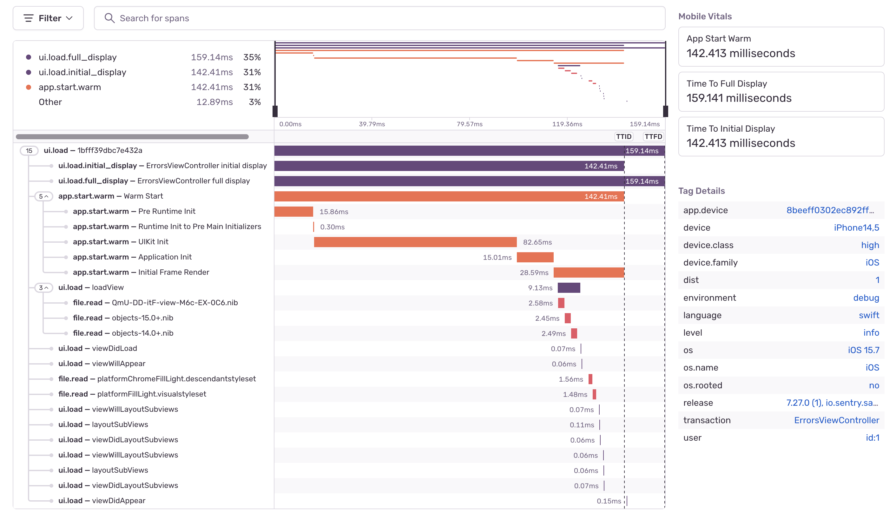

<Note>

This is a preview API, available in `7.2.0-beta.0` and above. Features available in a preview API are still in progress and may have bugs. We recognize the irony. The API may be renamed, changed, or removed in a future version.

Capturing transactions requires that you first <PlatformLink to="/performance/">set up performance monitoring</PlatformLink> if you haven't already.

</Note>

## UIViewController Instrumentation

This feature is available for iOS, tvOS, and Mac Catalyst, and only works for UIViewControllers.

The UIViewController Instrumentation, once enabled, captures transactions whenever your app loads a ViewController. The SDK sets the transaction name to the name of the ViewController, including the module, for example, `Your_App.MainViewController`, and the transaction operation to `ui.rendering`. The SDK creates spans to give you insight into how long each of the following methods took.


If you'd like to opt out of this feature, you can do so using options:

```swift {tabTitle:Swift}
import Sentry

SentrySDK.start { options in
    options.dsn = "___PUBLIC_DSN___"
    options.enableAutoUIPerformanceTracking = false
}
```

```objc {tabTitle:Objective-C}
@import Sentry;

[SentrySDK startWithConfigureOptions:^(SentryOptions *options) {
    options.dsn = @"___PUBLIC_DSN___";
    options.enableAutoUIPerformanceTracking = NO;
}];
```

## App Start Instrumentation

This feature is available for iOS, tvOS, and Mac Catalyst.

The App Start Instrumentation gives you insight into how long your application takes to launch. It adds spans for different phases of the application launch to the first auto-generated UI transaction.
For this feature to work, ensure that `AutoUIPerformanceTracking` is enabled and set a <PlatformLink to="/configuration/sampling/#setting-a-uniform-sample-rate">`tracesSampleRate`</PlatformLink> or a <PlatformLink to="/configuration/sampling/#setting-a-sampling-function">`tracesSampler`</PlatformLink>. The SDK differentiates between a cold and a warm start and doesn't track hot starts/resumes.
* __Cold start__: App launched for the first time, after a reboot or update. The app is not in memory, and no process exists.
* __Warm start__: App launched at least once, is partially in memory, and no process exists.

The SDK uses the process start time as the beginning of the app start and the [`UIWindowDidBecomeVisibleNotification`][UIWindow] as the end. It creates the following spans:
* __Pre Main__: From the process start time to the runtime init.
* __UIKit and Application Init__: From the runtime init to the [`didFinishLaunchingNotification`][didFinishLaunching].
* __Initial Frame Render__: From the [`didFinishLaunchingNotification`][didFinishLaunching] to [`UIWindowDidBecomeVisibleNotification`][UIWindow].



If you'd like to opt out of this feature, you can do so using options:

```swift {tabTitle:Swift}
import Sentry

SentrySDK.start { options in
    options.dsn = "___PUBLIC_DSN___"
    options.enableAppStartMeasuring = false
}
```

```objc {tabTitle:Objective-C}
@import Sentry;

[SentrySDK startWithConfigureOptions:^(SentryOptions *options) {
    options.dsn = @"___PUBLIC_DSN___";
    options.enableAppStartMeasuring = NO;
}];
```

[UIWindow]: https://developer.apple.com/documentation/uikit/uiwindowdidbecomevisiblenotification
[didFinishLaunching]: https://developer.apple.com/documentation/uikit/uiapplication/1622971-didfinishlaunchingnotification
