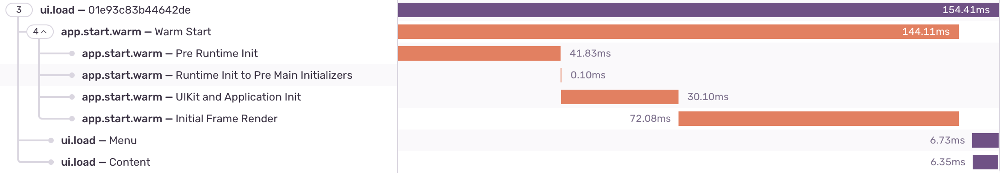

<Include name="beta-note.mdx" />

You can monitor the performance of your views in a SwiftUI project with the SentrySwiftUI library, which you can install via <PlatformLink to="/install/swift-package-manager/">SPM (Swift package manager)</PlatformLink> or CocoaPods:

```ruby
platform :ios, '13.0'
use_frameworks! # This is important

target 'YourApp' do
  pod 'SentrySwiftUI', :git => 'https://github.com/getsentry/sentry-cocoa.git', :tag => '{{@inject packages.version('sentry.cocoa') }}'
end
```

> If you plan to add _SentrySwiftUI_, you don`t need to also add _Sentry_ library since the former depends on the latter.

In order to start monitoring the performance of your views, you need to wrap it with `SentryTracedView`, like this:

```swift {tabTitle:Swift}

import SentrySwiftUI

var body: some View {
    SentryTracedView("<Name of your view>"){
        List {
            // Your SwiftUI code ...
        }
    }
}
```

You may omit the transaction name, Sentry will use the root view type as name, in the previous example the transaction name would be `List`.

Alternatively, you can use a modifier like this:

```swift {tabTitle:Swift}

import SentrySwiftUI

var body: some View {
    List {
        // Your SwiftUI code ...
    }.sentryTrace("<Name of your view>")
}
```

It is possible to use nested `SentryTracedView` to have a more granular transaction.

```swift {tabTitle:Swift}

import SentrySwiftUI

var body: some View {
    SentryTracedView("My Awesome Screen"){
        HStack {
            SentryTracedView("Menu") {
                List{
                    // Your SwiftUI code ...
                }
            }
            SentryTracedView("Content") {
                VStack{
                    // Your SwiftUI code ...
                }
            }
        }
    }
}
```

This is the result


