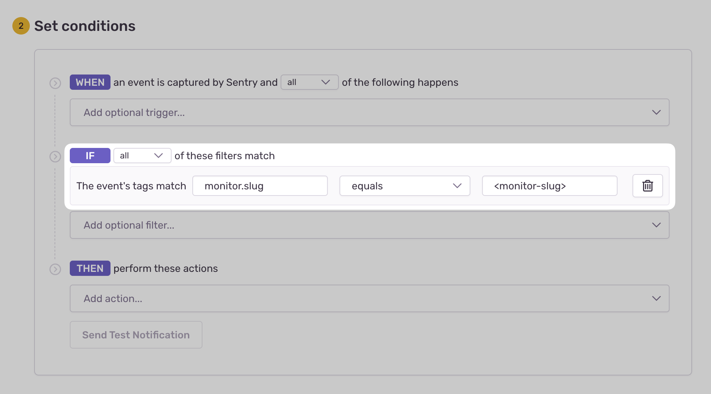

<Include name="feature-stage-beta-crons.mdx" />

Sentry Crons allows you to monitor the uptime and performance of any scheduled, recurring job. Once implemented, it'll allow you to get alerts and metrics to help you solve errors, detect timeouts, and prevent disruptions to your service.

<PlatformSection supported={["python", "php", "node", "javascript.nextjs", "javascript.sveltekit", "javascript.remix", "go"]}>

## Requirements

<PlatformContent includePath="crons/requirements" />

<PlatformContent includePath="crons/setup" />

## Connecting Errors to Cron Monitors

To link any exceptions captured during your job's lifecycle, use <PlatformLink to="/enriching-events/context/">Sentry's context</PlatformLink> with your monitor slug.

<PlatformContent includePath="crons/connect-errors" />

</PlatformSection>

<PlatformSection notSupported={["python", "php", "node", "javascript.nextjs", "javascript.sveltekit", "javascript.remix", "go"]}>

## Requirements

To begin monitoring your recurring, scheduled job:

1. [Create a new monitor](https://sentry.io/crons/create/) in Sentry.
2. Configure check-ins or a heartbeat for your job.

Optionally, you can skip the first step and [create or update (upsert) a monitor through a check-in](#creating-or-updating-a-monitor-through-a-check-in-optional). See more below.

## Check-Ins (Recommended)

Check-in monitoring allows you to track a job's progress by completing two check-ins: one at the start of your job and another at the end of your job. This two-step process allows Sentry to notify you if your job didn't start when expected (missed) or if it exceeded its maximum runtime (failed).

<SignInNote />

```bash {tabTitle: cURL}
SENTRY_INGEST="https://___ORG_INGEST_DOMAIN___"
SENTRY_CRONS="${SENTRY_INGEST}/api/___PROJECT_ID___/cron/<monitor_slug>/___PUBLIC_KEY___/"

# 🟡 Notify Sentry your job is running:
curl "${SENTRY_CRONS}?status=in_progress"

# Execute your scheduled task here...

# 🟢 Notify Sentry your job has completed successfully:
curl "${SENTRY_CRONS}?status=ok"
```

```http {tabTitle: HTTP}
GET /api/___PROJECT_ID___/cron/<monitor_slug>/___PUBLIC_KEY___/?status=in_progress HTTP/1.1
Host: ___ORG_INGEST_DOMAIN___

GET /api/___PROJECT_ID___/cron/<monitor_slug>/___PUBLIC_KEY___/?status=ok HTTP/1.1
Host: ___ORG_INGEST_DOMAIN___
```

If your job execution fails:

<SignInNote />

```bash {tabTitle: cURL}
# 🔴 Notify Sentry your job has failed:
curl "${SENTRY_CRONS}?status=error"
```

```http {tabTitle: HTTP}
GET /api/___PROJECT_ID___/cron/<monitor_slug>/___PUBLIC_KEY___/?status=error HTTP/1.1
Host: ___ORG_INGEST_DOMAIN___
```

<Note>

If you expect your scheduled jobs to overlap, read about [Overlapping Jobs](#overlapping-jobs-optional) below.

</Note>

### Specifying monitor environments (Optional)

When sending check-ins to your monitor you may specify the `environment` of the
check-in. This allows you to monitor a single schedule across multiple
environments.

If you don't specify an environment with your check-ins the default is `production`.

<Alert level="info">

Monitor environments are still early in development. Currently, after a check-in
occurs for a specified environment you must continue sending check-ins on
schedule or the monitor environment will be marked as missed.

In the future it will be possible to delete environments for a specified monitor.

</Alert>

<SignInNote />

```bash {tabTitle: cURL}
SENTRY_INGEST="https://___ORG_INGEST_DOMAIN___"
SENTRY_CRONS="${SENTRY_INGEST}/api/___PROJECT_ID___/cron/<monitor_slug>/___PUBLIC_KEY___/"

# 🟡 Notify Sentry your job is running in the dev environment:
curl "${SENTRY_CRONS}?environment=dev&status=in_progress"

# Execute your scheduled task here...

# 🟢 Notify Sentry your dev environment job has completed successfully:
curl "${SENTRY_CRONS}?environment=dev&status=ok"
```

### Creating or Updating a Monitor Through a Check-In (Optional)

Sentry enables the automatic creation or update of a monitor (upsert) through the check-in payload. This can be useful if you have many scheduled tasks or need to create them dynamically.

<Note type="warning">

In the future this feature will use the `ingest.sentry.io` style check in
format and the `sentry.io/api` format will be deprecated.

</Note>

<SignInNote />

```bash {tabTitle: cURL}
# Upsert monitor with a check-in
curl -X POST \
    'https://sentry.io/api/0/organizations/___ORG_SLUG___/monitors/<monitor_slug>/checkins/' \
    --header 'Authorization: DSN ___PUBLIC_DSN___' \
    --header 'Content-Type: application/json' \
    --data-raw '{"monitor_config": {"schedule": "0 * * * *", "schedule_type": "crontab"}, "status": "in_progress"}'
```

```http {tabTitle: HTTP}
PUT /api/0/organizations/___ORG_SLUG___/monitors/<monitor_slug>/checkins/ HTTP/1.1
Host: sentry.io
Authorization: DSN ___PUBLIC_DSN___
Content-Type: application/json

{
    "monitor_config": {
        "schedule": "0 * * * *",
        "schedule_type": "crontab",
        "checkin_margin": 1,
        "max_runtime": 20,
        "timezone": "America/Los_Angeles"
    },
    "status": "in_progress"
}
```

Monitor `monitor_config` parameters:

`schedule_type`:

: The schedule representation for your monitor, either `crontab` or `interval`.

`schedule`:

: The job's schedule based on the `schedule_type`:

- `crontab`: a string crontab expression with five fields, such as ` "0 * * * *"`.
- `interval`: a tuple for your interval such as `[2, "hour"]`.

`checkin_margin`:

: The amount of time (in minutes) Sentry should wait for your check-in before it's considered missed ("grace period"). Optional.

<Note>

We recommend that your check-in margin be less than or equal to your interval.

</Note>

`max_runtime`:

: The amount of time (in minutes) your job is allowed to run before it's considered failed. Optional.

`timezone`

: The `tz` where your job is running. This is usually your server's timezone, (such as `America/Los_Angeles`). See [list of tz database time zones](https://en.wikipedia.org/wiki/List_of_tz_database_time_zones). Optional.

<Alert level="warning">

It's important to provide a timezone for non-repeating crontab schedules, such as `0 17 * * *` (every day at 5pm).

</Alert>

### Check-in Attachment (Optional)

Sentry Crons can help you better understand your job check-ins by storing a file, such as a log output. You'll be able to use this to debug check-in failures or track job statuses. To upload your attachment, execute the following `HTTP POST (multipart/form-data)` request:

<SignInNote />

```bash {tabTitle: curl}
# Perform a POST request to attach a file to a check-in
curl -X POST \
  'https://sentry.io/api/0/organizations/___ORG_SLUG___/monitors/<monitor_slug>/checkins/latest/attachment/' \
  --header 'Authorization: DSN ___PUBLIC_DSN___' \
  --form 'file=<file_path>'
```

```http {tabTitle: HTTP}
POST /api/0/organizations/___ORG_SLUG___/monitors/<monitor_slug>/checkins/latest/attachment/ HTTP/1.1
Host: sentry.io
Authorization: DSN ___PUBLIC_DSN___
Content-Type: multipart/form-data; boundary=----WebKitFormBoundary7MA4YWxkTrZu0gW

------WebKitFormBoundary7MA4YWxkTrZu0gW
Content-Disposition: form-data; name="file"

<file_path>
------WebKitFormBoundary7MA4YWxkTrZu0gW--
```

<Note>
  We recommend uploading your attachment before you complete your second
  check-in.
</Note>

Attachments can be downloaded in each corresponding check-in on your “Monitor Details” page.

Current attachment limitations:

1. Each job is limited to one attachment.
2. The maximum file size is 100kb.
3. Attachments aren't currently supported by our CLI or SDKs.

### Overlapping Jobs (Optional)

A job execution that begins before the previous job execution has been completed is called an overlapping job. This happens if you have a job with a runtime duration longer than your job's interval schedule.

A simple example is if you have a job that runs every minute (1), but takes five (5) minutes to complete each execution.

If this happens, you have to provide a stable check-in ID for your execution with each request to prevent unintended consequences.

Usage example:

<SignInNote />

```bash {tabTitle: cURL}
CHECK_IN_ID="$(uuidgen)"

SENTRY_INGEST="https://___ORG_INGEST_DOMAIN___"
SENTRY_CRONS="${SENTRY_INGEST}/api/___PROJECT_ID___/cron/<monitor_slug>/___PUBLIC_KEY___/"

# 🟡 Notify Sentry your job is running with a check-in ID:
curl "${SENTRY_CRONS}?check_in_id=${CHECK_IN_ID}&status=in_progress"

# Execute your scheduled task here...

# 🟢 Notify Sentry your job has completed successfully with a check-in ID:
curl "${SENTRY_CRONS}?check_in_id=${CHECK_IN_ID}&status=ok"
```

## Heartbeat

Heartbeat monitoring notifies Sentry of a job's status through one check-in. This setup will only notify you if your job didn't start when expected (missed). If you need to track a job to see if it exceeded its maximum runtime (failed), use check-ins instead.

<SignInNote />

```bash {tabTitle: cURL}
# 🟢 Notify Sentry your job has completed successfully:
curl -X POST \
    'https://sentry.io/api/0/organizations/___ORG_SLUG___/monitors/<monitor_slug>/checkins/' \
    --header 'Authorization: DSN ___PUBLIC_DSN___' \
    --header 'Content-Type: application/json' \
    --data-raw '{"status": "ok"}'
```

```http {tabTitle: HTTP}
POST /api/0/organizations/___ORG_SLUG___/monitors/<monitor_slug>/checkins/ HTTP/1.1
Host: sentry.io
Authorization: DSN ___PUBLIC_DSN___
Content-Type: application/json

{
    "status": "ok"
}
```

If your job execution fails:

<SignInNote />

```bash {tabTitle: cURL}
# 🔴 Notify Sentry your job has failed:
curl -X POST \
    'https://sentry.io/api/0/organizations/___ORG_SLUG___/monitors/<monitor_slug>/checkins/' \
    --header 'Authorization: DSN ___PUBLIC_DSN___' \
    --header 'Content-Type: application/json' \
    --data-raw '{"status": "error"}'
```

```http {tabTitle: HTTP}
POST /api/0/organizations/___ORG_SLUG___/monitors/<monitor_slug>/checkins/ HTTP/1.1
Host: sentry.io
Authorization: DSN ___PUBLIC_DSN___
Content-Type: application/json

{
    "status": "error"
}
```

## Connecting Errors to Cron Monitors

If you're capturing Sentry errors, you can link them to a Cron Monitor by using context.

```python {tabTitle: Python}
sentry_sdk.set_context("monitor", {
    "slug": "<monitor_slug>",
})
```

```php
\Sentry\configureScope(function (\Sentry\State\Scope $scope): void {
    $scope->setContext('monitor', [
        'slug' => '<monitor_slug>',
    ]);
});
```

```javascript {tabTitle: JavaScript (Node.JS)}
Sentry.setContext("monitor", {
  slug: "<monitor_slug>",
});
```

See [additional context examples](/platform-redirect/?next=/enriching-events/context/) for your platform.

</PlatformSection>

## Alerts

When your recurring job fails to check in (missed), runs beyond its configured maximum runtime (failed), or manually reports a failure, Sentry will create an error event with a tag to your monitor.

To receive alerts about these events:

1. Navigate to **Alerts** in the sidebar.
2. Create a new alert and select "Issues" under "Errors" as the alert type.
3. Configure your alert and define a filter match to use: `The event's tags match {key} {match} {value}`.

Example: `The event's tags match monitor.slug equals my-monitor-slug-here`



Learn more in [Issue Alert Configuration](/product/alerts/create-alerts/issue-alert-config/).
