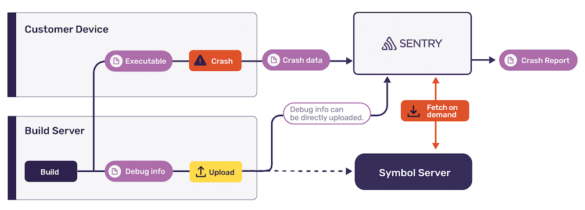

Debug information files allow Sentry to extract stack traces and provide more
information about crash reports for most compiled platforms. Information stored
in debug files includes original function names, paths to source files and line
numbers, source code context, or the placement of variables in memory. Sentry
can use some of this information and display it on the issue details page.

Each major platform uses different debug information files. We currently support
the following formats:

- [_dSYM files_](#macho-and-dsym) for iOS, iPadOS,
  tvOS, watchOS, and macOS
- [_ELF symbols_](#executable-and-linkable-format-elf) for Linux and
  Android (NDK)
- [_PDB files_](#pe-and-pdb) for Windows
- [_Breakpad symbols_](#breakpad-symbols) for all
  platforms
- [_ProGuard mappings_](#proguard-mappings) for
  Java and Android

<Note>

Source maps, while also being debug information files, are handled
differently in Sentry. For more information see [Source Maps in sentry-cli](/product/cli/releases/#sentry-cli-sourcemaps).

</Note>

Sentry requires access to debug information files of your application as well as
system libraries to provide fully symbolicated crash reports. You can either
[upload](#uploading-files) your files to Sentry or put them on a compatible
[Symbol Server](#symbol-servers) to be downloaded by Sentry when needed.

Debug information files can be managed on the _Debug Files_ section in _Project
Settings_. This page lists all uploaded files and allows to configure symbol
servers for automatic downloads.

## Debug Information

Sentry differentiates in four kinds of debug information:

- **Unwind Information:** Enables Sentry to extract stack traces from Minidumps
  and other binary crash formats of optimized builds. This process is referred
  to as "stack unwinding" or "stack walking". Since this is also required when
  throwing exceptions in C++, this information is often included in the
  executable or library. If an uploaded file contains this information, it shows
  the `unwind` tag.

- **Debug Information:** Provides function names, paths to source files, line
  numbers and inline frames. The process of resolving this information from
  instruction addresses is called "symbolication". This information is
  relatively large compared to the executable and usually put into a separate
  file. In Sentry, these files are designated as _debug companions_ and show the
  `debug` tag.

- **Symbol Tables:** If debug information is not available for a certain
  library, Sentry can use symbol tables as a fallback to retrieve function
  names. Symbol tables are usually included in both the executable and debug
  companion files. However, they do not contain sufficient information to
  resolve inline functions or file names and line numbers. The `symtab` tag
  indicates symbol tables.

- **Source Code:** Conventionally, source code is not part of regular debug
  information files. Sentry CLI can bundle source code of your application and
  upload it to display source context in stack traces in Sentry. These bundles
  show up with the `sources` tag.

Compilers place the above debug information in different files passed on the
target platform, architecture, build flags or optimization level. Consequently,
Sentry might not need all of the above information to process crash reports.
Still, it is always a good idea to provide all available debug information.

`sentry-cli` can be used to list properties of supported debug files and
validate their contents. See [_Debug Information Files in sentry-cli_](/product/cli/dif/) for more information.

The remainder of this section describes the file formats in detail.

### MachO and dSYM

Executables, dynamic libraries and debug companions on all Apple platforms use
the _Mach Object_, or short _MachO_, container format. This applies to iOS,
iPadOS, tvOS, watchOS, and macOS.

- **Executables** do not carry a file extension. For desktop applications, they
  are often placed in app bundle structures with the `.app` suffix. Unless
  stripped manually, executables contain unwind information and a symbol table.
  Debug information is never stored in executables.

- **Dynamic Libraries** use the `.dylib` extension, and otherwise behave exactly
  the same as executables.

- **Debug Companions** are placed in a folder structure with the `.dSYM`
  extension, and are located at `<name>.dSYM/Contents/Resources/DWARF/<name>`.
  They usually contain a symbol table and debug information, but rarely unwind
  information.

When building an application with Xcode or with the `clang` compiler, debug
information is automatically placed in a dSYM file. When linking manually,
however, the dSYM file must be created using the following command:

```bash
dsymutil /path/to/output[.dylib]
```

### Executable and Linkable Format (ELF)

On Linux distributions, executables and debug information are stored in _ELF_
containers. Unlike other platforms, there is no dedicated container or specifier
for debug companion files.

Debug information is part of the binary (executable or library) and stripped
when generating release builds due to their size. However, there is a way to
retain them in a separate file (either in a different location or with `.debug`
extension):

```bash
# There is an executable called "binary" in the CWD
objcopy --only-keep-debug binary binary.debug
objcopy --strip-debug --strip-unneeded binary
objcopy --add-gnu-debuglink=binary.debug binary
```

This results in the following structure:

- **Executables** do not carry a file extension. If stripped like above,
  executables contain a symbol table, but no debug information. If the build
  run omits frame pointers, unwind information will also be retained. Both can
  be further stripped using flags like `--strip-all`.

- **Shared Libraries** use the `.so` extension, and otherwise behave exactly
  the same as executables.

- **Debug Companions** do not carry a standard file extension, but are often
  named `.debug`. If stripped like above, these files contain unwind
  information, debug information and a symbol table.

Shared libraries installed via package managers usually provide their debugging
information in separate `*-dev` packages and put it in locations like
`/usr/local/debug/...`. To receive symbolicated stack traces from those
libraries, make sure to also upload their symbols in addition to your app’s
symbols.

ELF supports the compression of debug information which can significantly reduce
the time required to upload debug information files to Sentry and thus improve
build times. `gcc` (version 5 or newer) and `clang` (version 5 or newer) support
this by passing the `-gz` flag to both the compiler and linker. The common way
to compress debug information, however, is when stripping the executable:

```bash
# Note the --compress-debug-sections option
objcopy --only-keep-debug --compress-debug-sections=zlib binary binary.debug
```

This can be verified by checking for the `C` flag in `readelf`, corresponding to
`SHF_COMPRESSED`:

```bash
readelf -S path/to/file
  ...
  [21] .debug_info       PROGBITS         0000000000000000  00000370
       000000000000e133  0000000000000000   C       0     0     1
```

### PE and PDB

On Microsoft Windows, executables and dynamic libraries use the _Portable
Executable_ container, in short _PE_. Debug information is stored in _Program
Database_ files, commonly referred to as _PDB_.

- **Executables** use an `.exe` file extension. Only when compiled for 64-bit
  architectures, they contain unwind information. Otherwise, they do not contain
  any usable information and will be omitted for the upload to Sentry.

- **Dynamic Libraries** use the `.dll` file extension, and otherwise behave
  exactly the same as executables.

- **Debug Companions** are stored in `.pdb` files. They usually contain debug
  information and in most cases symbol tables. For 32-bit programs, they also
  contain unwind information. In rare cases, they might have different file
  names than their corresponding executable.

<Note>

At the moment, Sentry supports Native PDBs only. PDBs for the .NET platform are not supported.

</Note>

### Breakpad Symbols

The Google Breakpad library has established a platform-independent ASCII format
to store debug information. Such files are usually generated for applications
using Breakpad, Crashpad or the Electron Framework.

The Breakpad repository includes `dump_syms` tools for each platform that can
convert from native debug files to Breakpad symbols. These converters bundle all
available information into one file, such that only one file needs to be
uploaded.

In contrast to native debug files, Breakpad symbols discard a lot of information
that is not required to process minidumps. Most notably, inline functions are
not declared, such that Sentry is not able to display inline frames in stack
traces.

### ProGuard Mappings

<PlatformSection supported={["android", "flutter", "react-native"]}>

<Note>

  The recommended method for [Android users is to use the Gradle plugin](/platforms/android/proguard/).

</Note>

</PlatformSection>

ProGuard mapping files allow Sentry to resolve obfuscated Java classpaths and
method names into their original form. In that sense, they act as debug
information files for Java and Android applications.

## Debug Identifiers

Each debug information file specifies a unique identifier. Crash reports declare
these identifiers to allow debuggers and crash reporting systems to resolve the
correct files. Sentry distinguishes two kinds of identifiers:

- **Code Identifier**: The unique identifier of the executable or dynamic
  library -- the code file. The contents of this identifier are
  platform-dependent: MachO files use a UUID, ELF files a SHA hash, PE files use
  a concatenation of certain header attributes.

- **Debug Identifier**: The unique identifier of the debug companion file. In
  contrast to the code identifier, Sentry enforces the same structure on all
  platforms. On Windows, this is the actual unique id of the PDB file; on all
  other platforms this is a lossy transformation of the code identifier.

When uploading debug information files to Sentry, the CLI and server will always
compute a _Debug Identifier_ for each uploaded file. This identifier is
associated with executables and libraries as well as debug companions to ensure
that they can be uniquely located via one common mechanism.

<Note>

Debug information does not have to be associated with releases. The unique debug
identifier ensures that Sentry can choose the right files for every crash
report. However, it is still recommended to configure releases in the client to
benefit from other features.

</Note>

For native events, the issue details page displays a list of _Loaded Images_.
This list contains the executable and all loaded dynamic libraries including
their debug identifiers. You can copy this identifier and search for the exact
files that match it in the _Debug Files_ settings screen.

`sentry-cli` can help to print properties of debug information files like their
debug identifier. See [_Checking Debug Information Files_](/product/cli/dif/#checking-files) for more information.

### GNU Build Identifiers

For ELF files on Linux, Sentry uses the GNU build identifier to compute the
debug identifier. All recent compilers and linkers support the emission of build
IDs, but sometimes they might require additional configuration. `gcc` does this
by default, for `clang` use one of the following flags:

- `--build-id=uuid` for a fast but non-reproducible random identifier.
- `--build-id=sha1` for a slower but reproducible identifier generated by
  hashing the first page of the code section.

_The identifier needs to be present and identical in the binary as well
as stripped debug information files._ If the ID is missing for some reason,
upload the files before stripping so that `sentry-cli` can compute a stable
identifier from the unstripped file.

### PDB Age Mismatches

Microsoft PDBs compose their identifiers from two parts: A unique signature and
an age field. The signature is generated when the PDB is written initially and
usually changes with every build. The age is a counter that is incremented every
time the PDB is modified.

PE files, such as executables and dynamic libraries, specify the full identifier
of the corresponding PDB in their header. This includes the age. If the PDB is
modified after the PE has been generated, however, its age might diverge. This
can lead to different identifiers:

```
PE:  3003763b-afcb-4a97-aae3-28de8f188d7c-2
PDB: 3003763b-afcb-4a97-aae3-28de8f188d7c-4
```

`sentry-cli` can detect these differences during the upload process and
associates the same identifier to both files. However, this requires that both
files are uploaded in the same invocation of the upload command. Otherwise, the
identifiers diverge and Sentry might not be able to resolve the correct file
for symbolication.

### ProGuard UUIDs

Unlike other debug information files, ProGuard files do not have an intrinsic
unique identifier. Sentry CLI assigns them a SHA1 UUID based on the checksum of
the file. You can use `sentry-cli difutil check` on a ProGuard file to see the
generated UUID.

If you need to generate the UUID yourself, you can do so with the following
algorithm (Python code for reference):

```python
import uuid

NAMESPACE = uuid.uuid5(uuid.NAMESPACE_DNS, "guardsquare.com")

def get_proguard_uuid(filename):
    with open(filename, 'rb') as f:
        return uuid.uuid5(NAMESPACE, f.read())
```

## Uploading Files

The most straightforward way to provide Sentry with debug information file is
to upload them using `sentry-cli`. Depending on your workflow, you may want to
upload as part of your build pipeline or when deploying and publishing your
application:



Files can be uploaded using the `upload-dif` command. This command will scan a
given folder recursively for files and upload them to Sentry:

```bash
sentry-cli upload-dif -o <org> -p <project> /path/to/files

> Found 2 debug information files
> Prepared debug information files for upload
> Uploaded 2 missing debug information files
> File processing complete:

  PENDING 1ddb3423-950a-3646-b17b-d4360e6acfc9 (MyApp; x86_64 executable)
  PENDING 1ddb3423-950a-3646-b17b-d4360e6acfc9 (MyApp; x86_64 debug companion)
```

For all available options and more information refer to [_Uploading Debug
Information_](/product/cli/dif/#uploading-files).

Always ensure that debug files are uploaded before deploying or releasing your
application so that crash reports can be processed. For manual testing, use the
`sentry-cli upload-dif --wait` before sending the first native crash or error
event.

If you upload a file that was previously reported as missing by Sentry in a crash
report, it may take up to one hour until Sentry starts using this file for new
crash reports. Existing events and issues are not processed again.

In Sentry, your uploaded files are associated with projects. You can view and
manage uploads at _Project Settings > Debug Files_. This screen displays the
most important properties of debug files:

1. The debug identifier. There may be multiple entries sharing the same
   identifier, if debug information is split across multiple files.
2. The name of the debug file. Sentry uses the name on the file system when
   uploading the file using `sentry-cli`.
3. The architecture, and type of the file. This can be used to distinguish files
   into executables and debug companions if their debug identifiers and names
   match.
4. The debug information available in these files. This can include `unwind`,
   `debug`, `symtab` and `sources`.
5. Metadata like the size and time of upload.

If multiple projects require the same file, it needs to be re-uploaded. Sentry
does not access debug files stored in other projects to symbolicate crash
reports.

## Reprocessing

Sentry can suspend incoming crash reports until all required debug information
files have been uploaded. This feature is called _Reprocessing_. It can be
configured in _Project Settings > Processing Issues_. By default, this feature
is disabled.

If enabled, crash reports with missing debug files will not be displayed in the
issues stream. Instead, you will receive a warning that events cannot be
processed until all debug files have been uploaded.

Once an issue is shown in the issues stream, it is no longer processed. Even
with enabled reprocessing, new file uploads will not effect such events.

At the moment, this feature only applies to iOS crashes sent with the Cocoa SDK
and is not compatible with Symbol Servers.

## Symbol Servers

Sentry can download debug information files from external repositories. This
allows you to stop uploading debug files and instead configure a public symbol
server or run your own. It is also possible to configure external repositories
and upload debug files at the same time.

To configure external repositories, go to _Project Settings > Debug Files_.
Above the list of uploaded files, there are two settings to configure external
repositories:

1. **Custom Repositories:** Configures custom repositories containing debug
   files. You can choose from configuring an HTTP symbol server, Amazon S3
   bucket or Google Cloud Storage bucket. This requires a _Business_ or
   _Enterprise_ plan.

2. **Built-In Repositories:** Allows to select from a list of pre-configured
   symbol servers. By default, _iOS_ and _Microsoft_ are enabled.

Sentry queries external repositories for debug information files in the order
they are configured. If custom repositories are configured, those are probed
first. Only debug information files that are not found on one of the custom
repositories are queried from the built-in ones.

### Built-In Repositories

To enable a built-in repository, select it from the dropdown list. This
immediately adds the repository and uses its debug information files to
symbolicate new crash reports. Likewise, any built-in repository can be disabled
by clicking on the X next to the name.

Adding or removing external repositories applies immediately. As a result,
events may group differently with the new information and create new issues.
Beware that these cause notifications to your team members.

### Custom Repositories

<Alert title="Note" level="info">

Custom repositories are available for organizations on the _Business_ and
_Enterprise_ plans.

</Alert>

Independent of the internal format, Sentry supports three kinds of custom
repositories:

- **HTTP Symbol Server**: An HTTP server that serves debug files at a
  configurable path. Lookups in the server should generally be case-insensitive,
  although an explicit casing can be configured in the settings.

- **Amazon S3 Bucket**: Either an entire S3 bucket or a subdirectory. This
  requires `s3:GetObject`, and optionally `s3:ListBucket` permissions for the
  configured Access Key. Lookups in the bucket are case sensitive, which is why
  we recommend storing all files lower-cased.

- **Google Cloud Storage Bucket**: Either an entire GCS bucket or a
  subdirectory. This requires `storage.objects.get` and `storage.objects.list`
  permissions for the configured service account. Lookups in the bucket are case
  sensitive, which is why we recommend storing all files lower-cased.

Apart from authentication configuration, all types have common config
parameters:

1. **Name**: A name to identify the repository.

2. **Path Casing**: Overrides which casing Sentry uses to query for debug
   information files. The default is a mixed case, which will use the case
   described in the next section. When overridden, all access is either
   lowercased or uppercased. Defaults to _"mixed case"_.

3. **Directory Layout**: The internal structure of the bucket, or the protocol
   of the symbol server. There are three layouts to choose from which are
   discussed in the next section. Defaults to _"Platform Specific"_.

### Directory Layouts

Sentry supports multiple layouts for external repositories. Based on the
selected layout and the file type, we try to download files at specific paths.

The following table contains a mapping from the supported layouts to file path
schemas applied for specific files:

| Layout                          | MachO |   ELF   |    PE    |   PDB    | Breakpad |
| ------------------------------- | :---: | :-----: | :------: | :------: | :------: |
| Platform-Specific               | LLDB  | BuildID | SymStore | SymStore | Breakpad |
| Microsoft SymStore              |   -   |    -    | SymStore | SymStore |    -     |
| Microsoft SymStore (index2.txt) |   -   |    -    |  Index2  |  Index2  |    -     |
| Microsoft SSQP                  | SSQP  |  SSQP   |   SSQP   |   SSQP   |    -     |

The path schemas in the table above are defined as follows:

**Breakpad**

: Path: `<DebugName>/<BREAKPADid>/<SymName>`

Breakpad always uses a _Breakpad ID_ to store symbols. These identifiers can
be computed from _Debug Identifiers_ by removing dashes and applying the
following casing rules:

- The signature part of the id (first 32 characters) are **uppercase**.
- The age part of the id (remaining characters) are **lowercase**.

The name of the symbol file is platform dependent. On Windows, the file
extension (Either `.exe`, `.dll` or `.pdb`) is replaced with `.sym`. On all
other platforms, the `.sym` extension is **appended** to the full file name
including potential extensions.

Examples:

- `wkernel32.pdb/FF9F9F7841DB88F0CDEDA9E1E9BFF3B51/wkernel32.sym`
- `MyFramework.dylib/5E012A646CC536F19B4DA0564049169B/MyFramework.dylib.sym`

**LLDB**

: Path: `XXXX/XXXX/XXXX/XXXX/XXXX/XXXXXXXXXXXX[.app]`

The LLDB debugger on macOS can read debug symbols from [File Mapped UUID
Directories](https://lldb.llvm.org/use/symbols.html#file-mapped-uuid-directories).
The UUID is broken up by splitting the first 20 hex digits into 4 character
chunks, and a directory is created for each chunk. In the final directory,
LLDB usually expects a symlink named by the last 12 hex digits, which it
follows to the actual dSYM file.

This is not actually an LLVM feature. This is in fact a feature of
`CoreFoundation` and exclusively implemented on macOS on top of spotlight.
Spotlight indexes these paths and the private `DBGCopyFullDSYMURLForUUID` API
is used by lldb to locate the symbols. macOS uses the symlinks of those
locations.

Since the executable or library shares the same UUID as the dSYM file, the
former are distinguished with a `.app` suffix.

The hex digits are **uppercase**, the app suffix is **lowercase**.

Examples:

- `5E01/2A64/6CC5/36F1/9B4D/A0564049169B` (debug companion)
- `5E01/2A64/6CC5/36F1/9B4D/A0564049169B.app` (executable or library)

**BuildID**

: Path: `nn/nnnnnnnnnnnnnnnn...[.debug]`

GDB supports multiple lookup methods, depending on the way the debug info file
is specified. Sentry uses the [Build ID Method]: Assuming that a GNU build ID
note or section has been written to the ELF file, this specifies a unique
identifier for the executable which is also retained in the debug file.

The GNU build ID is a variable-length binary string, usually consisting of a
20-byte SHA1 hash of the code section (`.text`). The lookup path is
_pp/nnnnnnnn.debug_, where _pp_ are the first 2 hex characters of the build ID
bit string, and _nnnnnnnn_ are the rest of the hex string. To look up
executables, the `.debug` suffix is omitted.

Examples:

- `b5/381a457906d279073822a5ceb24c4bfef94ddb` (executable or library)
- `b5/381a457906d279073822a5ceb24c4bfef94ddb.debug` (stripped debug file)

**SSQP**

: Path: `<file_name>/<prefix>-<identifier>/<file_name>`

[SSQP Key Conventions] are an extension to the original Microsoft Symbol
Server protocol for .NET. It specifies lookup paths for PE, PDB, MachO and ELF
files. The case of all lookup paths is generally **lowercase** except for the
age field of PDB identifiers which should be **uppercase**.

For MachO files and ELF files, SSQP specifies to use the same identifiers as
used in the LLDB and GNU build id method, respectively. See the sections above
for more information. This results in the following paths for all possible
file types:

- `<code_name>/<timestamp><size_of_image>/<code_name>`
  (PE file)
- `<debug_name>/<signature><AGE>/<debug_name>` (PDB
  file)
- `<code_name>/elf-buildid-<buildid>/<code_name>` (ELF
  binary)
- `_.debug/elf-buildid-sym-<buildid>/_.debug` (ELF debug file)
- `<code_name>/mach-uuid-<uuid>/<code_name>` (MachO binary)
- `_.dwarf/mach-uuid-sym-<uuid>/_.dwarf` (MachO binary)

SSQP specifies an additional lookup method by SHA1 checksum over the
file contents, commonly used for source file lookups. _Sentry does not support
this lookup method._

Examples:

- `wkernel32.pdb/ff9f9f7841db88f0cdeda9e1e9bff3b5A/wkernel32.pdb`
- `kernel32.dll/590285e9e0000/kernel32.dll`
- `libc-2.23.so/elf-buildid-b5381a457906d279073822a5ceb24c4bfef94ddb/libc-2.23.so`
- `_.debug/elf-buildid-sym-b5381a457906d279073822a5ceb24c4bfef94ddb/_.debug`
- `CoreFoundation/mach-uuid-36385a3a60d332dbbf55c6d8931a7aa6/CoreFoundation`
- `_.dwarf/mach-uuid-sym-36385a3a60d332dbbf55c6d8931a7aa6/_.dwarf`

**SymStore**

: Path: `<FileName>/<SIGNATURE><AGE>/<FileName>`

The public symbol server provided by Microsoft used to only host PDBs for the
Windows platform. These use a _signature-age_ debug identifier in addition to
the file name to locate symbols. File paths are identical to SSQP, except for
the default casing rules:

- Filenames are **as given**
- The signature and age of a PDB identifier are **uppercase**.
- The timestamp of a PE identifier is **uppercase**, but the size is
  **lowercase**.

Since the original Microsoft Symbol Server did not serve ELF or MachO files,
we do not recommend using this convention for these types. However, Sentry
will support the SSQP conventions with adapted casing rules when this layout
is selected.

Examples:

- `wkernel32.pdb/FF9F9F7841DB88F0CDEDA9E1E9BFF3B5A/wkernel32.pdb`
- `KERNEL32.dll/590285E9e0000/KERNEL32.dll`

**Index2**

: Path: `<Fi>/<FileName>/<SIGNATURE><AGE>/<FileName>`

This layout is identical to _SymStore_, except that the first two characters
of the file name are prepended to the path as an additional folder.

Examples:

- `wk/wkernel32.pdb/FF9F9F7841DB88F0CDEDA9E1E9BFF3B5A/wkernel32.pdb`
- `KE/KERNEL32.dll/590285E9e0000/KERNEL32.dll`

[ssqp key conventions]: https://github.com/dotnet/symstore/blob/master/docs/specs/SSQP_Key_Conventions.md
[file mapped uuid directories]: https://lldb.llvm.org/use/symbols.html#file-mapped-uuid-directories
[build id method]: https://sourceware.org/gdb/onlinedocs/gdb/Separate-Debug-Files.html

### Compression of Debug Files

Sentry supports the following compression methods when downloading debug
information files from external sources: Gzip, zlib (both with and
without header), Zstandard, and Cabinet (CAB).

The convention on Microsoft's Symbol Server protocol is to store such files with
the last character of the file extension replaced with `_`. A full example would
be: `KERNEL32.dll/590285E9e0000/KERNEL32.dl_`. This is not required on your own
repositories, as Sentry detects compression on all paths.

## Source Context

If Sentry has access to application source code, it can show snippets of code
around the location of stack frames. Certain SDKs can resolve this source
context automatically, such as the Python SDK, because they have access to
unobfuscated source code at runtime.

To get source context for native applications, source code needs to be uploaded
alongside the debug information files. The recommended way to do this is by
using `sentry-cli`. See [Creating Source Bundles](/product/cli/dif/#creating-source-bundles) for more information.

Source bundles show up as regular debug files on the _Debug Files_ settings
page. They are designated as "source bundle" and feature a `sources` tag. To
match them with crash reports, they carry the same debug file as the respective
debug information file they have been created from.
