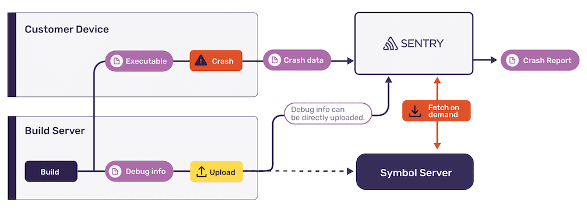

The most straightforward way to provide Sentry with debug information file is
to upload them using `sentry-cli`. Depending on your workflow, you may want to
upload as part of your build pipeline or when deploying and publishing your
application:

Files can be uploaded using the `upload-dif` command. This command will scan a
given folder recursively for files and upload them to Sentry:

<PlatformContent includePath="upload-dif" />

For all available options and more information refer to [_Uploading Debug
Information_](/product/cli/dif/#uploading-files).

Debug files should be uploaded before deploying or releasing your
application so that crash reports can be processed. For manual testing, use the
`sentry-cli upload-dif --wait` before sending the first native crash or error
event.

If you upload a file that was previously reported as missing by Sentry in a crash
report, it may take up to one hour until Sentry starts using this file for new
crash reports. Existing events and issues are not processed again.

In Sentry, your uploaded files are associated with projects. You can view and
manage uploads at **Project Settings > Debug Files**. This screen displays the
most important properties of debug files:

1. The debug identifier. There may be multiple entries sharing the same
   identifier, if debug information is split across multiple files.
2. The name of the debug file. Sentry uses the name on the file system when
   uploading the file using `sentry-cli`.
3. The architecture, and type of the file. This can be used to distinguish files
   into executables and debug companions if their debug identifiers and names
   match.
4. The debug information available in these files. This can include `unwind`,
   `debug`, `symtab` and `sources`.
5. Metadata like the size and time of upload.

If multiple projects require the same file, it needs to be re-uploaded. Sentry
does not access debug files stored in other projects to symbolicate crash
reports.
