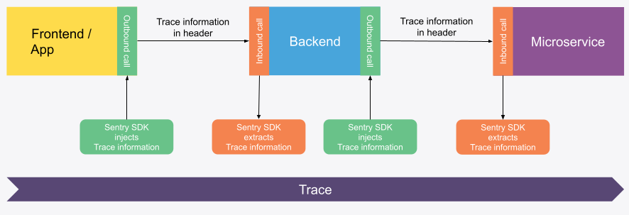

## What Is Distributed Tracing?

Applications can consist of multiple components, which are also called services. A web application for example can consist of a frontend, a backend and a microservice. A mobile app can alike constist of the mobile app running on the device and a backend and a microserivce.

When a user triggeres an action in the frontend/app it will call the backend which on its part calls the microservice.
So the users action leaves a trace through three services.

Adding a unique trace ID to the users actions and passing it on from the frontend/app to the backend and further on to the microservice is called distributed tracing.

This way all the information that is collect on the frontend, the backend and the microservice is associated with one unique trace. Which makes it possible to relate information that was collected on the frontend with information collected in the backend or microservice

You could for example see what UI element was clicked on the frontend that lead to an error in the microservice. This gives you the complete picture of what was happing in your application as a whole, not just what was happening in one service.

## How Does Distributed Tracing Work in Sentry?

The Sentry SDKs can inject tracing information into outgoing requests and can also extract tracing information from incoming requests.

There are two headers that are used to propagate tracing information:

- `sentry-trace`
- `baggage`

For distributed tracing to work make sure that those headers are not blocked or stripped by your proxy servers or firewalls.

<Expandable title="Want to nerd out about those headers? Click here! (optional)">

 

### `sentry-trace` header

The `sentry-trace` header is inspired by the `traceparent` header of the [W3C Trace Context](https://www.w3.org/TR/trace-context/#traceparent-header) but without the version.

`sentry-trace = traceid-spanid-sampled`

`sampled` is optional. So at a minimum, it's expected:

`sentry-trace = traceid-spanid`

Description of the parts:

- `traceid`: 128 bits encoded in 32 hex chars
- `spanid`: 64 bits encoded in 16 hex chars
- `sampled`: One single (optional) character
  - ` ` (no value) = Defer sampling decision
  - `0` = Don't sample
  - `1` = Sample

Example: `"771a43a4192642f0b136d5159a501700-1234567890abcdef-1"`

 

### `baggage` header

The [W3C Propagation format for distributed context: Baggage](https://www.w3.org/TR/baggage/) implementing tracing information as URI encoded key-value pairs.

It contains additional information used by Sentrys distributed tracing. See [Baggage header](https://develop.sentry.dev/sdk/performance/dynamic-sampling-context/#baggage-header) in our developer documentation to learn more.

</Expandable>

<PlatformContent includePath="distributed-tracing/configuration/" />

<PlatformContent includePath="distributed-tracing/other-services/" />

<!-- ## Verify

Screenshots wie es aussehen soll und wo man in Sentry.io es sich ansehen kann.

Von Instrumentationssue auf Trace

Von Replay auf Trace
## Temp

Ab welcher Version ist es supported?

-->
