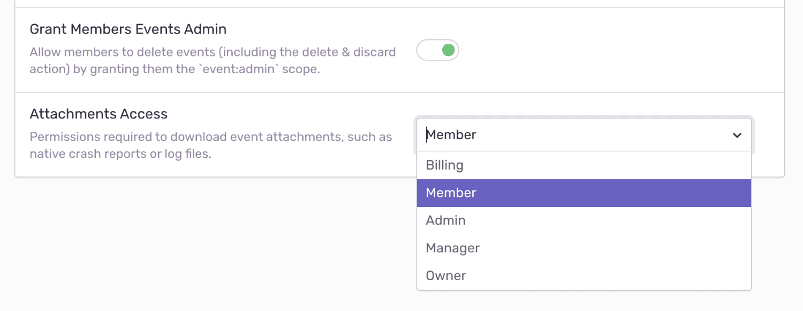

Sentry can augment your crash reports by storing additional files alongside the event, such as log files, as attachments. Attachments allow the files within a crash to not only upload to Sentry, but also persist for further investigation. You can use a higher-level SDK for platforms with built-in support for native crashes, or generate and upload attachments using the API:

- [Native C/C++](/platforms/native/)
- [Electron](/platforms/javascript/guides/electron/)
- [Minidump endpoint](/platforms/native/minidump/)

To receive symbolicated stack traces, you have to upload debug information to Sentry. Unless the option to store crash reports is enabled, Sentry will use the crash reports only to create the event, then will drop the files. For more information, see [Debug Information Files](/workflow/debug-files/).

## Uploading Attachments

To add an attachment, the path to the file has to be configured when
initializing the SDK. It will monitor the file and upload it along with any event
or crash that is sent to Sentry:

<PlatformContent includePath="add-attachment" />

## Size Limits

Sentry allows at most 100MB of attachments per event, including the crash report file. Uploads exceeding this size are rejected with HTTP error `413 Payload Too Large` and the data is dropped immediately. To add larger or more files, consider secondary storage options.

Usually, native crash reports range from a few kilobytes to a few megabytes. This leaves sufficient space to add custom attachments. In case your application generates particularly large crash reports, consider to limit or avoid adding additional attachments in the SDK.

## Storage and Quota Impact

Attachments persist for 30 days; if your total storage included in your quota is exceeded, attachments will not be stored. You can delete attachments or their containing events at any time. Deleting an attachment does not affect your quota - Sentry counts an attachment toward your quota as soon as it is stored.

Learn more about how attachments impact your [quota](/accounts/quotas/).

## Crash Reports and Privacy

Crash reports may contain sensitive information about the target system, such as environment variables, local pathnames, or in-memory representations of input fields, including passwords. By default, Sentry only uses crash report files to create events and immediately drops them. All sensitive information is stripped from the resulting events.

All other types of attachments, such as log files or screenshots, are stored for 30 days when sent to Sentry. Note that Sentry does not apply data scrubbing to attachments.

### Enabling Crash Report Storage

You can enable _Store Native Crash Reports_ in your organization's **Security and Privacy Settings**. By default, this setting is disabled. Determine the maximum number of crash reports that will be stored per issue; disabled, unlimited, or maximum per issue:

If you set a limit per issue, as in the example above, a limit of 10, Sentry will store the first 10 attachments associated with this issue, but drop any that follow. To make room for additional attachments, delete them. Sentry will then accept attachments until the limit is reached again.

### Access to Attachments

To limit access to attachments, navigate to your organization's **General Settings**, then select the _Attachments Access_ dropdown to set appropriate access — any member of your organization, the organization billing owner, member, admin, manager, or owner.

By default, access is granted to all members when storage is enabled. If a member does not have access to the project, the ability to download an attachment is not available; the button will be greyed out in Sentry. The member may only view that an attachment is stored.

## Viewing Attachments

Attachments display on the bottom of the **Issue Details** page for the event that is shown.

Alternately, attachments also appear in the _Attachments_ tab on the **Issue Details** page, where you can view the _Type_ of attachment, as well as associated events. Click the Event ID to open the **Issue Details** of that specific event.

If you chose to limit the number of crash reports per issue, you can show _Only Crash Reports_. This removes all other attachments from the list, which can be useful if the issue has accumulated a large number of events.
