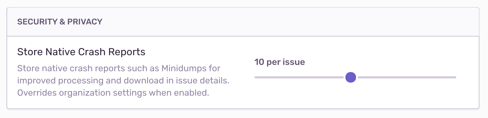

<PlatformSection supported={["apple"]}>

Be aware that attachments don't work yet with crashes.

</PlatformSection>

<PlatformSection supported={["android", "java"]}>

**Attention: This is a preview API available since 4.0.0-alpha.2. This API is not in stable state yet. It may be renamed, changed or even removed in a future version.**

Be aware that attachments don't work yet with crashes.

</PlatformSection>

<PlatformSection supported={["dotnet"]}>

This feature is supported starting with version 3.0 of .NET Sentry SDK.

</PlatformSection>

Sentry can enrich your events for further investigation by storing additional files, such as config or log files, as attachments.

<PlatformSection supported={["native"]}>

You can use a higher-level SDK for platforms with built-in support for native crashes, or generate and upload attachments using the API:

- [Native C/C++](/platforms/native/)
- [Electron](/platforms/javascript/guides/electron/)
- [Minidump endpoint](/platforms/native/guides/minidumps/)

To receive symbolicated stack traces, you have to upload debug information to Sentry. Unless the option to store crash reports is enabled, Sentry will use the crash reports only to create the event, then will drop the files. For more information, see [Debug Information Files](/workflow/debug-files/).

</PlatformSection>

<PlatformSection supported={["android", "apple", "java", "dotnet"]}>

## Creating Attachments

The simplest way to create an attachment is to use a `path`. The SDK will read the contents of the file each time it prepares an event or transaction, then adds the attachment to the same [envelope](https://develop.sentry.dev/sdk/envelopes/). If the SDK can't read the file, the SDK logs an error message and drops the attachment.

<PlatformContent includePath="attachment-init-with-path" />

Alternately, use `bytes` to initialize an attachment. When doing so, you also need to specify a filename.

<PlatformContent includePath="attachment-init-with-bytes" />

If your SDK supports offline caching, which is typical for mobile, each attachment is stored to disk for each event or transaction you capture when the device is offline. When using large attachments, this storage can consume the disk space if the device is offline for a longer time period. You can specify [maximum attachment size](#maximum-attachment-size) to drop large attachments and avoid this issue.

In addition, you can set these parameters:

`filename`

: The filename is the name of the file to display in Sentry. When using bytes you have to specify a filename, whereas with a path you don't as the SKD is going to use the last path component.

`contentType`

: The type of content stored in this attachment. Any [MIME type](https://www.iana.org/assignments/media-types/media-types.xhtml) may be used; the default is `application/octet-stream`.

</PlatformSection>

## Uploading Attachments

<PlatformSection supported={["native", "javascript"]}>

<PlatformContent includePath="add-attachment" />

</PlatformSection>

<PlatformSection supported={["android", "apple", "java", "dotnet"]}>

Attachments live on the <PlatformLink to="/enriching-events/scopes/">Scope</PlatformLink>. You can either add an attachment on the global scope to be sent with every event or add it on the <PlatformLink to="/enriching-events/scopes/#local-scopes">local Scope</PlatformLink> to just send the attachment with one specific event.

<PlatformContent includePath="attachment-upload" />

</PlatformSection>

<Note>

Sentry allows at most 100MB of attachments per event, including the crash report file (if applicable) Uploads exceeding this size are rejected with HTTP error `413 Payload Too Large` and the data is dropped immediately. To add larger or more files, consider secondary storage options.

<PlatformSection supported={["native"]}>

Usually, native crash reports range from a few kilobytes to a few megabytes. This leaves sufficient space to add custom attachments. In case your application generates particularly large crash reports, consider to limit or avoid adding additional attachments in the SDK.

</PlatformSection>

</Note>

Attachments persist for 30 days; if your total storage included in your quota is exceeded, attachments will not be stored. You can delete attachments or their containing events at any time. Deleting an attachment does not affect your quota - Sentry counts an attachment toward your quota as soon as it is stored.

Learn more about how attachments impact your [quota](/product/accounts/quotas/).

<PlatformSection supported={["native", "javascript.electron"]}>

## Crash Reports and Privacy

Crash reports may contain sensitive information about the target system, such as environment variables, local pathnames, or in-memory representations of input fields, including passwords. By default, Sentry only uses crash report files to create events and immediately drops them. All sensitive information is stripped from the resulting events.

All other types of attachments, such as log files or screenshots, are stored for 30 days when sent to Sentry. Note that Sentry does not apply data scrubbing to attachments.

### Enabling Crash Report Storage

You can enable _Store Native Crash Reports_ in your organization's **Security and Privacy Settings**. By default, this setting is disabled. Determine the maximum number of crash reports that will be stored per issue; disabled, unlimited, or maximum per issue:

If you set a limit per issue, as in the example above, a limit of 10, Sentry will store the first 10 attachments associated with this issue, but drop any that follow. To make room for additional attachments, delete them. Sentry will then accept attachments until the limit is reached again.

</PlatformSection>

### Access to Attachments

To limit access to attachments, navigate to your organization's **General Settings**, then select the _Attachments Access_ dropdown to set appropriate access — any member of your organization, the organization billing owner, member, admin, manager, or owner.

By default, access is granted to all members when storage is enabled. If a member does not have access to the project, the ability to download an attachment is not available; the button will be greyed out in Sentry. The member may only view that an attachment is stored.

## Viewing Attachments

Attachments display on the bottom of the **Issue Details** page for the event that is shown.

Alternately, attachments also appear in the _Attachments_ tab on the **Issue Details** page, where you can view the _Type_ of attachment, as well as associated events. Click the Event ID to open the **Issue Details** of that specific event.

<PlatformSection supported={["native", "javascript.electron"]}>

If you chose to limit the number of crash reports per issue, you can show _Only Crash Reports_. This removes all other attachments from the list, which can be useful if the issue has accumulated a large number of events.

</PlatformSection>

<PlatformSection supported={["android", "apple", "java", "dotnet"]}>

## Maximum Attachment Size

<PlatformSection supported={["android", "apple", "java"]}>
The maximum size for each attachment is set on `SentryOptions.maxAttachmentSize`.
</PlatformSection>

<PlatformSection supported={["dotnet"]}>
The maximum size for each attachment is set on `SentryOptions.MaxAttachmentSize`.
</PlatformSection>

The scale is bytes and the default is `20 MiB`. Please also check the
[maximum attachment size of Relay](https://docs.sentry.io/product/relay/options/)
to make sure your attachments don't get discarded there.

<PlatformContent includePath="attachment-max-size" />

</PlatformSection>
