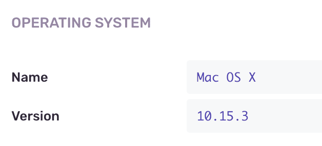

Custom contexts allow you to attach arbitrary data to an event. You cannot search these, but they are viewable on the issue page:



<Note>

If you need to be able to search on custom data, you will want to [use tags](../tags).

</Note>

To configure additional context:

<PlatformContent includePath="set-context" />

Note that the context's outer value has to be a dictionary/map/object, while the inner values can be arbitrary.

When sending context, _be aware of maximum payload size_, especially if you want to send the whole application state as extra data. Sentry does not recommend this approach since application state can be very large and easily exceed the 200kB maximum that Sentry has on individual event payloads. When this happens, you’ll receive an `HTTP Error 413 Payload Too Large` message as the server response or (when you set `keepalive: true` as a `fetch` parameter), the request will stay pending forever (for example, in Google Chrome).

Sentry will try its best to accommodate the data you send, but Sentry will trim large context payloads or truncate the payloads entirely.

For more details, see the [developer documentation on SDK data handling](https://develop.sentry.dev/sdk/data-handling/).

### Extra Data, Additional Data

If you come across any usages of "extra" (<PlatformIdentifier name="set-extra" /> in code) or "Additional Data" (in the UI), just mentally substitute it for context. Extra is deprecated in favor of context within most SDKs.

<PlatformSection supported={["javascript", "node"]}>

### Passing Context Directly

Starting in version 5.16.0 of our JavaScript SDKs, some of the contextual data can be provided directly to `captureException` and `captureMessage` calls. Provided data will be merged with the one that is already stored inside the current scope, unless explicitly cleared using a callback method.

This functionality works in three different variations:

1.  Plain object containing updatable attributes
2.  Scope instance from which we will extract the attributes
3.  Callback function that will receive the current scope as an argument and allow for modifications

We allow the following context keys to be passed: `tags`, `extra`, `contexts`, `user`, `level`, `fingerprint`.

#### Example Usages

```javascript
Sentry.captureException(new Error("something went wrong"), {
  tags: {
    section: "articles",
  },
});
```

Explicitly clear what has been already stored on the scope:

```javascript
Sentry.captureException(new Error("clean as never"), scope => {
  scope.clear();
  scope.setTag("clean", "slate");
  return scope;
});
```

Use Scope instance to pass the data (its attributes will still merge with the global scope):

```javascript
const scope = new Sentry.Scope();
scope.setTag("section", "articles");
Sentry.captureException(new Error("something went wrong"), scope);
```

Use Scope instance to pass the data and ignore globally configured Scope attributes:

```javascript
const scope = new Sentry.Scope();
scope.setTag("section", "articles");
Sentry.captureException(new Error("something went wrong"), () => scope);
```

### Clearing Context

Context is held in the current scope and thus is cleared out at the end of each operation — request and so forth. You can also push and pop your own scopes to apply context data to a specific code block or function.

Sentry supports two different scopes for unsetting context:

1. A global scope, which Sentry does not discard at the end of an operation
2. A scope created by the user

This will be changed for all future events:

```javascript
Sentry.setUser(someUser);
```

This will be changed only for the error caught inside the `withScope` callback and automatically restored to the previous value afterward:

```javascript
Sentry.withScope(function(scope) {
  scope.setUser(someUser);
  Sentry.captureException(error);
});
```

If you want to remove globally configured data from the scope, you can call:

```javascript
Sentry.configureScope(scope => scope.clear());
```

To learn more about setting the Scope, see our documentation on [Scopes and Hubs](../scopes/).

</PlatformSection>
