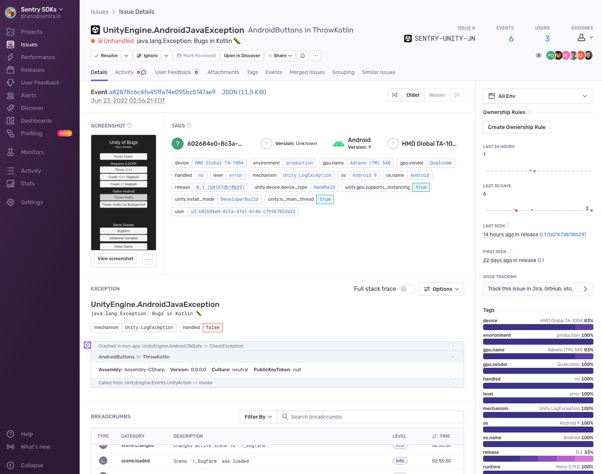
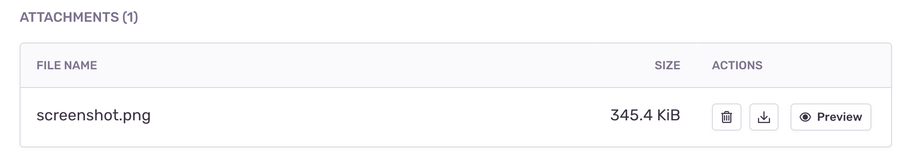

When a user experiences an error, an exception or a crash, Sentry provides the ability to take a screenshot and include it as an <PlatformLink to="/enriching-events/attachments/">attachment</PlatformLink>.

This feature only applies to SDKs with a user interface, such as the ones for mobile and desktop applications. In some environments like native iOS, taking a screenshot requires the UI thread and in the event of a crash, that might not be available. Another example where a screenshot might not be available is when the event happens before the screen starts to load. So inherently, this feature is a best effort solution.

## Enabling Screenshots

Screenshots may contain <PlatformLink to="/data-management/sensitive-data/">PII</PlatformLink> and is an opt-in feature. You can enable it as shown below:

<PlatformSection supported={["kotlin-multiplatform"]}>

<Note>

This feature is supported for iOS and Android only.

</Note>

</PlatformSection>

<PlatformContent includePath="enriching-events/attach-screenshots" />

<PlatformSection supported={["react-native"]}>

When `attachScreenshot` is enabled and an error event is captured, the screenshots are transferred from native SDKs to React Native over the bridge. This can negatively impact performance on lower-end devices, however, React Native New Architecture will improve the performance of the transfer, as the data are not serialized.

</PlatformSection>

## Viewing Screenshots

A thumbnail of the screenshot shows up at the top of the **Issue Details** page:

Additionally, screenshots appear in the "Attachments" tab, where you can view all attachments, as well as associated events. Click the event ID to open the **Issue Details** page of that specific event.

You can see an overview of all the screenshots associated with the events in your issue by clicking "Screenshots" in the "Attachments" tab.
