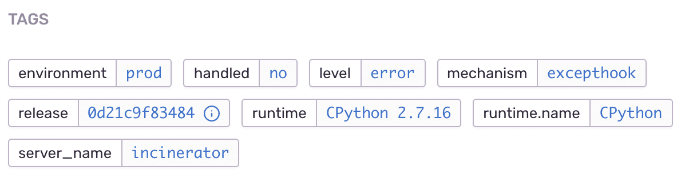

**Tags** are key/value string pairs that are both indexed and searchable. Tags power UI features such as filters and tag-distribution maps. Tags help you quickly access related events and view the tag distribution for a set of events. Common uses for tags include hostname, platform version, and user language.

We’ll automatically index all tags for an event, as well as the frequency and the last time that Sentry has seen a tag. We also keep track of the number of distinct tags and can assist you in determining hotspots for various issues.

<PlatformSection notSupported={["native.minidumps"]}>

Defining tags is easy, and will bind them to the [current scope](../scopes/) ensuring all future events within scope contain the same tags:

</PlatformSection>

<PlatformContent includePath="set-tag" />

<Note>

Some tags are automatically set by Sentry. We strongly recommend against overwriting those tags, and instead using your own nomenclature for names.

</Note>

Once you've started sending tagged data, you'll see it in the Sentry web UI: the filters within the sidebar on the Project page, summarized within an event, and on the tags page for an aggregated event.

