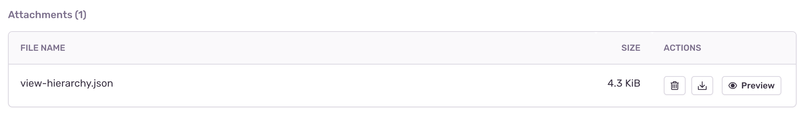

<PlatformSection supported={["flutter"]}>

<Include name="beta-note.mdx" />

</PlatformSection>

Sentry makes it possible to render a JSON representation of the view hierarchy of an error and includes it as an <PlatformLink to="/enriching-events/attachments/">attachment</PlatformLink>.

This feature only applies to SDKs with a user interface, such as the ones for mobile and desktop applications. In some environments like native iOS, rendering the view hierarchy requires the UI thread and in the event of a crash, that might not be available. Another example where the view hierarchy might not be available is when the event happens before the screen starts to load. So inherently, this feature is a best effort solution.

<Note>

Deobfuscation for view hierarchies is fully supported for native SDKs, and React Native, but is currently not supported for Flutter.

<PlatformSection supported={["apple"]}>
  View hierarchies are not supported for SwiftUI.
</PlatformSection>

</Note>

## Enabling View Hierarchy Attachments

View hierarchy debugging is an opt-in feature. You can enable it as shown below:

<PlatformContent includePath="enriching-events/attach-viewhierarchy" />

## Viewing View Hierarchy Attachments

View hierarchies appear in the "Attachments" tab, where you can view all attachments, as well as associated events. Click the event ID to open the [Issue Details](/product/issues/issue-details) page of that specific event.



On the **Issue Details** page, you can interact with the view hierarchy attachment in a section called "View Hierarchy". This section represents the state of your application at the time of an error event. There are three displays: a tree view, wireframe, and detailed view for a selected node. You can select nodes in either the tree or the wireframe to view the properties collected by the SDK. The SDK will report on the following keys for each node in the view: `alpha`, `visible`, `x`, `y`, `width`, `height`, `type`, and `identifier` if applicable, but there may be additional values specific to the SDK. This feature can be used as an exploratory tool to debug layout issues, visualize unnecessarily rendered content, or gain a better understanding of the relationship between views.

<PlatformSection supported={["android"]}>
  <PlatformContent includePath="enriching-events/attach-viewhierarchy-example" />
</PlatformSection>

<PlatformSection notSupported={["android"]}>


</PlatformSection>

<PlatformSection supported={["react-native"]}>

## View Hierarchy Mapping to React Native Components

View Hierarchy as captured by the SDK, represents the native user interface generated based on a React Native components structure. Generally, each React Element maps to a native component, but there are exception like [View Flattening](https://reactnative.dev/architecture/view-flattening), as described in the React Native documentation.

Native components wrapping the app (created by React Native), are another part of View Hierarchy.

### iOS

The code snippet below shows React Native and native UIKit components the way they would be included in the view hierarchy.

<!-- prettier-ignore -->
```javascript
                                 // UIWindow
                                 // RCTRootContentView
                                 // ...
function MyComponent() {
  return (
    <View testID='id'>           // RTCView - id
      <Text>Hello World!</Text>  // RCTTextView
    </View>
  );
}
```

### Android

The code snippet below shows React Native and native Android components the way they would be included in the view hierarchy.

<!-- prettier-ignore -->
```javascript
                                 // com.android.internal.policy.DecorView
                                 // android.widget.LinearLayout
                                 // ...
                                 // com.facebook.react.ReactRootView
function MyComponent() {
  return (
    <View>                       // com.facebook.react.views.view.ReactViewGroup
      <Text>Hello World!</Text>  // com.facebook.react.views.text.ReactTextView
    </View>
  );
}
                                 // android.view.View - navigationBarBackground
                                 // android.view.View - statusBarBackground
```

</PlatformSection>
