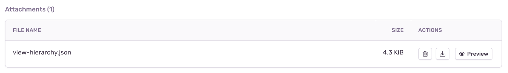

Sentry makes it possible to render a JSON representation of the view hierarchy of an error and includes it as an <PlatformLink to="/enriching-events/attachments/">attachment</PlatformLink>.

This feature only applies to SDKs with a user interface, such as the ones for mobile and desktop applications. In some environments like native iOS, rendering the view hierarchy requires the UI thread and in the event of a crash, that might not be available. Another example where the view hierarchy might not be available is when the event happens before the screen starts to load. So inherently, this feature is a best effort solution.

## Enabling View Hierarchy Attachments

View hierarchy debugging is an opt-in feature. You can enable it as shown below:

<PlatformContent includePath="enriching-events/attach-viewhierarchy" />

## Viewing View Hierarchy Attachments

View hierarchies appear in the "Attachments" tab, where you can view all attachments, as well as associated events. Click the event ID to open the **Issue Details** page of that specific event.

