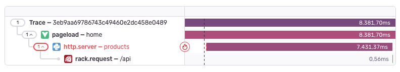

If the overall application landscape that want to observe with Sentry consists of more than just a single service or application, you might be interested in distributed tracing and what it can do for you.

## What is Distributed Tracing?

In the context of tracing events across a distributed system, distributed tracing acts as a powerful debugging tool. Imagine your application as a vast network of interconnected parts. This can mean a lot of things, for example that your system is spread across different servers, or simply that your application is split into different backend and frontend services, each potentially having their own technology stack.

When an error or performance issue occurs, it can be challenging to pinpoint the root cause due to the complexity of a system. Distributed tracing helps you follow the path of an event as it travels through this intricate web, recording every step it takes. By examining these traces, you can reconstruct the sequence of events leading up to the event of interest, identify the specific components involved, and understand their interactions. This detailed visibility enables you to diagnose and resolve issues more effectively, ultimately improving the reliability and performance of your distributed system.

## Basic Example

Here's an example showing a distributed trace in Sentry:

This distributed trace shows a Vue app's `pageload` making a request to a Python backend, which then calls the `/api` endpoint of a Ruby microservice.

What happens in the background is that Sentry uses reads and further propagates two HTTP headers between your applications:

- `sentry-trace`
- `baggage`

When you also run JavaScript applications in your distributed system, you have to make sure that those two headers are added to your CORS allowlist and won't be blocked or stripped by your proxy servers, gateways, or firewalls.

## How to Use Distributed Tracing?

<PlatformContent includePath="distributed-tracing/how-to-use/" />

But remember, in order to propagate trace information through your whole distributed system, you have to use Sentry in all of the involved services and applications. Take a look at the respective SDK documentation, to find out how distributed tracing can be enabled for each of them.
