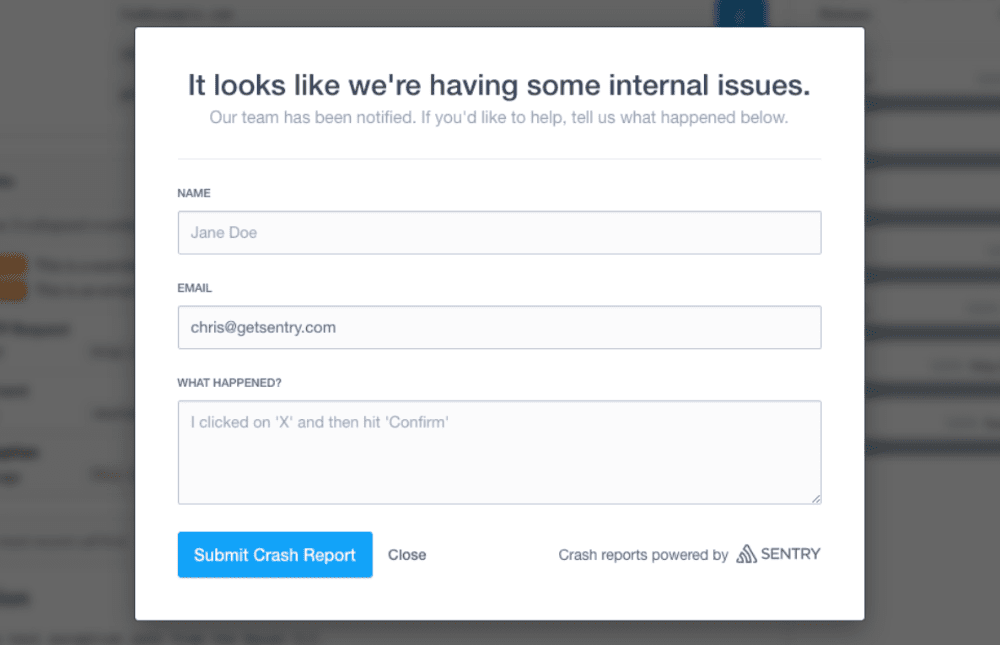

<PlatformSection supported={["javascript"]} notSupported={["javascript.electron", "node", "react-native"]}>
<Include name="feature-stage-beta-user-feedback.mdx" />

Sentry now allows you to collect user feedback from anywhere inside of your application, without requiring an error event to occur. This requires a minimum SDK version of [#TODO](#TODO). The previous [Crash-Report modal](#crash-report-dialog) still exists to handle user feedback that is associated with an error event.

## User Feedback Widget

Our embeddable JavaScript widget allows your users to submit feedback from anywhere inside of your application. This differs from the [Crash-Report modal](#crash-report-dialog) which is reactive feedback that is specifically tied to an error event.

!! #Insert image of widget here# !!

### Pre-requisites

<PlatformContent includePath="user-feedback/pre-requisites" />

### Installation

<PlatformContent includePath="user-feedback/install" />

### Set Up

To set up the integration, add the following to your Sentry initialization. There are many options you can pass to the integration constructor. See the [configuration documentation](/platforms/javascript/user-feedback/configuration/) for more details.

<SignInNote />

<PlatformContent includePath="user-feedback/setup" />

By default, this will insert the widget into the bottom right corner of your website. You're free to customize nearly every aspect of the widget, including replacing it completely with your own UI.

</PlatformSection>

<PlatformSection notSupported={["javascript"]}>
  When a user experiences an error, Sentry provides the ability to collect
  additional feedback. You can collect feedback according to the method
  supported by the SDK.
</PlatformSection>

<PlatformSection supported={["ruby"]} notSupported={["ruby.rails"]}>

While this feature isn't currently supported for Ruby or most of its frameworks, it is supported for [Rails](/platforms/ruby/guides/rails/user-feedback/).

</PlatformSection>

<PlatformSection supported={["native"]}>

**The user feedback feature is not currently supported for this SDK.**

</PlatformSection>

<PlatformSection supported={["javascript", "java", "apple", "android", "dart", "flutter", "unreal", "react-native", "kotlin-multiplatform"]}>

## User Feedback API

The user feedback API provides the ability to collect user information when an event occurs. You can use the same programming language you have in your app to send user feedback. In this case, the SDK creates the HTTP request so you don't have to deal with posting data via HTTP.

<PlatformSection notSupported={["unreal", "kotlin-multiplatform"]}>

Sentry pairs the feedback with the original event, giving you additional insight into issues. Sentry needs the `eventId` to be able to associate the user feedback to the corresponding event. For example, to get the `eventId`, you can use <PlatformLink to="/configuration/options/#before-send"><PlatformIdentifier name="before-send" /></PlatformLink> or the return value of the method capturing an event.

</PlatformSection>

<PlatformContent includePath="user-feedback/sdk-api-example" />

Alternatively, you can use the [User Feedback API endpoint](/api/projects/submit-user-feedback/) directly.

</PlatformSection>

<PlatformSection supported={["dotnet"]}>

## Use the .NET SDK

<Note>

User Feedback for **[ASP.NET](/platforms/dotnet/guides/aspnet/user-feedback/#integration)** or **[ASP.NET Core](/platforms/dotnet/guides/aspnetcore/user-feedback/#integration)** supply integrations specific to supporting those SDKs.

</Note>

You can create a form to collect the user input in your preferred framework, and use the SDK's API to send the information to Sentry. You can also use the widget, as described below. If you'd prefer an alternative to the widget or do not have a JavaScript frontend, you can use this API or a [Web API](/api/projects/submit-user-feedback/).

```csharp {tabTitle:C#}
using Sentry;

var eventId = SentrySdk.CaptureMessage("An event that will receive user feedback.");

SentrySdk.CaptureUserFeedback(eventId, "user@example.com", "It broke.", "The User");
```

```fsharp {tabTitle:F#}
open Sentry

let eventId = SentrySdk.CaptureMessage("An event that will receive user feedback.")

SentrySdk.CaptureUserFeedback(eventId, "user@example.com", "It broke.", "The User")
```

</PlatformSection>

<PlatformSection supported={["ruby.rails"]} notSupported={["android", "apple", "java", "native", "dart", "flutter", "ruby", "unity", "react-native", "unreal", "kotlin-multiplatform"]}>

## Crash-Report Modal

Our embeddable, JavaScript-based, Crash-Report modal is useful when you may typically render a plain error page (the classic `500.html`) on your website.

To collect feedback, the Crash-Report modal requests and collects the user's name, email address, and a description of what occurred. When feedback is provided, Sentry pairs the feedback with the original event, giving you additional insights into issues.

The screenshot below provides an example of the Crash-Report modal, though yours may differ depending on your customization:



### Integration

The widget authenticates with your public DSN, then passes in the Event ID that was generated on your backend.

<PlatformContent includePath="user-feedback/example-widget" />

</PlatformSection>

<PlatformSection supported={["ruby.rails"]}>

## Crash-Report Modal

Our embeddable, JavaScript-based, Crash-Report modal is useful when you may typically render a plain error page (the classic `500.html`) on your website.

To collect feedback, the Crash-Report modal requests and collects the user's name, email address, and a description of what occurred. When feedback is provided, Sentry pairs the feedback with the original event, giving you additional insights into issues.

The screenshot below provides an example of the Crash-Report modal, though yours may differ depending on your customization:


### Integration

The widget authenticates with your public DSN, then passes in the Event ID that was generated on your backend.

<PlatformContent includePath="user-feedback/example-widget" />

## User Feedback API

If you'd prefer an alternative to the widget or do not have a JavaScript frontend, you can use the [User Feedback API](/api/projects/submit-user-feedback/).

</PlatformSection>
