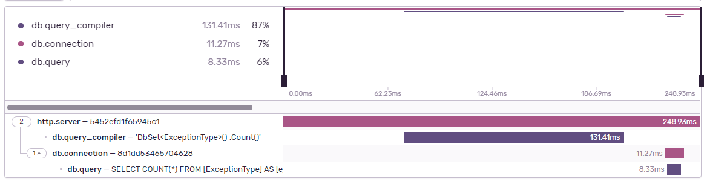
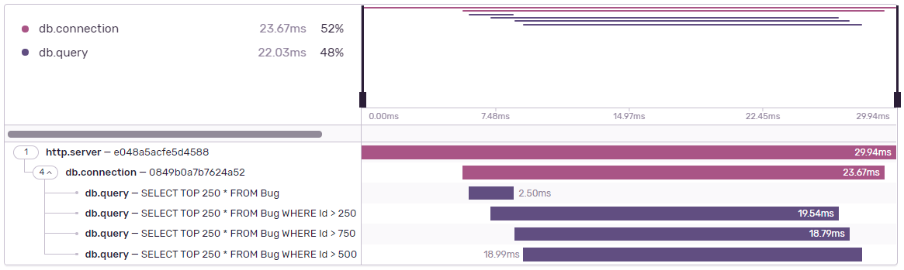

### Propagating a trace

<Note>

If you are using Sentry's ASP.NET Core integration, trace propagation is enabled automatically on all clients created by an HTTP client factory. Read more about it <Link to="/platforms/dotnet/guides/aspnetcore/performance/instrumentation/automatic-instrumentation">here</Link>.

</Note>

Sentry SDK provides a custom HTTP handler, `SentryHttpMessageHandler`. This handler can be used inside `HttpClient` to automatically propagate traces and create spans to track outgoing requests.

To use it, create an instance of `HttpClient` by passing an instance of `SentryHttpMessageHandler` as a constructor parameter:

```csharp
var httpHandler = new SentryHttpMessageHandler();
var httpClient = new HttpClient(httpHandler);

var response = await httpClient.GetStringAsync("https://example.com");
```

Upon sending a request to `https://example.com`, the instrumented HTTP client will:

- Populate the `sentry-trace` header on the request. This allows peer service to start a transaction by linking it to the current (assuming it's also instrumented with Sentry).
- Start a span named `GET https://example.com` which will track the corresponding HTTP operation on the current transaction.

Additionally, `SentryHttpMessageHandler` also inherits from `DelegatingHandler` which allows you to chain it together with other handlers. For example:

```csharp
var innerHttpHandler = new HttpClientHandler();
var sentryHttpHandler = new SentryHttpMessageHandler(innerHttpHandler);
var httpClient = new HttpClient(sentryHttpHandler);
```

## DiagnosticSource integration

Since version 3.9.0, the SDK will automatically integrate with Enitity Framework Core and SQLClient whenever available, those integrations will automacially be activated if your project matches one of the following condition:
* Includes Sentry.AspNet 3.9.0 or higher.
* Includes Sentry.AspNetCore 3.9.0 or higher.
* Targets .NET Core 3.0 or higher.

Even if your project doesn't meet any of those requirements, you'll be able to manually activate those instrumentations, by including the package 'Sentry.DiagnosticSource' and enable it during on the SDK's initializatiomn.

```csharp
using Sentry;

SentrySdk.Init( option => {
    option.Dsn = "YOUR_DSN";
    option.AddDiagnosticListeners(); //Enables the diagnostic source integration if you require Sentry.DiagnosticSource.
});
```

In case you don not wish to have this integration, you can disable it on SentryOptions by calling DisableDiagnosticListenerIntegration();
```csharp
using Sentry;

SentrySdk.Init( option => {
    option.Dsn = "YOUR_DSN";
    option.DisableDiagnosticListenerIntegration(); //Enables the diagnostic source integration if you require Sentry.DiagnosticSource.
});
```
### Entity Framework Core Integration



This integration is part of the DiagnosticSource integration and will automatically create spans for EF Core queries for the following operations:
* Query compiling: Occurs when EF Core optimizes a query, it then caches it so that future queries with the same input get reused.
The parameters for this span are:
** Operation: db.query_compiler
** Description: the query to be compiled.

* Database connection: Represents the lifecycle of a database connection, one connection may contain one or more query execution spans, and, in some circumstances, may not be registered, due to the nature of EF Core event model.
The parameters for this span are:
** Operation: db.connection
* Query Execution: Happens during the execution of a query, it represents how long a query took to be executed
The parameters for this span are:
** Operation: db.query
** Description: The query to be executed.

### SQLClient Integration.



This integration is part of the DiagnosticSource integration and will automatically create spans for SQLClient operations, the integrated operations are described below:

* Database connection: Represents the lifecycle of a database connection, one connection may contain one or more query execution spans.
The parameters for this span are:
** Operation: db.connection
** db.connection_id: the Connection ID from this connection.
** db.operation_id: the Operation ID from this connection.
** rows_sent: The number of rows sent during the connection.
** bytes_received: The amount of data (in bytes) received during the connection.
** bytes_sent: The amount of data (in bytes) sent during the connection.
* Query Execution: Happens during the execution of a query, it represents how long a query took to be executed
The parameters for this span are:
** Operation: db.query
** Description: The query to be executed.
** db.operation_id: the Operation ID from this connection.
