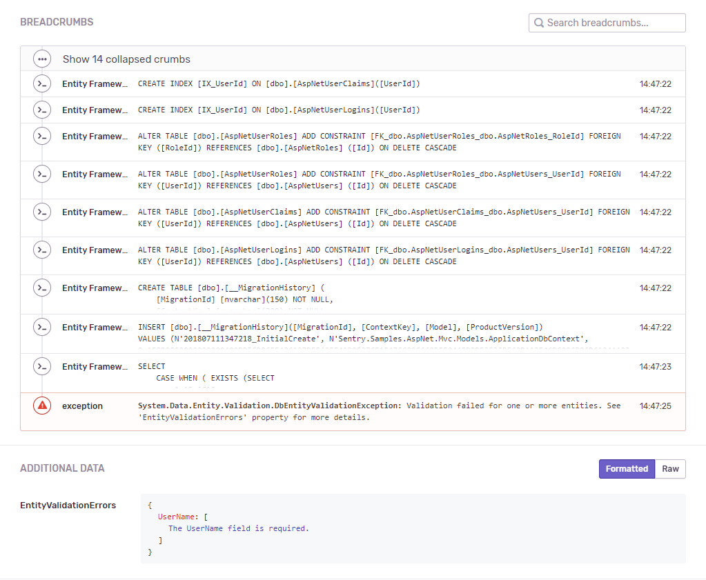

Sentry provides an integration with `EntityFramework` through the of the [Sentry.EntityFramework NuGet package](https://www.nuget.org/packages/Sentry.EntityFramework).

> Looking for `EntityFramework Core`? If you're targeting .NET Core 3.1 or newer, that's already built in to the main Sentry .NET SDK. It's also enabled by default for our ASP.NET or ASP.NET Core integrations, even for older targets. For other scenarios, you may need to add the `Sentry.DiagnosticSource` package and call `AddDiagnosticSourceIntegration`, [as described here](/platforms/dotnet/performance/instrumentation/automatic-instrumentation/#diagnosticsource-integration). (The rest of this page describes our EF6 integration, not EFCore.)

## Installation

```powershell {tabTitle:Package Manager}
Install-Package Sentry.EntityFramework -Version {{ packages.version('sentry.dotnet.ef') }}
```

```shell {tabTitle:.NET Core CLI}
dotnet add package Sentry.EntityFramework -v {{ packages.version('sentry.dotnet.ef') }}
```

This package extends `Sentry` main SDK. That means that besides the EF features, through this package you'll also get access to all API and features available in the main `Sentry` SDK.

## Features

- Queries as breadcrumbs
- Validation errors

All queries executed are added as breadcrumbs and are sent with any event which happens on the same [scope](enriching-events/scopes/). Besides that, validation errors are also included as `Extra`.

## Configuration

Add the Entity Framework 6 support to your project in one step:

- When initializing the SDK, call the extension method `AddEntityFramework()` on `SentryOptions`. This will register all error processors to extract extra data, such as validation errors, from the exceptions thrown by Entity Framework.

### Example configuration

For example, configuring an ASP.NET app with _global.asax_:

```csharp {filename:global.asax}
using System;
using System.Configuration;
using Sentry;
using Sentry.AspNet;

public class MvcApplication : System.Web.HttpApplication
{
    private IDisposable _sentrySdk;

    protected void Application_Start()
    {
        _sentrySdk = SentrySdk.Init(o =>
        {
            // We store the DSN inside Web.config
            o.Dsn = ConfigurationManager.AppSettings["SentryDsn"];
            // Add the EntityFramework integration
            o.AddEntityFramework();
        });
    }

    // Global error catcher
    protected void Application_Error() => Server.CaptureLastError();

    public override void Dispose()
    {
        _sentrySdk.Dispose();
        base.Dispose();
    }
}
```

### Sample

Check out a complete working [sample](https://github.com/getsentry/sentry-dotnet-ef/tree/master/samples/Sentry.Samples.AspNet.Mvc) to see it in action.


