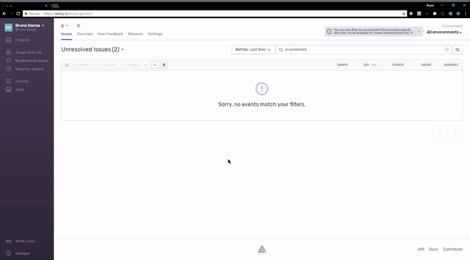

---
redirect_from:
  - /platforms/dotnet/log4net/
---

Sentry provides an integration with log4net through the [Sentry.Log4Net NuGet package](https://www.nuget.org/packages/Sentry.Log4Net).

Without any code change, this package is able to initialize the Sentry SDK and capture events while including additional properties like `Exception` data and more.

## Installation

Add the Sentry dependency:

```powershell {tabTitle:Package Manager}
Install-Package Sentry.Log4Net -Version {{ packages.version('sentry.dotnet.log4net') }}
```

```shell {tabTitle:.NET Core CLI}
dotnet add package Sentry.Log4Net -v {{ packages.version('sentry.dotnet.log4net') }}
```

This package extends `Sentry` main SDK. That means besides the log4net `Appender`, through this package you'll also get access to all API and features available in the main `Sentry` SDK.

## Configuration

Once the log4net integration package is installed in your project, you can modify your configuration file to add the appender.
This can be done, for example, via the `app.config` for console and desktop apps or `web.config` in case of ASP.NET.

```xml {filename:app.config}
  <appender name="SentryAppender" type="Sentry.Log4Net.SentryAppender, Sentry.Log4Net">
    <Dsn value="___PUBLIC_DSN___"/>
    <!--Sends the log event Identity value as the user-->
    <SendIdentity value="true" />
    <threshold value="INFO" />
  </appender>
```

<Note><markdown>

Only a subset of the options are exposed via the log4net appender configuration. If you wish to access an [SDK option](/platforms/dotnet/configuration/options/) which is not listed below, you'll need to initialize the SDK via [SentrySdk.Init](https://docs.sentry.io/platforms/dotnet/) instead of doing it via this integration as described below.

</markdown></Note>

### SendIdentity

In the example above, the `SendIdentity` flag was switched on. The SDK then will take the log4net `Identity` value and report to Sentry as the user's id.

### DSN

Also in the example above, you can find the DSN being set. That will instruct the `SentryAppender` to initialize the SDK.

This is only one of the ways to initialize the SDK. If you wish to configure the SDK programatically, you could **leave the DSN out** from the appender configuration section. The SDK needs to be initialized only **once** and since other integrations (like ASP.NET) are also able to initialize the SDK, you only need to pass the DSN to one of these integrations.
One common case to not add the DSN to the XML configuration file (which would initialize it via the log4net integration) is to have full access to the [SDK option](/platforms/dotnet/guides/log4net/configuration/options/).

### Sample

For a [sample app.config](https://github.com/getsentry/sentry-dotnet/blob/main/samples/Sentry.Samples.Log4Net/app.config) or a complete working [sample](https://github.com/getsentry/sentry-dotnet/tree/main/samples/Sentry.Samples.Log4Net) to see it in action.


