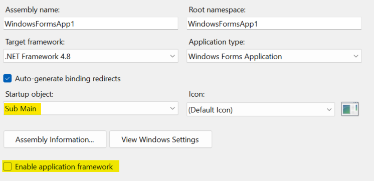
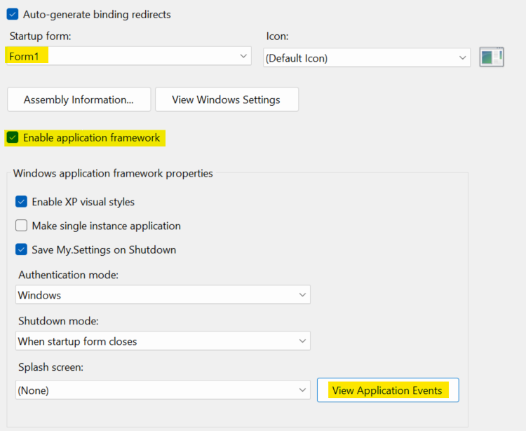

Sentry's .NET SDK works with WinForms applications through the [Sentry NuGet package](https://www.nuget.org/packages/Sentry). It works with WinForms apps running on .NET Framework 4.6.1, .NET Core 3.0, or higher.

## Configuration

After adding the NuGet package, the SDK should be initialized in the program's main entry point, before launching any forms or performing signifanct work. The options for initialization vary by language.

<PlatformContent includePath="getting-started-confignote" />

### C# Initialization

A C# Windows Forms application will have a `Program.cs` file. You should initialize Sentry in this file.

You should also set `Application.SetUnhandledExceptionMode(UnhandledExceptionMode.ThrowException)` so Sentry can capture unhandled exceptions.

A complete example of the recommended startup is as follows:

<SignInNote />

```csharp
using System;
using System.Windows.Forms;
using Sentry;

namespace WindowsFormsApp1
{
    static class Program
    {
        /// <summary>
        /// The main entry point for the application.
        /// </summary>
        [STAThread]
        static void Main()
        {

            // These WinForms options are usually set by default
            Application.EnableVisualStyles();
            Application.SetCompatibleTextRenderingDefault(false);

            // Add this so Sentry can catch unhandled exceptions
            Application.SetUnhandledExceptionMode(UnhandledExceptionMode.ThrowException);

            // Configure the options for Sentry
            var sentryOptions = new SentryOptions
            {
                // Tells which project in Sentry to send events to:
                Dsn = "___PUBLIC_DSN___",

                // When configuring for the first time, to see what the SDK is doing:
                Debug = true,

                // Set traces_sample_rate to 1.0 to capture 100% of transactions for performance monitoring.
                // We recommend adjusting this value in production.
                TracesSampleRate = 1.0,

                // Enable Global Mode since this is a client app
                IsGlobalModeEnabled = true,

                //TODO: any other options you need go here
            };

            // Initialize Sentry and run the main form of the application
            using (SentrySdk.Init(sentryOptions))
            {
                Application.Run(new YourMainApplicationForm());
            }
        }
    }
}
```

### Visual Basic Initialization

Windows Forms applications written in VB have two different initialization options. Pick one of them (not both).

#### Option 1

You can initialize Sentry in a similar approach as shown above for C#.

First, modify the settings on the project properties page as follows:

- Clear the "Enable application framework" checkbox.
- Set the "Startup object" to "Sub Main".



Then, add the following file as `Program.vb`:

<SignInNote />

```vb
Imports Sentry

Module Program

    ''' <summary>
    ''' The main entry point for the application.
    ''' </summary>
    <STAThread>
    Sub Main()

        ' These WinForms options are usually set by default
        Application.EnableVisualStyles()
        Application.SetCompatibleTextRenderingDefault(False)

        ' Add this so Sentry can catch unhandled exceptions
        Application.SetUnhandledExceptionMode(UnhandledExceptionMode.ThrowException)

        ' Configure the options for Sentry
        Dim sentryOptions = New SentryOptions With
        {
            .Dsn = "___PUBLIC_DSN___",

            ' Enable Global Mode since this is a client app
            .IsGlobalModeEnabled = True,

            ' any other options you need go here
        }

        ' Initialize Sentry and run the main form of the application
        Using SentrySdk.Init(sentryOptions)
            Application.Run(New YourMainApplicationForm)
        End Using
    End Sub

End Module
```

#### Option 2

If you prefer to keep the WinForms "Application Framework" feature enabled, then you can initialize Sentry in the "Application Events".

First, ensure the settings on the project properties page are as follows:

- The "Enable application framework" checkbox should be checked.
- The "Startup object" should be set to the name of your main form.



Next, you will need to modify the `ApplicationEvents.vb` file.

- If you are using .NET Framework, clicking the "View Application Events" button will create and open the `ApplicationEvents.vb` file.
- If you are using .NET Core, you will need to add the file manually.
- If you are using .NET 5 or higher, the file should already be present. If not, you can add it manually.

Once you have the file created:

- Initialize Sentry in the `Startup` event, and retain the result.
- Dispose Sentry in the `Shutdown` event, using the result from initialization.
- Use the `UnhandledException` event to send unhandled exceptions to sentry.

See the following complete example:

<SignInNote />

```vb
Imports Microsoft.VisualBasic.ApplicationServices
Imports Sentry
Imports Sentry.Protocol

Namespace My
    Partial Friend Class MyApplication

        Private _sentry As IDisposable

        Private Sub MyApplication_Startup(sender As Object, e As StartupEventArgs) Handles Me.Startup

            ' Configure the options for Sentry
            Dim sentryOptions = New SentryOptions With
            {
                .Dsn = "___PUBLIC_DSN___",

                ' Enable Global Mode since this is a client app
                .IsGlobalModeEnabled = True,

                ' any other options you need go here
            }

            ' Initialize Sentry
            _sentry = SentrySdk.Init(sentryOptions)

        End Sub

        Private Sub MyApplication_Shutdown(sender As Object, e As EventArgs) Handles Me.Shutdown

            ' Dispose the Sentry SDK to ensure events are flushed and sent to Sentry
            _sentry.Dispose()

        End Sub

        Private Sub MyApplication_UnhandledException(sender As Object, e As UnhandledExceptionEventArgs) Handles Me.UnhandledException

            ' Set some additional data on the exception for Sentry to recognize this exception as unhandled
            Dim ex = e.Exception
            ex.Data(Mechanism.HandledKey) = False
            ex.Data(Mechanism.MechanismKey) = "WindowsFormsApplicationBase.UnhandledException"

            ' Capture the exception with Sentry
            SentrySdk.CaptureException(ex)

        End Sub

    End Class
End Namespace
```

### Resources

[Discussion on GitHub `Application.SetUnhandledExceptionMode`](https://github.com/getsentry/sentry-dotnet/issues/176)
