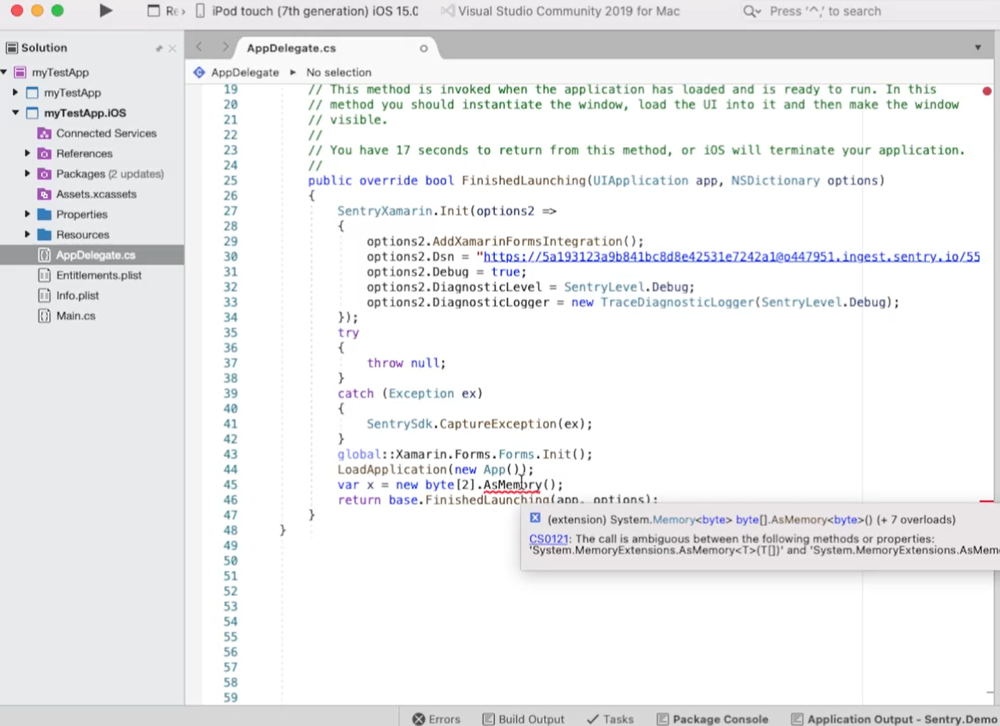
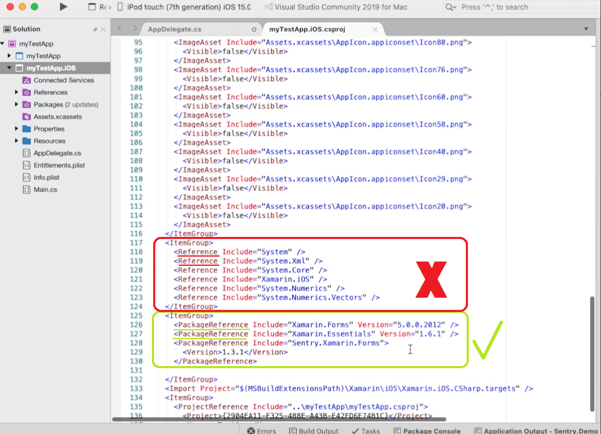
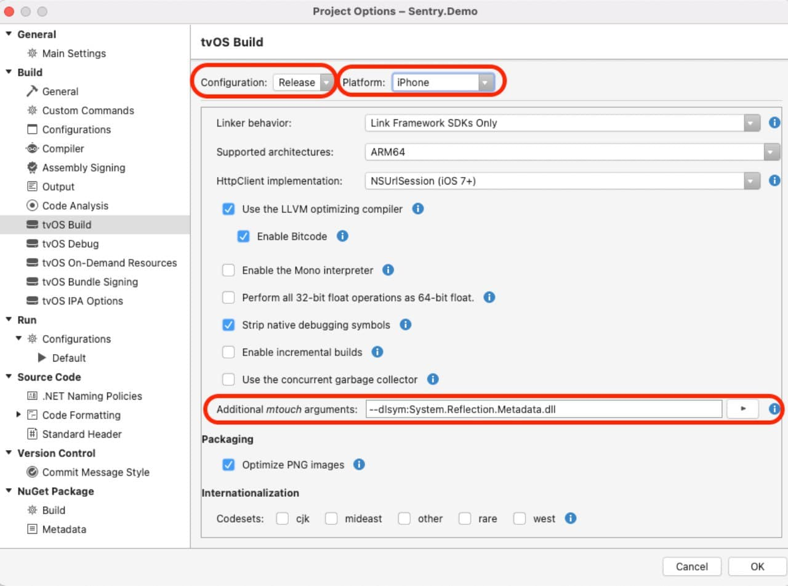

If you need help solving issues with Sentry's Xamarin SDK, you can read the edge cases documented here. If you need additional help, you can [ask on GitHub](https://github.com/getsentry/sentry-xamarin/issues/new/choose). Customers on a paid plan may also contact support.

## Offline Caching Information

For users on Xamarin iOS, offline caching may cause this issue.

### Event/Transaction Capture

`Failed to send cached envelope: System.MissingMethodException: Method not found: System.Text.Json.JsonDocument`

OR

`Attempting to JIT compile method 'System.Text.Json.JsonElement Sentry.Internal.Json:Parse (byte[])' while running in aot-only mode.`

To help you debug the issue, add the following line to into your iOS project:

```csharp
    _ = new byte[2].AsMemory();
```

You will notice a conflict of Assemblies in regard to AsMemory extension, the same is happening with the Sentry SDK but only reveals the issue in runtime.



To solve this, you will need to follow the steps below:

1. Edit your iOS 'csproj'

- `Visual Studio (Mac)`: Right-click on your iOS project and at the bottom, select the option `Edit Project File`.
- `Visual Studio (Windows)`: Right-click on your iOS project, select the option `Unload Project`. By doing that action, it'll open your raw project solution, otherwise, right-click your iOS project and select the option `Edit project file`.

<Note>
  You can also use an external text editor or another IDE to edit your iOS
  project.
</Note>

2. Locate the `ItemGroup` that contains `PackageReference`.



3. Add a new `packagereference` as shown on the snippet:

```csharp
<PackageReference Include="System.Memory" Version="4.5.4" IncludeAssets="None" />
```

<Note>
  It's important to add the `IncludeAssets` as `None`, or this fix will not
  work.
</Note>

<Note>Using Reference will not work, it must be PackageReference.</Note>

4. Save the edited `csproj` file and reload your project if it was unloaded:

- `Visual Studio (Windows)`: Right-click on your iOS project, select the option `Reload Project`.

5. If the extension `AsMemory` keeps showing the conflict you will need to restart your IDE to make sure the changes are applied.
6. Wait for the IDE to restore the packages. Once finished, try to capture an exception or transaction.
7. If the extension `AsMemory` is still showing as conflicted, double-check if you executed step 3 exactly as shown.
8. With the problem solved, you will no longer require the test code into your solution.

More information about this problem can be found here: https://github.com/mono/mono/issues/20805

## Android

### Event/Transaction Not Sent

You may encounter the following issue when sending Events or Envelopes:

`The SSL connection could not be established, CERTIFICATE_VERIFY_FAILED`

One solution is to alter your DSN; to do this, remove the values between `@` and `sentry.io` in your DSN.

- Before: `https://abc@1234.ingest.sentry.io/1234`
- After: `https://abc@sentry.io/1234`

Find more information here: https://github.com/xamarin/xamarin-android/issues/6351

## tvOS

You may encounter the following issue on a tvOS project:

### Build issues

`linker command failed with exit code 1 (use -v to see invocation)`
`MTOUCH : error MT5216: Native linking failed for '.../libSystem.Reflection.Metadata.dll.dylib'. Please file a bug report at https://github.com/xamarin/xamarin-macios/issues/new`

If this message displays in your build window when building your tvOS solution, you will need an additional mtouch argument in the project's iOS Build options (for all device configurations)

1. Open your iOS project properties.
2. On `tvOS Build` locate the `Additional mtouch arguments` entry.
3. add the following line

`--dlsym:System.Reflection.Metadata.dll`

4. Make sure the `additional mtouch argument` is applied to all configurations and platforms.
   
