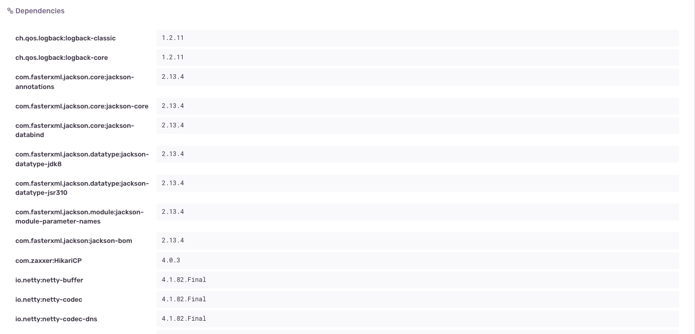

The [Sentry Gradle Plugin](https://github.com/getsentry/sentry-android-gradle-plugin) is an addition to the main Java SDK and offers
seamless integration with the Gradle build system. It supports the reporting of your application's external dependencies as part of events.

## Setup

### Install

Using Gradle in your application module's `build.gradle` add:

```groovy
buildscript {
    repositories {
        mavenCentral()
    }
}

plugins {
    id "io.sentry.jvm.gradle" version "{{@inject packages.version('sentry.java.android.gradle-plugin', '3.9.0') }}"
}
```

```kotlin
buildscript {
    repositories {
        mavenCentral()
    }
}

plugins {
    id("io.sentry.jvm.gradle") version "{{@inject packages.version('sentry.java.android.gradle-plugin', '3.9.0') }}"
}
```

<Note>

For non-Android projects, the plugin only collects external dependencies and uploads <PlatformLink to="/source-context/">Source Context</PlatformLink>.

</Note>

### Configure

We expose the following configuration values directly in `build.gradle`:

```groovy
sentry {
    // Enables more detailed log output, e.g. for sentry-cli.
    //
    // Default is false.
    debug = true

    // Generates a source bundle and uploads it to Sentry.
    // This enables source context, allowing you to see your source
    // code as part of your stack traces in Sentry.
    //
    // Default is disabled.
    includeSourceContext = true

    // Includes additional source directories into the source bundle.
    // These directories are resolved relative to the project directory.
    additionalSourceDirsForSourceContext = ["mysrc/java", "other-source-dir/main/kotlin"]

    // Disables or enables dependencies metadata reporting for Sentry.
    // If enabled, the plugin will collect external dependencies and
    // upload them to Sentry as part of events. If disabled, all the logic
    // related to the dependencies metadata report will be excluded.
    //
    // Default is enabled.
    includeDependenciesReport = true
}
```

```kotlin
sentry {
    // Enables more detailed log output, e.g. for sentry-cli.
    //
    // Default is false.
    debug.set(true)

    // Generates a source bundle and uploads it to Sentry.
    // This enables source context, allowing you to see your source
    // code as part of your stack traces in Sentry.
    //
    // Default is disabled.
    includeSourceContext.set(true)

    // Includes additional source directories into the source bundle.
    // These directories are resolved relative to the project directory.
    additionalSourceDirsForSourceContext.set(setOf("mysrc/java", "other-source-dir/main/kotlin"))

    // Disables or enables dependencies metadata reporting for Sentry.
    // If enabled, the plugin will collect external dependencies and
    // upload them to Sentry as part of events. If disabled, all the logic
    // related to the dependencies metadata report will be excluded.
    //
    // Default is enabled.
    includeDependenciesReport.set(true)
}
```

## Source Context

See our documentation on <PlatformLink to="/source-context/">Source Context</PlatformLink>.

## Dependencies Report

The plugin automatically collects an application's external dependencies (including transitive ones), and generates a compile-time report. The Sentry Java SDK picks up the report at runtime and sends it along with every Sentry event. The event dependencies metadata will look something like this:


