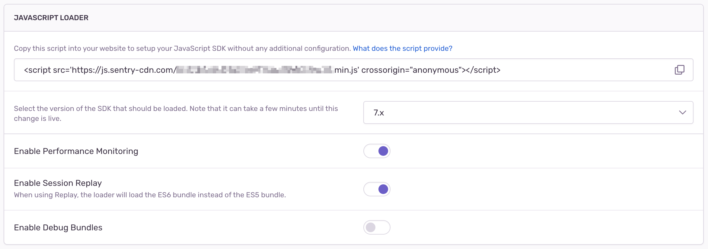

The _Loader_ is a small wrapper around our SDK, which does a few things:

- Always have the newest recommended stable version of our SDK
- Captures all *global errors* and *unhandled promise* rejections
- Lazy injects our SDK into your website
- After you’ve loaded the SDK, the Loader will send everything to Sentry

The loader is less than 1kB gzipped and includes the `Sentry.init` call with your DSN.

```html
<script
  src="https://js.sentry-cdn.com/___PUBLIC_KEY___.min.js"
  crossorigin="anonymous"
></script>
```

## Additional Configuration

In case you want to set additional [options](../../configuration/options/), you have to set them like this:

`onLoad` is a function that only the Loader provides; Loader will call it once it injects the SDK into the website. The Loader `init()` works a bit differently as well; instead of just setting the options, we merge the options internally, only for convenience, so you don’t have to set the `DSN` again because the Loader already contains it.

As explained, the Loader lazy loads and injects our SDK into your website, but you can also tell the loader to fetch it immediately instead of only fetching it when you need it. Setting `data-lazy` to `no` will tell the Loader to inject the SDK as soon as possible:

```html
<script>
  Sentry.onLoad(function() {
    // Use whatever Sentry.* function you want
  });
  Sentry.forceLoad();
</script>
```

### SDK Version

Go into the Sentry web UI, view _Settings -> Projects -> Client Keys (DSN)_, then press the **Configure** button. From here, you can view the options to configure your DSN and select which SDK version the Loader should load.

<Note>

It can take a few minutes until the change is visible in the code, since it’s cached.

</Note>



## **Current limitations**

Because we inject our SDK asynchronously, we will only monitor *global errors* and *unhandled promise* for you until the SDK is fully loaded. That means that we might miss breadcrumbs during the download.

For example, a user clicking on a button on your website is making an XHR request. We will not miss any errors, only breadcrumbs and only up until the SDK is fully loaded. You can reduce this time by manually calling `forceLoad` or set `data-lazy="no"`.
