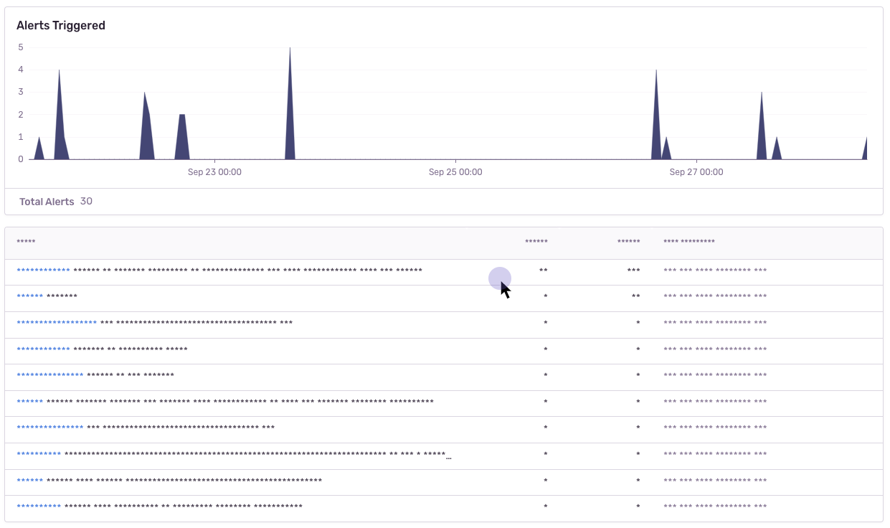
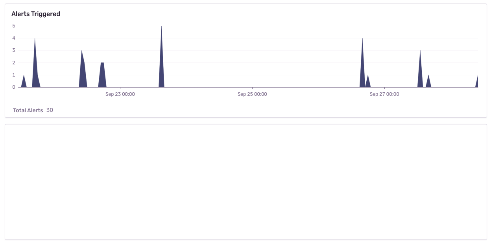
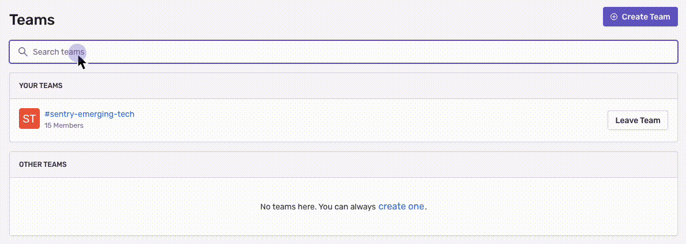

<Include name="beta-note-session-replay.mdx" />

There are several ways to deal with PII (personally identifiable information). By default, the integration will mask all text content with `*` and block all media elements (`img, svg, video, object, picture, embed, map, audio`). This can be disabled by setting `maskAllText` to `false`. It is also possible to add the following CSS classes to specific DOM elements to prevent recording its contents: `sentry-block`, `sentry-ignore`, and `sentry-mask`. The following sections will show examples of how content is handled by the differing methods.

### Masking
Masking replaces the text content with something else. The default masking behavior is to replace each character with a `*`. In this example the relevant html code is: `<table class="sentry-mask">...</table>`.

### Blocking
Blocking replaces the element with a placeholder that has the same dimensions. The recording will show an empty space where the content was. In this example the relevant html code is: `<table data-sentry-block>...</table>`.

### Ignoring
Ignoring only applies to form inputs. Events will be ignored on the input element so that the replay does not show what occurs inside of the input. In the below example, notice how the results in the table below the input changes, but no text is visible in the input.

### Privacy Configuration

The following options can be configured as options to the integration, in `new Replay({})`:

| key              | type                     | default                             | description |
| ---------------- | ------------------------ | ----------------------------------- | --- |
| maskAllText      | boolean                  | `true`                              | Mask _all_ text content. Will pass text content through `maskTextFn` before sending to server. |
| blockAllMedia    | boolean                  | `true`                              | Block _all_ media elements (`img, svg, video, object, picture, embed, map, audio`) |
| maskTextFn       | (text: string) => string | `(text) => '*'.repeat(text.length)` | Function to customize how text content is masked before sending to server. By default, masks text with `*`. |
| maskAllInputs    | boolean                  | `true`                              | Mask values of `<input>` elements. Passes input values through `maskInputFn` before sending to server. |
| maskInputOptions | Record<string, boolean>  | `{ password: true }`                | Customize which inputs `type` to mask.   Available `<input>` types: `color, date, datetime-local, email, month, number, range, search, tel, text, time, url, week, textarea, select, password`. |
| maskInputFn      | (text: string) => string | `(text) => '*'.repeat(text.length)` | Function to customize how form input values are masked before sending to server. By default, masks values with `*`. |
| blockClass       | string \| RegExp         | `'sentry-block'`                    | Redact all elements that match the class name. See [Blocking](#blocking) above for an example. |
| blockSelector    | string                   | `'[data-sentry-block]'`             | Redact all elements that match the DOM selector. See [Blocking](#blocking) above for an example. |
| ignoreClass      | string \| RegExp         | `'sentry-ignore'`                   | Ignores all events on the matching input field. See [Ignoring](#ignoring) above for an example. |
| maskTextClass    | string \| RegExp         | `'sentry-mask'`                     | Mask all elements that match the class name. See [Masking](#masking) above for an example. |
| maskTextSelector | string                   | `undefined`                         | Mask all elements that match the given DOM selector. See [Masking](#masking) above for an example. |
