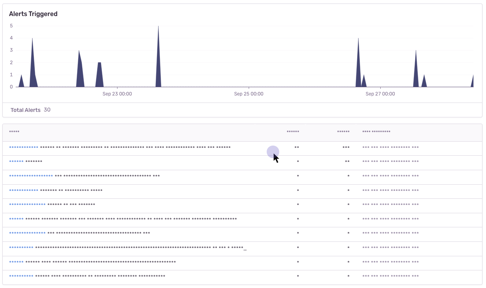
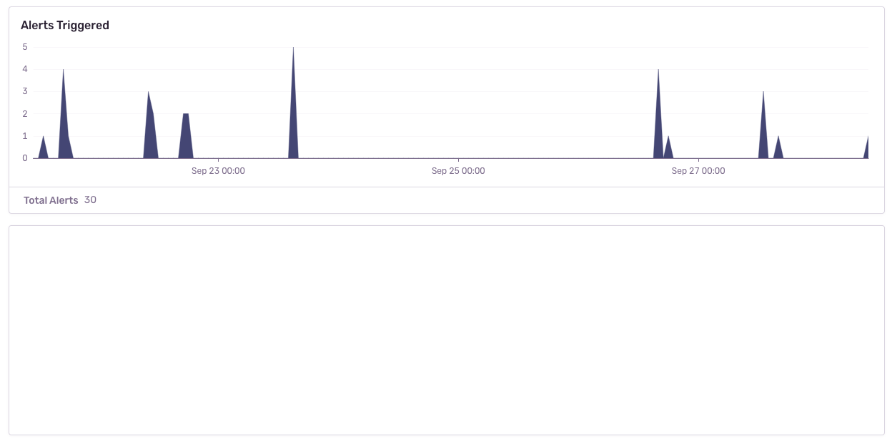
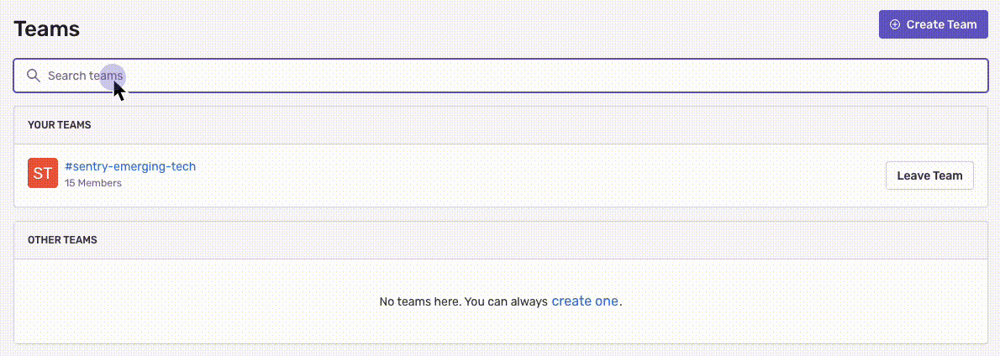

<Include name="beta-note-session-replay.mdx" />

There are several ways to deal with personally identifiable information (PII). By default, the integration will mask all text content with `*` and block all media elements (`img`, `svg`, `video`, `object`, `picture`, `embed`, `map`, `audio`). This can be disabled by setting `maskAllText` to `false`. It's also possible to add the following CSS classes to specific DOM elements to prevent recording their contents: `sentry-block`, `sentry-ignore`, and `sentry-mask`. The following sections will show examples of how content is handled by the differing methods.

## Masking

Masking replaces the text content with something else. The default masking behavior is to replace each character with a `*`. Elements with class name `sentry-mask` or the attribute `data-sentry-mask` will be blocked. In this example the relevant HTML code is: `<table class="sentry-mask">...</table>`:

## Blocking

Blocking replaces the element with a placeholder that has the same dimensions. The recording will show an empty space where the content was. Elements with class name `sentry-block` or the attribute `data-sentry-block` will be blocked. In this example the relevant HTML code is: `<table data-sentry-block>...</table>`:

## Ignoring

Ignoring only applies to form inputs. Events will be ignored on the input element so that the replay doesn't show what occurs inside of the input. Elements with class name `sentry-ignore` or the attribute `data-sentry-ignore` will have their events be ignored. In the below example, notice how the results in the table below the input changes, but no text is visible in the input:

## Privacy Configuration

The following options can be configured as options to the integration, in `new Replay({})`:
The following options can be configured as options to the integration, in `new Replay({})`:

| key              | type                     | default                                 | description                                                                                                                                                                                         |
| ---------------- | ------------------------ | -----------------------------------     | --------------------------------------------------------------------------------------------------------------------------------------------------------------------------------------------------- |
| block            | string[]                 | `.sentry-block, [data-sentry-block]`    | Redact all elements that match the DOM selector(s). See [Blocking](#blocking) above for an example.                                                                                                 |
| blockAllMedia    | boolean                  | `true`                                  | Block _all_ media elements (`img`, `svg`, `video`, `object`, `picture`, `embed`, `map`, `audio`).                                                                                                   |
| ignore           | string[]                 | `.sentry-ignore, [data-sentry-ignore]`  | Ignores all events on the matching input fields. See [Ignoring](#ignoring) above for an example.                                                                                                    |
| mask             | string[]                 | `.sentry-mask, [data-sentry-mask]`      | Mask all elements that match the given DOM selectors. See [Masking](#masking) section for an example.                                                                                               |
| maskAllText      | boolean                  | `true`                                  | Mask _all_ text content. Will pass text content through `maskTextFn` before sending to server.                                                                                                      |
| maskAllInputs    | boolean                  | `true`                                  | Mask values of `<input>` elements. Passes input values through `maskTextFn` before sending to server.                                                                                               |
| maskTextFn       | (text: string) => string | `(text) => '*'.repeat(text.length)`     | Function to customize how text content is masked before sending to server. By default, masks text with `*`.                                                                                         |
| unblock          | string[]                 | `.sentry-unblock, [data-sentry-unblock]`| Do not redact any elements that match the DOM selectors. Used to unblock specific media elements that are blocked due to using `blockAllMedia`.                                                     |
| unmask           | string[]                 | `.sentry-unmask, [data-sentry-unmask]`  | Unmask all elements that match the given DOM selectors. Used to unmask specific elements that are masked due to using `maskAllText`.                                                                |

### Deprecated options
In order to streamline our privacy options, the following have been deprecated in favor of the respective options above.

| deprecated key   | replaced by | description                                                                                                                                      |
| ---------------- | ----------- | ------------------------------------------------------------------------------------------------------------------------------------------------ |
| maskInputOptions | mask        | Use CSS selectors in `mask` in order to mask all inputs of a certain type. For example, `input[type="address"]`                                  |
| blockSelector    | block       | The selector(s) can be moved directly in the `block` array.                                                                                      |
| blockClass       | block       | Convert the class name to a CSS selector and add to `block` array. For example, `first-name` becomes `.first-name`. Regexes can be moved as-is.  |
| maskClass        | mask        | Convert the class name to a CSS selector and add to `mask` array. For example, `first-name` becomes `.first-name`. Regexes can be moved as-is.   |
| maskSelector     | mask        | The selector(s) can be moved directly in the `mask` array.                                                                                       |
| ignoreClass      | ignore      | Convert the class name to a CSS selector and add to `ignore` array. For example, `first-name` becomes `.first-name`. Regexes can be moved as-is. |

