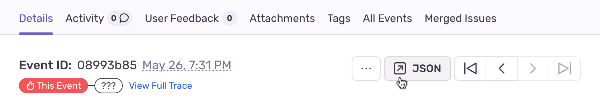

If you need help solving issues with your Sentry JavaScript SDK integration, you can read the edge cases documented below. If you need additional help, you can [ask on GitHub](https://github.com/getsentry/sentry-javascript/issues/new/choose). Customers on a paid plan may also contact support.

## Updating to a New Sentry SDK Version

If you update your Sentry SDK to a new major version, you might encounter breaking changes that need some adaption on your end.
Check out our [migration guide](https://github.com/getsentry/sentry-javascript/blob/master/MIGRATION.md) to learn everything you need
to know to get up and running again with the latest Sentry features.

## Debugging Additional Data

You can view the JSON payload of an event to see how Sentry stores additional data in the event. The shape of the data may not exactly match the description.



For more details, see the [full documentation on Event Payload](https://develop.sentry.dev/sdk/event-payloads/).

## Max JSON Payload Size

`maxValueLength` has a default value of 250, but you can adjust this value according to your needs if your messages are longer. Please note that not every single value is affected by this option.

## CORS Attributes and Headers

To gain visibility into a JavaScript exception thrown from scripts originating from different origins, do two things:

1. Add a crossorigin=”anonymous” script attribute

```bash
 <script src="http://another-domain.com/app.js" crossorigin="anonymous"></script>
```

The script attribute tells the browser to fetch the target file “anonymously.” Potentially user-identifying information like cookies or HTTP credentials won’t be transmitted by the browser to the server when requesting this file.

2. Add a Cross-Origin HTTP header

```bash
Access-Control-Allow-Origin: *
```

Cross-Origin Resource Sharing (CORS) is a set of APIs (mostly HTTP headers) that dictate how files ought to be downloaded and served across origins.

By setting `Access-Control-Allow-Origin: *`, the server is indicating to browsers that any origin can fetch this file. Alternatively, you can restrict it to a known origin you control:

```bash
 Access-Control-Allow-Origin: https://www.example.com
```

Most community CDNs properly set an `Access-Control-Allow-Origin` header.

```bash
 $ curl --head https://ajax.googleapis.com/ajax/libs/jquery/2.2.0/jquery.js | \
 grep -i "access-control-allow-origin"

 Access-Control-Allow-Origin: *
```

## Unexpected OPTIONS request

If your application started to misbehave because of performing additional OPTIONS requests, it is most likely an issue with unwanted `sentry-trace` request headers, which can happen when you are using too generic a configuration for our Tracing Integration in the Browser SDK.

To fix this, change the `tracePropagationTargets` option during SDK initialization. For more details, see [Automatic Instrumentation](/platforms/javascript/performance/instrumentation/automatic-instrumentation/#tracePropagationTargets) in our Performance Monitoring documentation.

## `instrument.js` Line Numbers for Console Log statements

If `instrument.js` displays in your console while debugging, add Sentry to your [Framework Ignore List](https://developer.chrome.com/docs/devtools/settings/ignore-list/#skip-extensions) by adding this pattern: `/@sentry/`

Chrome then ignores the SDK stack frames when debugging.

## Dealing with Ad-Blockers

When you are using our CDN, ad-blocking or script-blocking extensions may prevent our SDK from being fetched and initialized properly. Because of this, any call to the SDKs API will fail and may cause your application to behave unexpectedly.

Additionally, even when the SDK is downloaded and initialized correctly, Sentry endpoints that need to receive captured data may be blocked as well. This prevents any error reports, sessions health, or performance data from being delivered, making it effectively unavailable in [sentry.io](https://sentry.io).

You can work around the first issue in multiple ways explained above. However, the endpoint blockage can be only resolved using the tunnel.

### Using the `tunnel` Option

A tunnel is an HTTP endpoint that acts as a proxy between Sentry and your application. Because you control this server, there is no risk of any requests sent to it being blocked. When the endpoint lives under the same origin (although it does not have to in order for the tunnel to work), the browser will not treat any requests to the endpoint as a third-party request. As a result, these requests will have different security measures applied which, by default, don't trigger ad-blockers. A quick summary of the flow can be found below.


Starting with version `6.7.0` of the JavaScript SDK, you can use the `tunnel` option to tell the SDK to deliver events to the configured URL, instead of using the DSN. This allows the SDK to remove `sentry_key` from the query parameters, which is one of the main reasons ad-blockers prevent sending events in the first place. This option also stops the SDK from sending preflight requests, which was one of the requirements that necessitated sending the `sentry_key` in the query parameters.

To enable the `tunnel` option, provide either a relative or an absolute URL in your `Sentry.init` call. When you use a relative URL, it's relative to the current origin, and this is the form that we recommend. Using a relative URL will not trigger a preflight CORS request, so no events will be blocked, because the ad-blocker will not treat these events as third-party requests.

```javascript
Sentry.init({
  dsn: '___PUBLIC_DSN___',
  tunnel: '/tunnel',
});
```

Once configured, all events will be sent to the `/tunnel` endpoint. This solution, however, requires an additional configuration on the server, as the events now need to be parsed and redirected to Sentry. Here's an example for your server component:

```php
<?php
// Change $host appropriately if you run your own Sentry instance.
$host = "sentry.io";
// Set $known_project_ids to an array with your Sentry project IDs which you
// want to accept through this proxy.
$known_project_ids = array(  );

$envelope = stream_get_contents(STDIN);
$pieces = explode("\n", $envelope, 2);
$header = json_decode($pieces[0], true);
if (isset($header["dsn"])) {
    $dsn = parse_url($header["dsn"]);
    $project_id = intval(trim($dsn["path"], "/"));
    if (in_array($project_id, $known_project_ids)) {
      $options = array(
        'http' => array(
            'header'  => "Content-type: application/x-sentry-envelope\r\n",
            'method'  => 'POST',
            'content' => $envelope
        )
      );
      echo file_get_contents(
          "https://$host/api/$project_id/envelope/",
          false,
          stream_context_create($options));
    }
}
```

```csharp
// Requires .NET Core 3.1 and C# 9 or higher
using System;
using System.Collections.Generic;
using System.IO;
using System.Net.Http;
using System.Text.Json;
using Microsoft.AspNetCore;
using Microsoft.AspNetCore.Builder;
using Microsoft.AspNetCore.Hosting;
using Microsoft.AspNetCore.Http;

// Change host appropriately if you run your own Sentry instance.
const string host = "sentry.io";
// Set knownProjectIds to a list with your Sentry project IDs which you
// want to accept through this proxy.
var knownProjectIds = new HashSet<string>() {  };

var client = new HttpClient();
WebHost.CreateDefaultBuilder(args).Configure(a =>
    a.Run(async context =>
    {
        context.Request.EnableBuffering();
        using var reader = new StreamReader(context.Request.Body);
        var header = await reader.ReadLineAsync();
        var headerJson = JsonSerializer.Deserialize<Dictionary<string, object>>(header);
        if (headerJson.TryGetValue("dsn", out var dsnString)
            && Uri.TryCreate(dsnString.ToString(), UriKind.Absolute, out var dsn))
        {
            var projectId = dsn.AbsolutePath.Trim('/');
            if (knownProjectIds.Contains(projectId) && string.Equals(dsn.Host, host, StringComparison.OrdinalIgnoreCase)) {
              context.Request.Body.Position = 0;
              await client.PostAsync($"https://{dsn.Host}/api/{projectId}/envelope/",
                  new StreamContent(context.Request.Body));
            }
        }
    })).Build().Run();
```

```ruby
require 'net/http'

class HomeController < ApplicationController

  SENTRY_HOST = "oXXXXXX.ingest.sentry.io"
  SENTRY_PROJECT_IDS = ["123456"]

  def tunnel
    envelope = request.body.read
    piece = envelope.split("\n").first
    header = JSON.parse(piece)
    dsn = URI.parse(header['dsn'])
    project_id = dsn.path.tr('/', '')

    raise "Invalid sentry hostname: #{dsn.hostname}" if dsn.hostname != SENTRY_HOST
    raise "Invalid sentry project id: #{project_id}" unless SENTRY_PROJECT_IDS.include?(project_id)

    upstream_sentry_url = "https://#{SENTRY_HOST}/api/#{project_id}/envelope/"
    Net::HTTP.post(URI(upstream_sentry_url), envelope)

    head(:ok)
  rescue => e
    # handle exception in your preferred style,
    # e.g. by logging or forwarding to server Sentry project
    Rails.logger.error('error tunneling to sentry')
  end

end
```

Check out our [examples repository](https://github.com/getsentry/examples/tree/master/tunneling) to learn more about it.

If your use-case is related to the SDK package itself being blocked, any of the following solutions will help you resolve this issue.

### Using Package Directly

The best way to deal with script-blocking extensions is to use the SDK package directly through the `npm` and bundle it with your application. This way, you can be sure that the code will be always be there as you expect it to be.

The second way is to download the SDK from our CDN and host it yourself. This way, the SDK will still be separated from the rest of your code, but you'll be certain that it won't be blocked since its origin will be the same as the origin of your website.

You can easily fetch it using `curl` or any other similar tool:

```bash
curl https://browser.sentry-cdn.com/5.20.1/bundle.min.js -o sentry.browser.5.20.1.min.js -s
```

### Using the JavaScript Proxy API

The last option is to use `Proxy` guard, which will make sure that your code won't break, even when you call our SDK, which was blocked. `Proxy` is supported by all browser except Internet Explorer, though there are no extensions in this browser. Also if `Proxy` is not in any of your user's browser, it will be silently skipped, so you don't have to worry about it breaking anything.

Place this snippet immediately **above** the `<script>` tag containing our CDN bundle. The snippet in a readable format presents like this:

```javascript
if ('Proxy' in window) {
  var handler = {
    get: function (_, key) {
      return new Proxy(function (cb) {
        if (key === 'flush' || key === 'close') return Promise.resolve();
        if (typeof cb === 'function') return cb(window.Sentry);
        return window.Sentry;
      }, handler);
    },
  };
  window.Sentry = new Proxy({}, handler);
}
```

If you would like to copy and paste the snippet directly, here it is minified:

```html
<script>
  if ('Proxy' in window) {
    var n = {
      get: function (o, e) {
        return new Proxy(function (n) {
          return 'flush' === e || 'close' === e
            ? Promise.resolve()
            : 'function' == typeof n
            ? n(window.Sentry)
            : window.Sentry;
        }, n);
      },
    };
    window.Sentry = new Proxy({}, n);
  }
</script>
```

## Using a Client directly

To be able to manage several Sentry instances without any conflicts between them you need to create your own `Client`.
This also helps to prevent tracking of any parent application errors in case your application is integrated
inside of it. In this example we use `@sentry/browser` but it's also applicable to `@sentry/node`.

```javascript
import {
  BrowserClient,
  defaultStackParser,
  defaultIntegrations,
  makeFetchTransport,
} from '@sentry/browser';

const client = new BrowserClient({
  dsn: '___PUBLIC_DSN___',
  transport: makeFetchTransport,
  stackParser: defaultStackParser,
  integrations: defaultIntegrations,
});

client.captureException(new Error('example'));
```

While the above sample should work perfectly fine, some methods like `configureScope` and `withScope` are missing on the `Client` because the `Hub` takes care of the state management. That's why it may be easier to create a new `Hub` and bind your `Client` to it. The result is the same but you will also get state management with it.

```javascript
import {
  BrowserClient,
  defaultStackParser,
  defaultIntegrations,
  makeFetchTransport,
} from '@sentry/browser';

const client = new BrowserClient({
  dsn: '___PUBLIC_DSN___',
  transport: makeFetchTransport,
  stackParser: defaultStackParser,
  integrations: defaultIntegrations,
});

const hub = new Hub(client);

hub.configureScope(function (scope) {
  scope.setTag('a', 'b');
});

hub.addBreadcrumb({message: 'crumb 1'});
hub.captureMessage('test');

try {
  a = b;
} catch (e) {
  hub.captureException(e);
}

hub.withScope(function (scope) {
  hub.addBreadcrumb({message: 'crumb 2'});
  hub.captureMessage('test2');
});
```

### Dealing with Integrations

Integrations are setup on the `Client`, if you need to deal with multiple clients and hubs you have to make sure to also do the integration handling correctly.
Here is a working example of how to use multiple clients with multiple hubs running global integrations.

```javascript
import * as Sentry from '@sentry/browser';

// Very happy integration that'll prepend and append very happy stick figure to the message
class HappyIntegration {
  constructor() {
    this.name = 'HappyIntegration';
  }

  setupOnce() {
    Sentry.addGlobalEventProcessor(event => {
      const self = Sentry.getCurrentHub().getIntegration(HappyIntegration);
      // Run the integration ONLY when it was installed on the current Hub
      if (self) {
        event.message = `\\o/ ${event.message} \\o/`;
      }
      return event;
    });
  }
}

HappyIntegration.id = 'HappyIntegration';

const client1 = new Sentry.BrowserClient({
  dsn: '___PUBLIC_DSN___',
  transport: Sentry.makeFetchTransport,
  stackParser: Sentry.defaultStackParser,
  integrations: [...Sentry.defaultIntegrations, new HappyIntegration()],
  beforeSend(event) {
    console.log('client 1', event);
    return null; // Returning `null` prevents the event from being sent
  },
});
const hub1 = new Sentry.Hub(client1);

const client2 = new Sentry.BrowserClient({
  dsn: '___PUBLIC_DSN___', // Can be a different DSN
  transport: Sentry.makeFetchTransport,
  stackParser: Sentry.defaultStackParser,
  integrations: [...Sentry.defaultIntegrations, new HappyIntegration()],
  beforeSend(event) {
    console.log('client 2', event);
    return null; // Returning `null` prevents the event from being sent
  },
});
const hub2 = new Sentry.Hub(client2);

hub1.run(currentHub => {
  // The `hub.run` method makes sure that `Sentry.getCurrentHub()` returns this hub during the callback
  currentHub.captureMessage('a');
  currentHub.configureScope(function (scope) {
    scope.setTag('a', 'b');
  });
});

hub2.run(currentHub => {
  // The `hub.run` method makes sure that `Sentry.getCurrentHub()` returns this hub during the callback
  currentHub.captureMessage('x');
  currentHub.configureScope(function (scope) {
    scope.setTag('c', 'd');
  });
});
```

## Third Party Promise Libraries

When you include and configure Sentry, our JavaScript SDK automatically attaches global handlers to _capture_ uncaught exceptions and unhandled promise rejections. You can disable this default behavior by changing the `onunhandledrejection` option to `false` in your GlobalHandlers integration and manually hook into each event handler, then call `Sentry.captureException` or `Sentry.captureMessage` directly.

You may also need to manage your configuration if you are using a third-party library to implement promises. Also, remember that browsers often implement security measures that can block error reporting when serving script files from different origins.

## Events With "Non-Error Exception"

If you’re seeing errors with the message “Non-Error exception (or promise rejection) captured with keys: x, y, z.”, this happens when you a) call `Sentry.captureException()` with a plain object, b) throw a plain object, or c) reject a promise with a plain object.

You can see the contents of the non-Error object in question in the `__serialized__` entry of the “Additional Data” section.

To get better insight into these error events, we recommend finding where the plain object is being passed or thrown to Sentry based on the contents of the `__serialized__` data, and then turning the plain object into an Error object.

## Capturing Resource 404s

By default, Sentry does not capture errors when a resource (like an image or a css file) fails to load. If you would like it to do so, you can use the following code. (Note: We recommend loading Sentry as early as possible in any case, but this method in particular will only work if Sentry is loaded before other resources.)

```javascript
document.body.addEventListener(
  'error',
  event => {
    if (!event.target) return;

    if (event.target.tagName === 'IMG') {
      Sentry.captureMessage(`Failed to load image: ${event.target.src}`, 'warning');
    } else if (event.target.tagName === 'LINK') {
      Sentry.captureMessage(`Failed to load css: ${event.target.href}`, 'warning');
    }
  },
  true // useCapture - necessary for resource loading errors
);
```

Remember to pass in `true` as the second parameter to `addEventListener()`. Without it, the event handler won't be called, since it's being added to the event target's ancestor rather than the event target itself, and unlike JavaScript runtime errors, `error` events resulting from load failures don't bubble, and therefore must be captured during the `capture` phase. For more information, see [the W3C spec](https://www.w3.org/TR/2003/NOTE-DOM-Level-3-Events-20031107/events.html#Events-phases).

## Supporting Older Browsers

Starting with version 7.0.0, the Sentry JavaScript SDK uses ES6 syntax, along with a few other ES6+ language features, like object spread. If you are down-compiling your code in order to target older browsers that don't support such syntax, you'll need to include the Sentry SDK in that process.

<PlatformContent includePath="troubleshooting/older-browser-support" />

## Build Errors With Vite

If you're using the [Vite Bundler](https://vitejs.dev/) and a Sentry NPM package, and you see the following error:

```
Error: Could not resolve './{}.js' from node_modules/@sentry/utils/esm/index.js
```

This might be because the [`define`](https://vitejs.dev/config/shared-options.html#define) option in your Vite config is string-replacing some variable used by the Sentry SDK, like `global`, which causes build errors. Vite recommends using `define` for CONSTANTS only, and not putting `process` or `global` into the options. To fix this build error, remove or update your `define` option, as shown below:

```diff {filename:vite.config.ts}
export default defineConfig({
   build: {
     sourcemap: true
   },
-  define: {
-    global: {}
-  },
   plugins: [react()]
})
```
