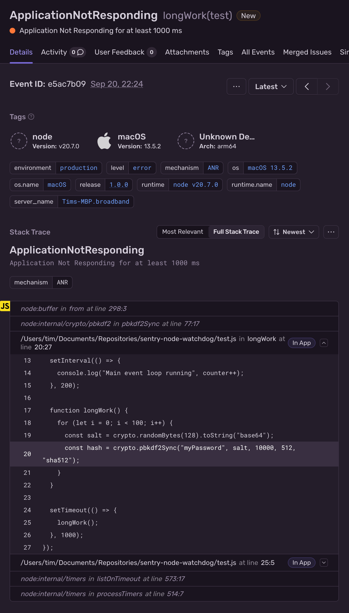

Application Not Responding (ANR) errors, or Event Loop Stall errors, are triggered when the Node.js main thread event loop of an application is blocked for more than five seconds. The Node SDK reports ANR errors as Sentry events and can optionally attach a stack trace of the blocking code to the ANR event.

<Include name="feature-stage-beta.mdx" />

<Note>

ANR detection is not supported for [Node.js clusters](https://nodejs.org/api/cluster.html).

</Note>

_(Available in version 7.72.0 and above)_

To enable ANR detection, import and use the `enableAnrDetection` function from the `@sentry/node` package before you run the rest of your application code. Any event loop blocking before calling `enableAnrDetection` will not be detected by the SDK.

<Alert level="info">

ANR detection requires Node 10 or higher.

</Alert>

```javascript {tabTitle: ESM}
import * as Sentry from "@sentry/node";

Sentry.init({
  dsn: "___PUBLIC_DSN___",
  tracesSampleRate: 1.0,
});

await Sentry.enableAnrDetection({ captureStackTrace: true });
// Function that runs your app
runApp();
```

```javascript {tabTitle: CJS}
const Sentry = require("@sentry/node");

Sentry.init({
  dsn: "___PUBLIC_DSN___",
  tracesSampleRate: 1.0,
});

Sentry.enableANRDetection({ captureStackTrace: true }).then(() => {
  // Function that runs your app
  runApp();
});
```



## Configuration options

You can pass in a configuration object to the `enableANRDetection` function to customize the ANR detection behavior.

```ts
declare function enableAnrDetection(options: Partial<Options>): Promise<void>;

interface Options {
  /**
   * The app entry script. This is used to run the same script as the child process.
   *
   * Defaults to `process.argv[1]`.
   */
  entryScript: string;
  /**
   * Interval to send heartbeat messages to the child process.
   *
   * Defaults to 50ms.
   */
  pollInterval: number;
  /**
   * Threshold in milliseconds to trigger an ANR event.
   *
   * Defaults to 5000ms.
   */
  anrThreshold: number;
  /**
   * Whether to capture a stack trace when the ANR event is triggered.
   *
   * Defaults to `false`.
   *
   * This uses the node debugger which enables the inspector API and opens the required ports.
   */
  captureStackTrace: boolean;
  /**
   * Log debug information.
   */
  debug: boolean;
}
```

## ANR Implementation and Overhead

ANR detection with the Node SDK uses a forked child process. The child process runs the same entry point as the main app. To ensure that the main app code does not run in the child process, the SDK uses a promise that only resolves in the main process.

The main app process sends a heartbeat message to the child process every 50ms. If the child process does not receive a heartbeat message for 5 seconds, it triggers an ANR event. If the `captureStackTrace` option is enabled, the child process uses WebSockets to capture stack traces via the [v8 inspector API](https://nodejs.org/api/inspector.html).

Once an ANR event is reported, the child process exits to prevent further duplicate events. The main process will continue to run as usual.

Overhead from Node.js ANR tracking should be minimal. With no ANR detected, the only overhead in the main app process is polling the child process over IPC every 50ms by default. The ANR child process consumes around 50-60 MB or RAM to keep track of the polling. Once an ANR has been detected, the main process is paused briefly in the debugger to capture a stack trace frames. At this point, the event loop has been blocked for seconds so the debugging overhead is negligible.
