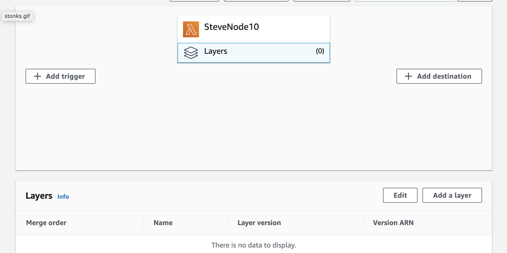
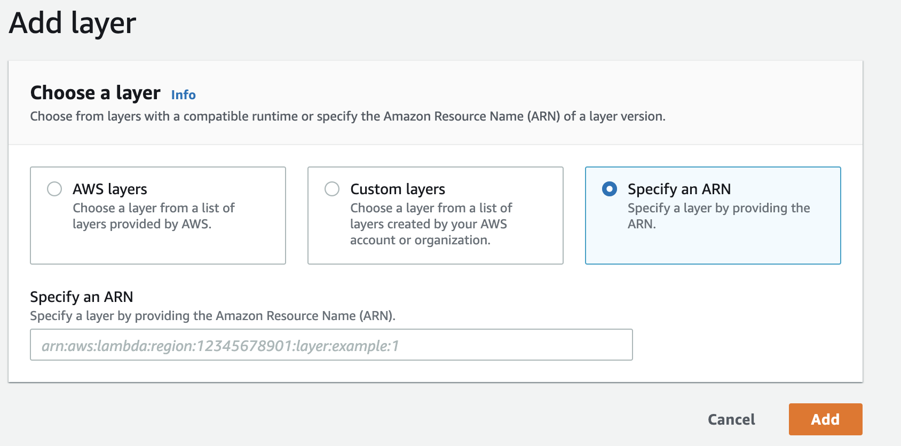

You can also install Sentry using a [Lambda Layer](https://docs.aws.amazon.com/lambda/latest/dg/configuration-layers.html) instead of adding `@sentry/serverless` with `npm` or `yarn`. Import Sentry as usual:

```javascript
const Sentry = require("@sentry/serverless");
```

<Note>

This installation method will not work if you are using Webpack.

</Note>

Then add the Sentry Layer by navigating to your Lambda function. Select **Layers**, then **Add a Layer**.

   

 **Specify an ARN** tab as illustrated:

   
   
Finally, set the region and copy the provided ARN value into the input.

<LambdaLayerDetail canonical="aws-layer:node" />
