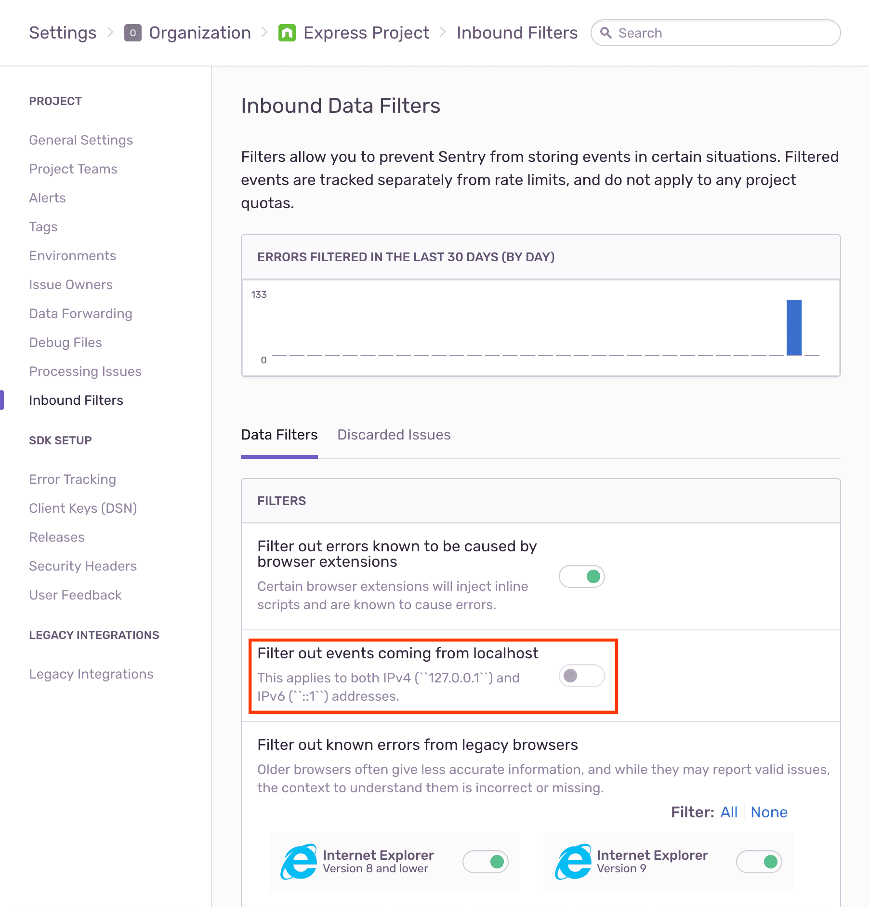

Add `@sentry/node` as a dependency:

```bash {tabTitle:npm}
npm install --save @sentry/node
```

```bash {tabTitle:Yarn}
yarn add @sentry/node
```

Sentry should be initialized as early in your app as possible:

```javascript
import express from "express";
import * as Sentry from "@sentry/node";

// or using CommonJS
// const express = require('express');
// const Sentry = require('@sentry/node');

const app = express();

Sentry.init({ dsn: "___PUBLIC_DSN___" });

// The request handler must be the first middleware on the app
app.use(Sentry.Handlers.requestHandler());

// All controllers should live here
app.get("/", function rootHandler(req, res) {
  res.end("Hello world!");
});

// The error handler must be before any other error middleware and after all controllers
app.use(Sentry.Handlers.errorHandler());

// Optional fallthrough error handler
app.use(function onError(err, req, res, next) {
  // The error id is attached to `res.sentry` to be returned
  // and optionally displayed to the user for support.
  res.statusCode = 500;
  res.end(res.sentry + "\n");
});

app.listen(3000);
```

You can verify the Sentry integration by creating a route that will throw an error:

```js
app.get("/debug-sentry", function mainHandler(req, res) {
  throw new Error("My first Sentry error!");
});
```

`requestHandler` accepts some options that let you decide what data should be included in the event sent to Sentry.

Possible options are:

```javascript
// keys to be extracted from req
request?: boolean | string[]; // default: true = ['cookies', 'data', 'headers', 'method', 'query_string', 'url']

// server name
serverName?: boolean; // default: true

// generate transaction name
//   path == request.path (eg. "/foo")
//   methodPath == request.method + request.path (eg. "GET|/foo")
//   handler == function name (eg. "fooHandler")

transaction?: boolean | 'path' | 'methodPath' | 'handler'; // default: true = 'methodPath'
// keys to be extracted from req.user

user?: boolean | string[]; // default: true = ['id', 'username', 'email']

// client ip address
ip?: boolean; // default: false

// node version

version?: boolean; // default: true

// timeout for fatal route errors to be delivered
flushTimeout?: number; // default: undefined
```

For example, if you want to skip the server name and add just user, you would use `requestHandler` like this:

```javascript
app.use(
  Sentry.Handlers.requestHandler({
    serverName: false,
    user: ["email"],
  })
);
```

By default, `errorHandler` will capture only errors with a status code of `500` or higher. If you want to change it, provide it with the `shouldHandleError` callback, which accepts middleware errors as its argument and decides, whether an error should be sent or not, by returning an appropriate boolean value.

```js
app.use(
  Sentry.Handlers.errorHandler({
    shouldHandleError(error) {
      // Capture all 404 and 500 errors
      if (error.status === 404 || error.status === 500) {
        return true;
      }
      return false;
    },
  })
);
```

If you use TypeScript, you need to cast our handlers to express specific types.
They are fully compatible, so the only things you need to change are:

```javascript
// from
const express = require('express');
// to
import * as express from 'express';


// from
app.use(Sentry.Handlers.requestHandler());
// to
app.use(Sentry.Handlers.requestHandler() as express.RequestHandler);


// from
app.use(Sentry.Handlers.errorHandler());
// to
app.use(Sentry.Handlers.errorHandler() as express.ErrorRequestHandler);
```

## Monitor Performance

```bash {tabTitle:npm}
npm install --save @sentry/node @sentry/tracing
```

```bash {tabTitle:Yarn}
yarn add @sentry/node @sentry/tracing
```

It’s possible to add tracing to all popular frameworks; however, we only provide pre-written handlers for Express.

```javascript
const Sentry = require("@sentry/node");
const Tracing = require("@sentry/tracing");
const express = require("express");
const app = express();

Sentry.init({
  dsn: "___PUBLIC_DSN___",
  integrations: [
    // enable HTTP calls tracing
    new Sentry.Integrations.Http({ tracing: true }),
    // enable Express.js middleware tracing
    new Tracing.Integrations.Express({ 
      // to trace all requests to the default router
      app, 
      // alternatively, you can specify the routes you want to trace:
      // router: someRouter, 
    }),
  ],

  // We recommend adjusting this value in production, or using tracesSampler
  // for finer control
  tracesSampleRate: 1.0,
});

// RequestHandler creates a separate execution context using domains, so that every
// transaction/span/breadcrumb is attached to its own Hub instance
app.use(Sentry.Handlers.requestHandler());
// TracingHandler creates a trace for every incoming request
app.use(Sentry.Handlers.tracingHandler());

// the rest of your app

app.use(Sentry.Handlers.errorHandler());
app.listen(3000);
```

Spans are instrumented for the following operations within a transaction:

- HTTP requests made with `request`
- `get` calls using native `http` and `https` modules
- Middleware (Express.js only)

### Troubleshooting

When capturing errors locally, ensure that your project's data filter for filtering localhost events is toggled off:



This ensures that errors produced by your browser (such as errors produced by HTTP methods) are properly captured.
