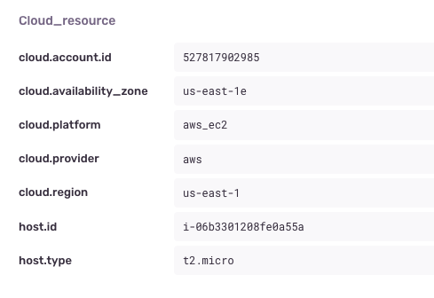
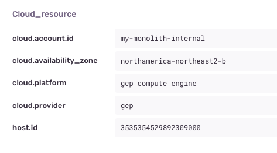

The Cloud Resource Context integration adds information about the cloud platform your app runs to errors and performance events.

## Install

To install it, run:

```bash
pip install --upgrade 'sentry-sdk'
```

## Configure

Add `CloudResourceContextIntegration()` to your `integrations` list:

```python
import sentry_sdk
from sentry_sdk.integrations.cloud_resource_context import CloudResourceContextIntegration

sentry_sdk.init(
    dsn="___PUBLIC_DSN___",
    integrations=[
        CloudResourceContextIntegration(),
    ],
)
```

## Behavior

When the SDK starts up, information from the cloud provider the app is running in is retrieved and added to all error and performance events sent to Sentry.
The [developer documentation](https://develop.sentry.dev/sdk/event-payloads/contexts/#runtime-context) lists all the information that's being added.

In AWS EC2 the context looks like this:



In Google Cloud Platform GCE the context looks like this:



## Supported Versions

- Python: 3.6+
- Cloud platforms: AWS EC2, Google Cloud Engine
