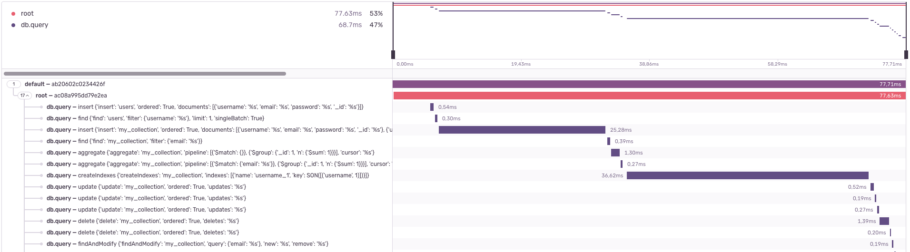

The PyMongo integration adds support for [PyMongo](https://www.mongodb.com/docs/drivers/pymongo/), the official MongoDB driver.

## Install

Install `sentry-sdk` from PyPI with the `pymongo` extra:

```bash
pip install --upgrade 'sentry-sdk[pymongo]'
```

## Configure

To configure the SDK, initialize it before creating any of PyMongo's MongoClient instances:

```python
import sentry_sdk
from sentry_sdk.integrations.pymongo import PyMongoIntegration


sentry_sdk.init(
    dsn="___PUBLIC_DSN___",
    integrations=[
        PyMongoIntegration(),
    ],

    # Set traces_sample_rate to 1.0 to capture 100%
    # of transactions for performance monitoring.
    # We recommend adjusting this value in production,
    traces_sample_rate=1.0,
)
```

<Note>

In the future, we will make this auto-enabling, so you won't need to add the `PyMongoIntegration` to your
`sentry_sdk.init()` call. Instead, the Sentry SDK will detect the presence of PyMongo and will set up the integration
automatically.

</Note>

## Behavior

The following information about your MongoDB queries will be available to you on Sentry.io:

- Performance traces for all MongoDB queries
- Breadcrumbs for all MongoDB queries
- Personal identifiable information (PII) will be stripped from all MongoDB queries if `send_default_pii` is disabled in the SDK. (This was tested for PyMongo 4.2 and below, but "should" also be future proof)



### Other MongoDB libraries

PyMongo is an official synchronous driver for MongoDB. It means that many other Python libraries interacting with
MongoDB use it under the hood, like, for example `mongoengine` (always) or `umongo` (if selected from multiple available
drivers). Official async MongoDB driver called `Motor` uses PyMongo under the hood as well.
Queries generated by those libraries will also be monitored.

If you use a different driver (for example, `TxMongo`), this integration won't work.

### Mongomock

While `mongomock` can be used to replace `PyMongo` in tests, it doesn't implement all features available in the official
driver. This integration will not generate any breadcrumbs or spans from `mongomock`'s clients.

## Supported Versions

- PyMongo: 3.1+, 4.0, 4.1, 4.2
- Python: 2.7 (PyMongo 3.1+), Python 3.6+ (PyMongo 4.0), Python 3.7+ (PyMongo 4.1+)
